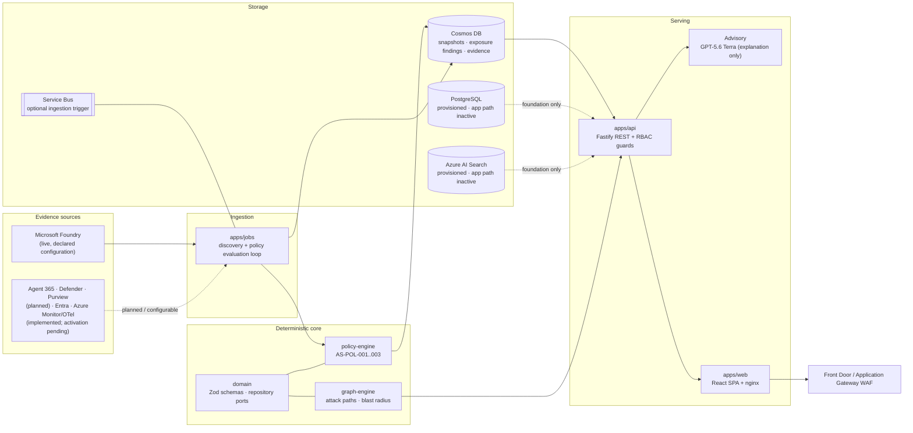

# Agent Sentinel

**Evidence-first operations, governance, security, optimization, and lifecycle control plane for enterprise AI agents.**

Agent Sentinel gives an organization one explainable view of every AI agent it runs: what exists, who owns it, what it can reach, where it is exposed, whether it is governed, and whether it is still fit to operate. Every claim in the product cites typed evidence with a source, a confidence, and an observation timestamp.

> **Status: pre-production engineering preview (2026-08-27).** The deployed environment uses read-only Microsoft Entra JWT authentication with a synthetic-only agent portfolio. Writes remain disabled at both the API and WAF. See [Security warning](#security-warning) and [docs/current-status.md](docs/current-status.md).

---

## Value proposition

| Agent Sentinel does                                                                                                                                                  | Agent Sentinel does **not** do                                                       |
| -------------------------------------------------------------------------------------------------------------------------------------------------------------------- | ------------------------------------------------------------------------------------ |
| Consume authoritative records from Agent 365, Microsoft Entra, Microsoft Defender, Microsoft Purview, Microsoft Foundry, platform telemetry, and third-party sources | Replace the native administration console of any of those platforms                  |
| Correlate those sources into a single cross-plane typed evidence graph                                                                                               | Become the system of record for agent registration, identity, or data classification |
| Compute deterministic attack paths and blast radius from that graph                                                                                                  | Infer relationships, owners, or health that a source did not actually return         |
| Run bounded, non-destructive validation to move a theoretical finding to validated or not-reproduced                                                                 | Execute destructive probes or unauthorized actions                                   |
| Preview remediation impact before anything is changed                                                                                                                | Apply changes without authorization and an approval trail                            |
| Score each agent across separate, explainable assurance dimensions                                                                                                   | Collapse assurance into a single opaque number                                       |
| Drive a cross-domain governance workflow over one shared evidence set                                                                                                | Ask security, platform, and business owners to reconcile five different consoles     |

### Differentiators

- **Cross-plane typed evidence graph** — assets and relationships from different control planes are normalized into one graph; a missing source lowers confidence and never implies safety.
- **Deterministic attack paths and blast radius** — computed by [`@agent-sentinel/graph-engine`](packages/graph-engine), reproducible in unit tests without model access.
- **Safe validation** — bounded, non-destructive probes with synthetic canaries only.
- **Remediation what-if** — impact preview before any authorized, idempotent, rollback-aware action.
- **Separate explainable per-agent assurance dimensions** — security, governance, lifecycle, quality, reliability, and cost are scored and explained independently, and report `unknown` rather than guessing.
- **Cross-domain governance workflow** — one evidence set shared by security, platform, and business stakeholders.

Implemented but not activated in the deployed environment: authenticated custom-manifest ingestion, Microsoft Entra identity enrichment, behavior drift analysis, measured token economics, and the Azure Monitor OTel connector. The offline shift-left scanner is available for local and CI publish gates. See [docs/roadmap.md](docs/roadmap.md).

---

## Implemented surfaces

| Surface                     | Route                        | What it shows                                                                              |
| --------------------------- | ---------------------------- | ------------------------------------------------------------------------------------------ |
| Overview                    | `/overview`                  | Estate posture summary across discovery, exposure, and governance                          |
| Agent inventory             | `/agent-inventory`           | Organization-wide inventory: platform, ownership, trust, environment, governance readiness |
| Agent detail                | `/agent-inventory/:agentId`  | Per-agent profile, identity, dependencies, evidence coverage, assurance scorecard          |
| Agent assurance catalog     | `/agent-catalog`             | Employee-facing assurance overlay for discoverable agents                                  |
| Exposure list and detail    | `/exposure`, `/exposure/:id` | Findings, attack-path graph, cited evidence, advisory narrative, remediation preview       |
| Governance                  | `/governance`                | Policy posture with deep links into the filtered findings that produced it                 |
| Governance work queue       | `/work-queue`                | Assignment, approval, exception, lifecycle, and immutable audit workflow                   |
| Observability               | `/observability`             | Evidence operations: freshness, confidence, and source coverage                            |
| Optimization                | `/optimization`              | Bounded, evidence-backed recommendations                                                   |
| Lifecycle                   | `/lifecycle`                 | Version and release-readiness evidence without invented lineage                            |
| Trust catalog               | `/trust-catalog`             | Agents, MCP servers, and tools with provenance, permissions, and dependency evidence       |
| Connectors                  | `/connectors`                | Connector catalog, readiness, capabilities, permissions, and measured connection health    |
| Settings                    | `/settings`                  | Landing page and density preferences                                                       |
| Global search and app shell | `Ctrl` + `K`                 | Cross-surface search and navigation shell                                                  |

The Entra-independent publish gate is a local CLI rather than an HTTP surface:

```bash
pnpm manifest:scan tools/fixtures/shift-left-block.json \
  --tenant tenant-ci --environment production --format text
```

It strictly validates and normalizes the manifest, then calls the same
`evaluateAllExposurePolicies()` function used by runtime ingestion. JSON is the
default deterministic format. Exit `0` means accepted (pass, or warn unless
`--fail-on warn` is set), `1` means the policy gate blocked publication, `2`
means invalid input, and `3` means an unexpected scanner failure. Findings keep
the domain `ExposureFinding` shape and include the cited domain `Evidence`
records. Manifest evidence remains explicitly non-authoritative and is never
ingested or exposed through an unauthenticated endpoint.

---

## Architecture at a glance



Deterministic policy evaluation and graph traversal are authoritative. The language model only explains evidence that already exists; it never creates facts and never authorizes actions ([ADR 0002](docs/adr/0002-evidence-first-deterministic-core.md)).

Full detail: [docs/architecture.md](docs/architecture.md).

---

## Quick local start

Requirements: **Node.js 22** (see [`.nvmrc`](.nvmrc)) and **pnpm 10.15.1** (pinned by `packageManager`). Clone into the Linux filesystem — see [docs/development.md](docs/development.md) for the canonical WSL workflow and the OneDrive prohibition.

```bash
git clone https://github.com/<org>/agent-sentinel.git
cd agent-sentinel
pnpm install

# Everything defaults to the mock connector; no Azure access is required.
pnpm dev
```

`pnpm dev` starts the API on `http://127.0.0.1:3001` and the web SPA on `http://127.0.0.1:5173`.

To point the API at live Microsoft Foundry discovery instead of mock data, copy [`.env.example`](.env.example) and set `AGENT_SENTINEL_CONNECTOR=foundry` plus the three `FOUNDRY_*` values. Invalid or incomplete Foundry settings stop startup rather than silently falling back to mock. See [docs/foundry-live-agents.md](docs/foundry-live-agents.md).

---

## Validation commands

```bash
pnpm lint          # ESLint across every workspace
pnpm typecheck     # tsc project references, no emit
pnpm test          # Vitest unit and component suites
pnpm build         # turbo build for all packages and apps
pnpm test:e2e      # Playwright end-to-end suite (starts api + web)
pnpm manifest:scan <manifest.json> --tenant <id>  # Offline pre-publication policy gate
pnpm format:check  # Prettier
pnpm validate      # format:check + lint + typecheck + test + build
```

Verified baseline on 2026-08-23:

| Suite                    | Result                                                  |
| ------------------------ | ------------------------------------------------------- |
| API unit tests           | 138 passing (11 files)                                  |
| Web unit/component tests | 196 passing (26 files)                                  |
| Playwright end-to-end    | 23 tests across 10 specs                                |
| Bicep                    | `az bicep build` succeeds with baseline linter warnings |
| Web production build     | Succeeds with a Rollup chunk-size warning (>500 kB)     |

---

## Live vs mock truth table

| Capability                                 | State                                | Notes                                                                                               |
| ------------------------------------------ | ------------------------------------ | --------------------------------------------------------------------------------------------------- |
| Microsoft Foundry agent discovery          | **Live**                             | Read-only discovery of **declared configuration** only, not runtime telemetry                       |
| Exposure findings storage                  | **Live**                             | Cosmos DB `findings`, upsert preserves `firstSeen`                                                  |
| Governance posture                         | **Live**                             | Derived from the same Cosmos-backed findings                                                        |
| Jobs ingestion loop                        | **Live**                             | `apps/jobs` discovery + policy evaluation on an interval, plus Service Bus trigger                  |
| Agent portfolio                            | **Synthetic only**                   | Six Microsoft Foundry validation agents on GPT-5.6 Terra; no production customer agents             |
| Terra live validation                      | **Live, operator-invoked**           | `pnpm foundry:validate`; never run by CI                                                            |
| Advisory narratives (public Azure edge)    | **Mock**                             | Deterministic mock provider until corporate Entra and WAF activation                                |
| Advisory narratives (grounded model path)  | **Live when configured**             | GPT-5.6 Terra, advisory explanation only; deterministic core stays authoritative                    |
| Agent 365 connector                        | **Not implemented**                  | Catalogued as `authorization-required`                                                              |
| Azure Monitor OTel                         | **Implemented, unconfigured**        | Strict read-only query and mapping path; deployed runtime evidence remains `unknown`                |
| Entra identity enrichment                  | **Implemented, unconfigured**        | Read-only service-principal inventory and Foundry composition; tenant-admin consent remains pending |
| Defender and Purview                       | **Planned**                          | Catalogued but no runtime evidence path is active                                                   |
| Governance work queue                      | **Live persistence, writes blocked** | Cosmos-backed cases and audit history; public mutation remains disabled                             |
| Authentication in the deployed environment | **Enabled, read-only**               | `AUTH_MODE=jwt`; employee login, anonymous `401`, Viewer `403`, and `/api/auth/me` validated        |
| Write and remediation execution            | **Blocked at the edge**              | `writeEnabled=false`; WAF blocks pre-auth mutations under `/api/`                                   |

---

## Documentation

| Area            | Document                                                                                                                                                                                               |
| --------------- | ------------------------------------------------------------------------------------------------------------------------------------------------------------------------------------------------------ |
| **Index**       | [docs/README.md](docs/README.md)                                                                                                                                                                       |
| **Product**     | [Product overview](docs/product-overview.md) · [Domain context](docs/CONTEXT.md) · [Roadmap](docs/roadmap.md)                                                                                          |
| **Engineering** | [Architecture](docs/architecture.md) · [Data model](docs/data-model.md) · [Development](docs/development.md) · [Foundry live agents](docs/foundry-live-agents.md)                                      |
| **Operations**  | [Deployment](docs/deployment.md) · [Runbooks](docs/runbooks.md) · [Supply chain](docs/supply-chain.md) · [DR design](docs/dr-design.md) · [Security & authentication](docs/security-authentication.md) |
| **Decisions**   | [ADR 0001 — modular monolith](docs/adr/0001-modular-monolith.md) · [ADR 0002 — evidence-first deterministic core](docs/adr/0002-evidence-first-deterministic-core.md)                                  |
| **Status**      | [Current status](docs/current-status.md) · [Known issues](docs/known-issues.md)                                                                                                                        |

---

## Security warning

> **The deployed environment runs with read-only Microsoft Entra authentication.**
>
> - `AUTH_MODE=jwt` is deployed. Anonymous callers receive `401` on protected API routes, and the current employee validation account resolves to Viewer.
> - Mutating requests are held back by two independent gates: the `BlockApiMutationPreAuth` WAF rule blocks every non-`GET`/`HEAD`/`OPTIONS` request under `/api/`, and the connector reports `writeEnabled=false`.
> - Read-only employee sign-in, token validation, logout, and Viewer boundaries are live. Analyst, Approver, Administrator, write-scope, and public mutation validation remain pending.
> - The Microsoft Entra identity inventory connector is separate from user sign-in and remains disabled until tenant-admin consent and bounded live validation are complete.
> - Do **not** attach production customer data or enable writes until [the activation checklist](docs/security-authentication.md#activation-checklist) is complete.

No credentials, tokens, or connection strings are stored in this repository. All Azure access uses `DefaultAzureCredential` with managed identity or developer sign-in.

---

## Current maturity

Agent Sentinel is an **engineering preview**. The full navigation surface is implemented and covered by unit, component, and end-to-end tests. Live evidence today comes from exactly one source — Microsoft Foundry declared configuration — persisted in Cosmos DB and evaluated by deterministic policies. Everything that depends on runtime telemetry, cross-plane identity, data classification, or authenticated employee context is either explicitly labelled as planned or reported as `unknown` rather than estimated.

The next maturity gates are tenant-authorized Entra identity enrichment, complete role and write-path validation, a unified Cosmos-backed read model, and runtime telemetry activation. They are tracked in [docs/roadmap.md](docs/roadmap.md) and [docs/known-issues.md](docs/known-issues.md).
