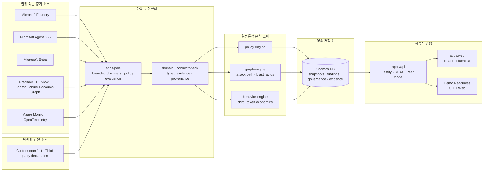

# Agent Sentinel

**엔터프라이즈 AI 에이전트를 위한 증거 중심 운영·거버넌스·보안·최적화·수명주기 통합 제어 플랫폼**

Agent Sentinel은 Microsoft Agent 365, Microsoft Entra, Microsoft Foundry,
Microsoft Defender, Microsoft Purview, Microsoft Teams, Azure Monitor 및
사용자 정의 런타임의 에이전트·신원·제어·거버넌스·telemetry 레코드를 하나의
**타입이 지정된 증거 그래프**로 통합합니다. Agent와 직접 연결할 권위 있는
식별자가 없는 레코드는 독립 증거로 유지하며 에이전트에 임의 귀속하지 않습니다.

조직은 Agent Sentinel을 통해 다음 질문에 일관된 증거로 답할 수 있습니다.

- 어떤 AI 에이전트가 어디에서 운영되고 있는가?
- 누가 소유하고 어떤 데이터·도구·다른 에이전트에 접근할 수 있는가?
- 어떤 노출이 이론적이며 어떤 노출이 실제로 검증되었는가?
- 변경을 적용하면 공격 경로와 영향 범위가 어떻게 달라지는가?
- 에이전트가 보안·거버넌스·신뢰성·비용·수명주기 기준을 충족하는가?

모든 제품 주장은 출처, 신뢰도, 최신성, 관측 시각을 가진 증거를 인용합니다.
증거가 없으면 안전하다고 판단하지 않고 `unknown`, `partial`,
`insufficient-data` 또는 `unavailable`로 표시합니다.

> **릴리스 상태: 프로덕션 출시 준비 단계**
>
> 저장소의 P0 실데이터 통합 및 Demo Readiness 기능은 구현·검증되어
> `feature/multi-source-otel` 브랜치에 병합되었습니다. 그러나 현재 Azure
> 배포는 이전 이미지 `7458b3e`와 `AUTH_MODE=disabled`를 사용합니다.
> 저장소 구현 상태와 실제 배포 상태는 반드시 구분해야 합니다.
>
> 프로덕션 출시를 위해서는 Entra 로그인 활성화, Agent 365 지속 수집 검증,
> 실제 `RUNS_AS` 증거 확인, 대표 OTel 트래픽 확보, Security·Accessibility·
> OneRAI 출시 검토가 완료되어야 합니다.

---

## 제품 원칙

Agent Sentinel의 초기 기획과 현재 구현은 다음 불변 원칙을 공유합니다.

1. **증거 없는 사실은 만들지 않습니다.**
2. **누락된 증거는 안전이 아니라 불확실성입니다.**
3. **에이전트·신원·도구 관계를 이름이나 소유자 정보로 추정하지 않습니다.**
4. **LLM은 기존 증거를 설명하지만 보안 사실이나 권한을 결정하지 않습니다.**
5. **영향이 있는 작업은 인증, 권한, 승인, 감사 기록 없이는 실행하지 않습니다.**
6. **tenant·estate·environment·source·project 경계는 UI 아래 계층에서도 적용됩니다.**
7. **mock·synthetic·stale·partial 데이터를 live 성공으로 승격하지 않습니다.**

---

## 초기 제품 기획과 현재 구현 정합성

| 제품 축       | 초기 목표                                         | 현재 상태                                                                                                    |
| ------------- | ------------------------------------------------- | ------------------------------------------------------------------------------------------------------------ |
| **Discover**  | 여러 플랫폼의 에이전트·소유권·도구·배포 상태 통합 | Foundry 실데이터, Entra·Purview·Defender·Teams·Azure Resource Graph 연결, Agent 365 코드 완료·배포 검증 대기 |
| **Govern**    | 정책, 예외, 승인, 감사, 규정 준수 증거 통합       | 정책 자세·Cosmos work queue·불변 감사 이력 구현, 공개 쓰기는 차단                                            |
| **Protect**   | 노출, 공격 경로, blast radius, 안전한 검증        | 결정론적 정책·그래프 엔진·노출 상세·검증·remediation what-if 구현                                            |
| **Observe**   | 최신성, 커버리지, 신뢰성, 활동, 비용 관측         | OTel 읽기·provenance·품질 판정 구현, 실제 분석 가능 span은 아직 부족                                         |
| **Optimize**  | 증거 기반 개선안과 효과 확인                      | 제한된 추천·what-if 구현, 실제 provider 변경 실행은 비활성                                                   |
| **Lifecycle** | 릴리스, 승격, drift, rollback, retirement 관리    | 수명주기 증거와 governance transition 구현, 실제 배포 릴리스 검증은 진행 중                                  |

초기 계획의 핵심인 **cross-platform evidence graph**, **deterministic security
analysis**, **bounded validation**, **approval-based remediation** 구조는 유지되고
있습니다. 현재 남은 작업은 새로운 제품 방향이 아니라 실제 배포 환경에서 이
구조를 활성화하고 검증하는 단계입니다.

---

## Agent Sentinel이 하는 일과 하지 않는 일

| Agent Sentinel이 하는 일                                           | Agent Sentinel이 하지 않는 일                     |
| ------------------------------------------------------------------ | ------------------------------------------------- |
| 권위 있는 읽기 전용 레코드와 명시적 비권위 선언을 구분해 수집·인용 | Agent 365, Entra, Foundry 등 원본 관리 콘솔 대체  |
| 여러 제어 평면을 하나의 타입 증거 그래프로 상관 분석               | source가 반환하지 않은 관계·소유자·건강 상태 추론 |
| 결정론적 공격 경로와 blast radius 계산                             | LLM을 이용한 보안 사실 생성                       |
| 비파괴·제한적 검증으로 theoretical 상태를 갱신                     | 무단 또는 파괴적 보안 테스트                      |
| 변경 전 remediation 영향 미리보기                                  | 승인 없는 실제 변경                               |
| 차원별 설명 가능한 assurance 제공                                  | 불확실성을 숨기는 단일 종합 점수                  |
| 하나의 증거 집합으로 보안·플랫폼·비즈니스 협업                     | 플랫폼별 결과를 사용자가 수동 조정하도록 강제     |

---

## 핵심 아키텍처



- `apps/web`: React SPA, Fluent UI, 접근성 적용 운영 화면
- `apps/api`: Fastify REST API, 인증·RBAC, Cosmos 기반 read model
- `apps/jobs`: 주기적 discovery, policy 평가, snapshot·finding 영속화
- `packages/domain`: Zod schema, estate·evidence·repository 계약
- `packages/connector-sdk`: connector, health, provenance, runtime evidence 계약
- `packages/graph-engine`: 공격 경로와 blast radius 계산
- `packages/policy-engine`: 결정론적 보안 정책 평가
- `packages/behavior-engine`: OTel 기반 drift·신뢰성·token economics 분석

상세 설계는 [아키텍처 문서](docs/architecture.md)와
[ADR 0002](docs/adr/0002-evidence-first-deterministic-core.md)를 참고하십시오.

---

## 주요 사용자 화면

| 화면                    | 경로                        | 목적                                           |
| ----------------------- | --------------------------- | ---------------------------------------------- |
| Overview                | `/overview`                 | estate, 노출, governance 요약                  |
| Agent inventory         | `/agent-inventory`          | 플랫폼·소유권·trust·환경별 에이전트 목록       |
| Agent detail            | `/agent-inventory/:agentId` | 신원, 도구, 증거, assurance, 수명주기          |
| Agent assurance catalog | `/agent-catalog`            | 직원 관점의 에이전트 신뢰도 overlay            |
| Cloud resources         | `/cloud-resources`          | 에이전트 주변 Azure 리소스 증거                |
| Exposure                | `/exposure`                 | 이론적·검증된 노출과 심각도                    |
| Exposure detail         | `/exposure/:findingId`      | 공격 경로, 증거, 검증, what-if                 |
| Governance              | `/governance`               | 정책 자세와 증거 기반 상태                     |
| Work queue              | `/work-queue`               | 할당·승인·예외·만료·감사 이력                  |
| Observability           | `/observability`            | 증거 최신성·완전성·source health               |
| Optimization            | `/optimization`             | 제한적·증거 기반 개선 제안                     |
| Lifecycle               | `/lifecycle`                | release readiness, drift, rollback, retirement |
| Trust catalog           | `/trust-catalog`            | Agent·MCP·tool·connector provenance            |
| Connectors              | `/connectors`               | connector 설정·권한·health·data state          |
| Demo Readiness          | `/demo-readiness`           | Agent 365·`RUNS_AS`·OTel·배포 상태 통합 판정   |
| Settings                | `/settings`                 | 사용자 환경 설정                               |

---

## 데이터 소스와 현재 상태

아래 표는 **코드 구현 상태**와 **현재 Azure에서 검증된 상태**를 구분합니다.

| 데이터 소스                | 코드 상태                | 현재 배포·실증 상태                                                                   |
| -------------------------- | ------------------------ | ------------------------------------------------------------------------------------- |
| Microsoft Foundry          | 완료, multi-source       | 1개 project에서 6개 synthetic validation agent의 declared configuration 수집          |
| Microsoft Entra inventory  | 완료, multi-source       | service principal inventory 연결; 현재 Foundry agent에 정확한 ID가 없어 `RUNS_AS` 0건 |
| Microsoft Agent 365        | 완료, deployment-managed | 라이선스·UAMI 권한·HTTP 200/306 package 접근 검증; 새 runtime 배포·snapshot 검증 대기 |
| Azure Monitor / OTel       | 완료, multi-source       | query path 연결; 현재 30일 범위의 분석 가능한 request span 부족                       |
| Azure Resource Graph       | 완료                     | 현재 권한 범위의 Azure 리소스 증거 수집                                               |
| Microsoft Purview          | 완료                     | sensitivity label 정의 수집; 실제 사용·보호 상태를 의미하지 않음                      |
| Defender for Cloud Apps    | 완료                     | 현재 bounded window는 valid-empty                                                     |
| Teams organization catalog | 완료                     | 현재 bounded catalog는 valid-empty                                                    |
| Power Platform             | 구현 완료                | unattended app-only 권한 부재로 비활성                                                |
| Custom manifest            | 완료                     | 비권위 read-only adapter; API ingestion은 인증·write gate 필요                        |
| Business outcome           | 계약 완료                | 권위 있는 outcome source 미설정                                                       |

현재 Foundry의 6개 에이전트는 제품 검증용 synthetic agent이며 production customer
agent가 아닙니다. Agent 365의 306개 package도 306개 agent를 의미하지 않습니다.

더 자세한 상태는 [Connector availability](docs/connector-availability.md)와
[Current status](docs/current-status.md)를 참고하십시오.

---

## 인증과 쓰기 안전성

코드에는 다음 기능이 구현되어 있습니다.

- Microsoft Entra JWT 서명·tenant·audience·issuer·scope·role 검증
- SPA MSAL 로그인·로그아웃·redirect bridge
- `Viewer`, `Analyst`, `Approver`, `Administrator` 역할
- route별 capability guard
- `/api/auth/me`의 개인정보 최소화 principal 응답

현재 replacement Azure 배포는 다음 상태입니다.

- `AUTH_MODE=disabled`
- `AGENT_SENTINEL_WRITE_ENABLED=false`
- WAF가 `/api/`의 비조회 요청을 차단

따라서 현재 공개 환경은 로그인과 실제 remediation 실행을 제공하지 않습니다.
인증 활성화와 쓰기 활성화는 서로 다른 승인 단계입니다.

상세 절차는 [Security and authentication](docs/security-authentication.md)을
참고하십시오.

---

## 로컬 실행

### 요구 사항

- Node.js 22 이상
- pnpm 10.15.1
- Linux 또는 WSL의 Linux 파일 시스템

```bash
git clone https://github.com/<org>/agent-sentinel.git
cd agent-sentinel
pnpm install
pnpm dev
```

기본값은 mock connector이므로 Azure 권한 없이 실행할 수 있습니다.

- API: `http://127.0.0.1:3001`
- Web: `http://127.0.0.1:5173`

Foundry live discovery를 사용하려면 `.env.example`을 기준으로
`AGENT_SENTINEL_CONNECTOR=foundry`와 `FOUNDRY_*` 값을 설정하십시오. 잘못되거나
불완전한 설정은 mock으로 fallback하지 않고 startup을 중단합니다.

---

## 검증 명령

```bash
pnpm format:check
pnpm lint
pnpm typecheck
pnpm test
pnpm build
pnpm test:e2e
pnpm validate
```

추가 운영 검증:

```bash
# Foundry synthetic validation agent 검증
pnpm foundry:validate

# Entra 인증 활성화 후 역할·상태 코드 검증
pnpm auth:validate-live

# 배포 후 Agent 365, RUNS_AS, OTel, 이미지 상태 통합 검증
# 아래 값은 승인된 배포 기록과 short-lived Viewer token에서 가져오며
# token이나 digest를 파일·로그·shell history에 저장하지 않습니다.
export AGENT_SENTINEL_BASE_URL='https://approved-front-door-host.example'
read -rsp 'Short-lived Viewer token: ' AGENT_SENTINEL_DEMO_TOKEN && echo
export AGENT_SENTINEL_DEMO_TOKEN
export WEB_SHA='0123456789abcdef0123456789abcdef01234567'
export API_SHA='0123456789abcdef0123456789abcdef01234567'
export JOBS_SHA='0123456789abcdef0123456789abcdef01234567'
export WEB_DIGEST='sha256:0123456789abcdef0123456789abcdef0123456789abcdef0123456789abcdef'
export API_DIGEST='sha256:0123456789abcdef0123456789abcdef0123456789abcdef0123456789abcdef'
export JOBS_DIGEST='sha256:0123456789abcdef0123456789abcdef0123456789abcdef0123456789abcdef'

pnpm demo:verify -- \
  --url "$AGENT_SENTINEL_BASE_URL" \
  --token-env AGENT_SENTINEL_DEMO_TOKEN \
  --expected-web-sha "$WEB_SHA" \
  --expected-api-sha "$API_SHA" \
  --expected-jobs-sha "$JOBS_SHA" \
  --expected-web-digest "$WEB_DIGEST" \
  --expected-api-digest "$API_DIGEST" \
  --expected-jobs-digest "$JOBS_DIGEST"

# 배포 전 manifest 정책 검사
pnpm manifest:scan <manifest.json> --tenant <tenant-id>
```

감사 가능한 최근 검증 경계:

- `8124c0ee` (2026-09-11): Vitest 1,827개 통과, 1개 skip
- `8124c0ee` (2026-09-11): Playwright connector/catalog/Agent 365 11/11 통과
- `8124c0ee` + lint 보정 `84187254` (2026-09-11): 전체 lint, typecheck, build 통과
- `8124c0ee` (2026-09-11): offline Bicep platform·replacement parameter 검증 통과
- Demo Readiness `74fc7f5f` (2026-09-12): 전체 lint, typecheck, test, build, Bicep 통과

실제 provider 검증 스크립트는 자동 CI에서 실행하지 않으며, 승인된 환경에서만
사용합니다.

---

## 프로덕션 배포

프로덕션 이미지는 mutable tag가 아니라 `@sha256:<digest>`로 배포합니다.
private ACR 접근은 target VNet의 self-hosted runner와 managed identity를 사용합니다.

안전한 배포 순서:

1. 검증된 exact Git SHA를 선택합니다.
2. target VNet runner에서 web/API/jobs 이미지를 빌드하고 ACR digest를 확인합니다.
3. 전체 Bicep 배포가 아닌 reviewed surgical change를 `what-if`로 검토합니다.
4. API를 먼저 배포하고 health·auth·read model을 검증합니다.
5. jobs를 배포하고 snapshot 저장을 확인합니다.
6. 필요할 때만 web을 배포합니다.
7. `pnpm demo:verify`로 Agent 365·`RUNS_AS`·OTel·version 상태를 판정합니다.
8. 실패 시 저장한 이전 digest/revision으로 API → jobs → web 순서로 rollback합니다.

현재 개발 resource group은 전체 Bicep desired state와 drift가 있으므로 전체
`deployment group create`를 실행하면 안 됩니다.

상세 절차:

- [Deployment](docs/deployment.md)
- [Runbooks](docs/runbooks.md)
- [Supply chain](docs/supply-chain.md)

---

## 프로덕션 출시 기준

Agent Sentinel을 production release로 선언하려면 다음 조건이 모두 충족되어야 합니다.

### 필수 출시 게이트

- [ ] replacement Azure에 검증된 full SHA와 image digest가 배포됨
- [ ] Entra `AUTH_MODE=jwt` read-only 활성화 및 실제 로그인·로그아웃 검증
- [ ] anonymous `401`, Viewer `403`, `/api/auth/me` 검증
- [ ] Viewer·Analyst·Approver·Administrator의 실제 token capability 경계 검증
- [ ] Agent 365 source가 `ready + complete`이며 persisted snapshot과 분류가 검증됨
- [ ] 모든 대상 agent의 `RUNS_AS`가 정확한 provider ID로 생성되고 unmatched·ambiguous가 0건임
- [ ] OTel baseline·observed window에 대표 non-synthetic span이 존재함
- [ ] trace/span/token/cost provenance가 source와 agent에 정확히 연결됨
- [ ] 공개 쓰기는 계속 차단되거나 승인된 private reversible write만 검증됨
- [ ] Security review 완료
- [ ] Accessibility review 완료
- [ ] OneRAI release assessment에 실행된 safety evaluation 첨부
- [ ] sanitized release evidence에 full SHA, image digest, config hash 기록
- [ ] rollback 절차와 이전 digest가 검증됨

### 출시 후에도 유지할 원칙

- package count를 agent count로 표시하지 않습니다.
- valid-empty를 전체 커버리지로 표시하지 않습니다.
- synthetic validation을 production workload 증거로 표시하지 않습니다.
- stale snapshot을 현재 live 상태로 표시하지 않습니다.
- 이름·소유자·별칭으로 identity edge를 생성하지 않습니다.
- 인증되지 않은 public write 경로를 허용하지 않습니다.

---

## 저장소 구조

```text
apps/
  api/          REST API, JWT/RBAC, live read model
  jobs/         discovery, policy evaluation, persistence
  web/          React SPA, Fluent UI, Demo Readiness

connectors/
  foundry/
  agent365/
  entra-identity/
  azure-monitor-otel/
  azure-resource-graph/
  defender-cloud-apps/
  purview/
  teams-distribution/
  power-platform/
  manifest/

packages/
  domain/
  connector-sdk/
  connector-runtime/
  persistence/
  graph-engine/
  policy-engine/
  behavior-engine/
  ui/

infra/          Bicep, environment parameters, private runner foundation
scripts/        provisioning, validation, release evidence, demo verifier
docs/           product, architecture, operations, security, decisions
```

---

## 문서

| 영역      | 문서                                                                                                           |
| --------- | -------------------------------------------------------------------------------------------------------------- |
| 제품      | [Product overview](docs/product-overview.md) · [Domain context](docs/CONTEXT.md)                               |
| 현재 상태 | [Current status](docs/current-status.md) · [Known issues](docs/known-issues.md)                                |
| 계획      | [Roadmap](docs/roadmap.md)                                                                                     |
| 설계      | [Architecture](docs/architecture.md) · [Data model](docs/data-model.md)                                        |
| 개발      | [Development](docs/development.md) · [Foundry live agents](docs/foundry-live-agents.md)                        |
| 운영      | [Deployment](docs/deployment.md) · [Runbooks](docs/runbooks.md) · [Supply chain](docs/supply-chain.md)         |
| 보안      | [Security and authentication](docs/security-authentication.md)                                                 |
| Connector | [Connector availability](docs/connector-availability.md)                                                       |
| 의사결정  | [ADR 0001](docs/adr/0001-modular-monolith.md) · [ADR 0002](docs/adr/0002-evidence-first-deterministic-core.md) |

---

## 현재 성숙도

Agent Sentinel의 코드 기반은 프로덕션 출시 후보 수준의 P0 기능을 포함합니다.
다만 **프로덕션 출시 여부는 코드 완성도가 아니라 실제 배포와 증거 검증으로
결정됩니다.**

현재 가장 중요한 다음 단계는 다음과 같습니다.

1. Entra read-only 로그인 활성화
2. Agent 365 실제 package snapshot 검증
3. 정확한 Entra `RUNS_AS` 결과 또는 unmatched 진단 검증
4. 대표 OTel non-synthetic telemetry 확보
5. Security·Accessibility·OneRAI 출시 검토 완료

Agent Sentinel은 원본 플랫폼을 대체하지 않습니다. 여러 플랫폼의 증거를 연결해
조직이 AI 에이전트를 **발견하고, 이해하고, 검증하고, 안전하게 운영하도록 돕는
통합 제어 계층**입니다.
