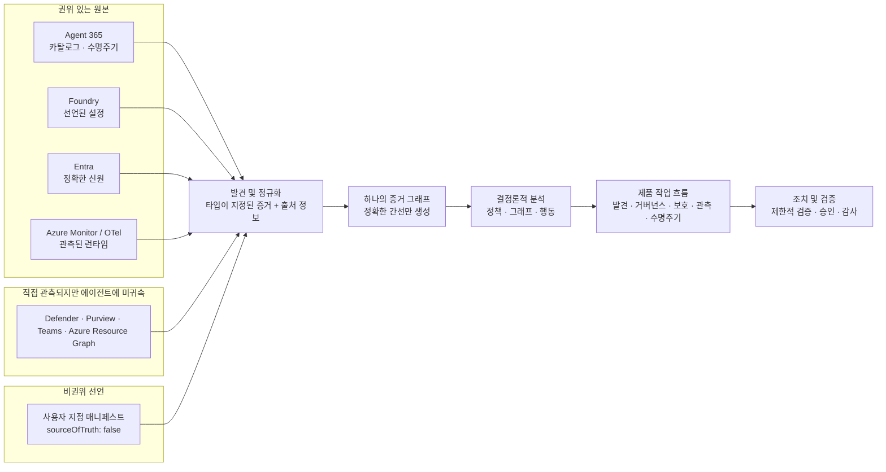

# Agent Sentinel

**여러 플랫폼에 흩어진 엔터프라이즈 AI 에이전트의 운영·보안·거버넌스 증거를 하나의 설명 가능한 그래프로 연결하는 통합 제어 계층입니다.**

Agent Sentinel을 사용하면 다음을 할 수 있습니다.

- **발견:** 어떤 에이전트가 어디에 있고 누가 소유하는지 한 인벤토리에서 확인
- **연결:** 에이전트·신원·도구·데이터·정책의 관계를 출처가 있는 증거로 추적
- **분석:** 결정론적 정책과 그래프 계산으로 노출 경로와 영향 범위(blast radius) 설명
- **검증:** 비파괴·제한적 검증과 수정 조치 what-if로 변경 전후의 차이 확인
- **운영:** 증거 최신성, 커넥터 상태, 릴리스 준비도, 수명주기를 같은 화면에서 판단

> **성숙도 · 릴리스 후보 저장소** — 현재 Azure 참조 배포는 Agent 365 읽기 전용 인벤토리를 ready/complete 상태로 제공하지만, 인증·정확한 신원 상관 분석·대표 OpenTelemetry(OTel) 증거·쓰기 경로는 아직 릴리스 게이트를 통과하지 못했습니다. **아직 프로덕션 릴리스가 아닙니다.**

---

<a id="why-agent-sentinel"></a>

## Agent Sentinel이 필요한 이유

### 엔터프라이즈의 문제

하나의 조직에서도 AI 에이전트 자산 집합(estate: 조직이 운영하는 모든 에이전트와 버전, 신원,
도구, 소유자, 환경의 집합)는 Microsoft Agent 365, Microsoft Foundry, Microsoft
Entra, Microsoft 365, Teams, 보안·데이터 거버넌스 제품, 자체 런타임에 나뉩니다.
각 관리 화면은 자기 플랫폼은 잘 보여 주지만, 다음 질문은 플랫폼 경계를 넘습니다.

- 이 에이전트는 **어떤 신원으로 실행**되고 무엇에 접근하는가?
- 발견된 위험은 선언된 가능성인가, 실제 실행 증거로 검증되었는가?
- 정책 예외와 승인, 변경 이력, 롤백 근거가 같은 사실 집합을 가리키는가?
- 데이터가 없을 때 안전한 것인가, 아직 모르는 것인가?

Agent Sentinel은 이 조각들을 **증거 그래프**로 정규화합니다. 모든
노드·관계·판정은 출처, 신뢰도, 최신성, 관측 시각을 가지며, 지원되는 정확한 식별자가
없으면 관계를 만들지 않습니다.

<a id="before--after-예시"></a>

### 도입 전후 예시

| 상황                                                     | Agent Sentinel 이전                                                                                        | Agent Sentinel 이후                                                                                     |
| -------------------------------------------------------- | ---------------------------------------------------------------------------------------------------------- | ------------------------------------------------------------------------------------------------------- |
| 보안 리더가 외부 전송 가능 에이전트의 영향 범위를 묻는다 | Foundry에서 에이전트 설정, Entra에서 서비스 주체, Defender에서 경고, 운영팀에서 추적을 각각 찾아 수동 대조 | Exposure에서 동일 증거 그래프의 경로·근거·최신성을 확인하고, 이론적 발견 사항과 검증된 발견 사항을 구분 |
| 플랫폼 소유자가 릴리스 가능 여부를 묻는다                | “커넥터가 연결됐다”는 보고와 실제 배포 이미지·인증·텔레메트리 상태가 섞임                                  | Release readiness와 릴리스 게이트에서 저장소 기능, 배포 상태, 누락 증거를 분리해 판단                   |
| 담당자가 정확한 신원 ID를 찾지 못한다                    | 이름·별칭으로 연결해 잘못된 권한 경로를 만들 위험                                                          | `RUNS_AS`를 생성하지 않고 불일치 원인을 표시하며 누락을 안전으로 간주하지 않음                          |

---

<a id="who-it-is-for"></a>

## 대상 사용자

| 사용자                                                 | Agent Sentinel에서 내리는 결정                                                                         |
| ------------------------------------------------------ | ------------------------------------------------------------------------------------------------------ |
| **릴리스 검토자·운영자**                               | 운영 증거가 릴리스 검토에 충분한지 판단하되 준비도와 최종 승인을 구분                                  |
| **보안 리더·분석가**                                   | 어떤 노출을 먼저 조사하고, 공격 경로와 영향 범위가 어떤 증거로 성립하는지 판단                         |
| **에이전트 플랫폼 소유자·사이트 신뢰성 엔지니어(SRE)** | 커넥터·스냅샷·텔레메트리가 충분히 최신이고 완전한지, 무엇이 릴리스를 막는지 판단                       |
| **거버넌스·규정 준수 담당자**                          | 어떤 정책이 적용되고 어떤 예외·승인·감사 증거가 필요한지 판단                                          |
| **에이전트 소유자·개발자**                             | 에이전트가 어떤 통제를 통과하지 못했고, 배포 전에 어떤 매니페스트·신원·텔레메트리를 고쳐야 하는지 판단 |
| **승인자·관리자**                                      | 제안된 변경의 근거·영향·롤백을 검토하고 승인 경계를 지킬지 판단                                        |

---

<a id="how-it-works"></a>

## 작동 방식

<a id="1-discover--원본을-읽고-경계를-보존"></a>

### 1. 발견 — 원본을 읽고 경계를 보존

읽기 전용 커넥터가 에이전트, 신원, 리소스, 정책, 카탈로그, 텔레메트리를 제한된
범위로 수집합니다. 각 원본의 테넌트·환경·프로젝트 경계와 출처 정보를 보존합니다.

<a id="2-correlate--정확한-id만-연결"></a>

### 2. 상관 분석 — 정확한 ID만 연결

타입이 지정된 공통 모델로 정규화한 뒤, 공급자가 제공한 정확한 식별자가 일치할
때만 `RUNS_AS` 같은 간선을 만듭니다. 이름·소유자·별칭·유사한 텍스트로 신원 관계를
추정하지 않습니다.

<a id="3-analyze--결정론적으로-계산"></a>

### 3. 분석 — 결정론적으로 계산

정책 엔진은 발견 사항을, 그래프 엔진은 공격 경로와 영향 범위를, 행동 엔진은
충분한 OTel 측정값이 있을 때 드리프트·신뢰성·실측 비용을 계산합니다.
대규모 언어 모델(LLM)은 기존 증거를 설명할 수 있지만 보안 사실이나 권한을 결정하지 않습니다.

<a id="4-act--verify--먼저-미리-보고-제한적으로-검증"></a>

### 4. 조치·검증 — 먼저 미리 보고, 제한적으로 검증

사용자는 인용된 증거를 확인하고 제한적 검증(비파괴·시간·범위 제한 검증)과
수정 조치 what-if를 수행합니다. 실제 변경은 인증·역할·승인·감사·롤백 조건을
통과해야 하며, 현재 공개 배포에서는 비활성입니다.



증거 종류는 다음처럼 다르게 취급합니다.

| 종류                  | 의미                                                           | Agent Sentinel의 처리                                                                       |
| --------------------- | -------------------------------------------------------------- | ------------------------------------------------------------------------------------------- |
| **권위 있는 원본**    | 해당 사실을 소유하는 원본 시스템의 레코드                      | 출처를 인용하고, 지원되는 정확한 ID가 있을 때만 다른 레코드와 연결                          |
| **미귀속 증거**       | 공급자가 직접 반환했지만 특정 에이전트와 연결할 키가 없는 증거 | 독립 노드로 유지하며 에이전트 위험·건강·준수 상태로 임의 귀속하지 않음                      |
| **비권위 매니페스트** | 운영자가 제공한 선언                                           | `sourceOfTruth: false`로 표시하고 권위 있는 원본보다 우선하지 않으며, 실행 권한을 갖지 않음 |

---

<a id="what-you-can-see-in-the-product"></a>

## 제품에서 확인할 수 있는 것

라우트 목록을 외우는 대신, 다음 작업 흐름으로 제품을 탐색할 수 있습니다.

| 작업 흐름               | 주요 화면                                                                 | 답하는 질문                                                                           |
| ----------------------- | ------------------------------------------------------------------------- | ------------------------------------------------------------------------------------- |
| **자산 집합 발견**      | Overview, Agent inventory, Agent detail, Cloud resources, Connectors      | 무엇이 존재하고, 어디에서 왔으며, 어느 범위까지 보이는가?                             |
| **노출 조사**           | Exposure 목록·상세, 공격 경로 그래프, Evidence drawer                     | 발견 사항이 왜 생겼고, 경로와 영향 범위는 무엇이며, 어떤 증거가 부족한가?             |
| **거버넌스와 수명주기** | Governance, Work queue, Lifecycle, Trust catalog, Agent assurance catalog | 어떤 통제·예외·승인·릴리스·롤백 상태가 적용되는가?                                    |
| **관측과 최적화**       | Observability, Optimization                                               | 증거가 최신·완전한가, 측정된 드리프트·신뢰성·비용으로 무엇을 개선할 수 있는가?        |
| **릴리스 검토**         | Release readiness (`/release-readiness`)                                  | Agent 365, 커넥터 결합, 정확한 `RUNS_AS`, OTel, 이미지 식별 정보가 검토 준비되었는가? |

<a id="operator-release-review-journey"></a>

### 운영자의 릴리스 검토 흐름

1. **Release readiness:** 모의 성공으로 대체하지 않는 전체 운영 준비도와 차단 원인을 확인합니다.
2. **Overview → Agent inventory:** 자산 집합 규모와 원본 상태를 확인하고 검토할 에이전트를 선택합니다.
3. **Agent assurance catalog:** 조직 전체의 Agent 365 패키지 레코드와 Foundry 선언 레코드를 원본·플랫폼별로 확인합니다.
4. **My agents:** 인증과 권위 있는 사용 권한 증거가 구성된 경우에만 개인화된 접근 가능 목록을 확인합니다.
5. **Exposure → Governance → Work queue:** 발견 사항의 근거와 승인·예외·감사 흐름을 검토합니다.
6. **Observability → Lifecycle:** 누락·오래된·불충분한 증거가 릴리스 차단 요인으로 남는지 확인합니다.
7. **Release readiness로 복귀:** 운영 증거를 요약합니다. `Ready`는 릴리스 검토 입력이며 최종 릴리스 승인이 아닙니다.

### Release readiness가 확인하는 것

- 완전한 실제 원본 결합 Agent 365 패키지 증거와 배포 관리 커넥터 결합
- 모든 대상 에이전트의 정확한 `RUNS_AS` 간선, 그리고 **불일치 0 / 모호함 0**
- 비합성 OTel 호출, 추적·스팬 출처 정보, 실측 토큰·비용 출처 정보
- 웹·API·작업 처리기의 기대 전체 Git SHA와 정식 이미지 다이제스트 일치

패키지 수는 실행 중인 에이전트 수로 해석하지 않습니다. 빈·알 수 없는·오래된·합성
증거는 ready로 승격되지 않으며, ready 상태도 릴리스 승인을 의미하지 않습니다.

### 5분 데모

**Catalog → 합성 Foundry 레코드 하나 → Exposure 증거 → Lifecycle / Release readiness**
순서로 “어디서 온 증거이며, 무엇을 아직 모르는가”를 확인합니다. 현재 Catalog는 **302개
Agent 365 agent-package + 6개 Foundry 합성** 레코드이지 실행 중인 프로덕션
에이전트 308개가 아닙니다. 운영 목록은 개인별 사용 권한도 부여하지 않습니다.
[진행 대본·제품 질의응답](docs/maintainer-handoff.md#5-minute-demo)과
[선택적 내부 사용자 과제](docs/maintainer-handoff.md#small-real-user-task-protocol)를 참고하십시오.
고객 시간·비용 절감 성과는 아직 측정되지 않았습니다.

---

<a id="why-it-is-different"></a>

## 차별점

### Agent 365와의 경계

Microsoft Agent 365는 자신이 관리하는 에이전트의 권위 있는 레지스트리·관리 계층입니다.
Agent Sentinel은 이를 대체하거나 에이전트 접근 권한을 부여하지 않습니다.

| 영역                         | Agent 365         | Agent Sentinel                                                               |
| ---------------------------- | ----------------- | ---------------------------------------------------------------------------- |
| 에이전트 등록·관리·사용 권한 | 권위 있는 원본    | 읽고 인용하는 소비자                                                         |
| 플랫폼 간 인벤토리           | 관리 범위 중심    | Foundry·Entra·M365·Azure·사용자 지정 런타임 증거를 하나의 그래프로 상관 분석 |
| 공격 경로·영향 범위          | 원본 관리 목적 밖 | 결정론적 그래프 분석                                                         |
| 검증·수정 조치 미리 보기     | 원본 관리 목적 밖 | 제한적 검증과 what-if                                                        |
| 보증                         | 플랫폼 상태       | 보안·거버넌스·수명주기·품질·신뢰성·비용의 독립 차원                          |

### 제품 불변 원칙

- **증거 우선 결정론적 코어:** 발견 사항, 간선, 경로, 심각도는 모델의 추측이 아니라 스키마·정책·그래프·임계값으로 계산합니다.
- **추측으로 안전을 판단하지 않음:** 증거가 없으면 `unknown`, `partial`, `insufficient-data`, `unavailable`로 남깁니다.
- **정확한 상관 분석만 허용:** 권위 있는 정확한 ID가 없으면 관계를 만들지 않습니다.
- **제한적 검증:** 비파괴, 읽기 전용 또는 명시적으로 승인된 제한 범위에서만 검증합니다.
- **설명 가능한 차원:** 보증 차원을 하나의 안심시키는 평균 점수로 숨기지 않고 각각의 포괄 범위와 이유를 보여 줍니다.
- **근거 기반 AI 경계:** AI 설명은 제공된 증거와 하위 그래프에 근거해야 하며, 보안 사실 생성이나 작업 승인을 하지 않습니다.

---

<a id="production-readiness"></a>

## 프로덕션 출시 준비도

**현재 참조 배포는 실제 서비스 읽기 전용 상태이지만 프로덕션 릴리스는 아닙니다.** 기준 URL은 `https://agent-sentinel-dadmh3cee9edbwha.b01.azurefd.net`입니다.

| 영역                               | 저장소 기능                                                                                                                   | 검증된 현재 배포                                                                                                                                                                                                                                                                                                                                          | 릴리스 차단 요인                                                                         |
| ---------------------------------- | ----------------------------------------------------------------------------------------------------------------------------- | --------------------------------------------------------------------------------------------------------------------------------------------------------------------------------------------------------------------------------------------------------------------------------------------------------------------------------------------------------- | ---------------------------------------------------------------------------------------- |
| **릴리스 식별 정보**               | 전체 SHA·웹·API·작업 처리기 다이제스트 검증 도구 구현                                                                         | 세 구성요소 모두 SHA `7c1336bc7985ea7e383c335d631b7c705fffb97c`, 웹 `sha256:7dca740d6d7161fc57a14a0cc79a8488e25a12cf2c0ea37f8cd677188c13e267`, API 리비전 `api-as-m098047--p07c1336bc` / `sha256:b43991c120161b73737d492847bd2c3e8dbb6fe33408e4ac49fac6fa01de13a7`, 작업 처리기 `sha256:7918fa5fc0f207e11cc7b22c0a340cb40926369265c622085bab27bddf132ecc` | 이 범주는 완료되었으며 이후 변경에는 새 전체 SHA·다이제스트 증거 필요                    |
| **인증·역할 기반 접근 제어(RBAC)** | Entra JWT(JSON 웹 토큰), MSAL(Microsoft 인증 라이브러리), 기능 권한 보호와 `Viewer`·`Analyst`·`Approver`·`Administrator` 구현 | 대체 API·SPA 등록과 서비스 주체 생성 완료, `AUTH_MODE=disabled`, `AGENT_SENTINEL_WRITE_ENABLED=false`, 관리자 동의와 테스트 사용자 역할 할당 미완료                                                                                                                                                                                                       | 활성 Entra 애플리케이션 관리자 역할로 읽기 동의·할당 후 네 역할의 실제 토큰 검증         |
| **Agent 365**                      | 읽기 전용 배포 관리 커넥터와 영속화된 원본 상태 구현                                                                          | **ready + complete:** 패키지 308개 → agent-package 노드 302개 + extension-package 노드 6개 + 실제 원본 결합 증거 레코드 308개                                                                                                                                                                                                                             | 이 범주는 완료되었으며 패키지 수를 실행 에이전트 수로 해석하지 않음                      |
| **신원 상관 분석**                 | 정확한 개체·애플리케이션·Agent Identity ID 진단과 `RUNS_AS` 생성 구현                                                         | 권위 있는 Foundry 에이전트 6개에 사용 가능한 정확한 신원 ID가 없어 `RUNS_AS` 0개                                                                                                                                                                                                                                                                          | 모든 대상 에이전트에 정확한 간선이 있고 불일치·모호함이 모두 0이어야 함                  |
| **런타임 증거**                    | 제한된 Azure Monitor OTel 쿼리, 드리프트·신뢰성·실측 토큰·비용 분석 구현                                                      | 적격 실제 OTel 레코드 0개, 상태는 `unknown` / `insufficient-data`                                                                                                                                                                                                                                                                                         | 최신·완전·비샘플링 비합성 스팬과 정확한 추적·스팬·토큰·비용 출처 정보 필요               |
| **조치 안전성**                    | 역할·승인·감사·what-if·롤백 기반 구현                                                                                         | 실제 공급자 수정 조치 비활성, 공개 환경은 읽기 전용 상태                                                                                                                                                                                                                                                                                                  | JWT와 검토된 Front Door 변경 요청 규칙을 검증한 뒤 승인된 프라이빗 가역 쓰기만 별도 검증 |
| **릴리스 검토**                    | 정확한 SHA 기반 결정론적 release-review v2 구현                                                                               | 도구는 `7c1336bc` 배포에 포함됐지만 실제 보안·접근성·OneRAI·릴리스 승인은 없음                                                                                                                                                                                                                                                                            | 실행된 증거 묶음과 네 가지 사람의 결정 필요                                              |

Release readiness 결과는 **partial**입니다. Agent 365는 ready이지만 `RUNS_AS` 0개, 적격 실제 OTel 0개, 인증 비활성화, 쓰기 false가 그대로 차단 요인으로 남습니다. 이 결과는 릴리스 검토 입력이며 릴리스 승인이 아닙니다.

상세하고 날짜가 있는 상태는 [현재 상태](docs/current-status.md), 새 테넌트 준비는 [새 테넌트 초기 구성](docs/new-tenant-bootstrap.md), 제약은 [알려진 문제](docs/known-issues.md), 커넥터별 상태는 [커넥터 가용성](docs/connector-availability.md)을 기준으로 확인하십시오.

---

<a id="quick-start"></a>

## 빠른 시작

### 요구 사항

- Node.js 22 이상
- pnpm 10.15.1
- Linux 또는 WSL의 Linux 파일 시스템

```bash
git clone https://github.com/<org>/agent-sentinel.git
cd agent-sentinel
pnpm install
pnpm dev
```

기본값은 결정론적 모의 커넥터이므로 다른 개발자는 Azure·Microsoft 365 계정이나 권한 없이 복제 후 제품 작업 흐름을 재현할 수 있습니다. 실제 서비스 재현은 별도의 테넌트 리소스와 권한을 독립적으로 준비해야 하며 [새 테넌트 초기 구성](docs/new-tenant-bootstrap.md)을 따라야 합니다.

- 웹: `http://127.0.0.1:5173`
- API: `http://127.0.0.1:3001`

실제 Foundry 탐색은 `.env.example`의 `AGENT_SENTINEL_CONNECTOR=foundry`와
`FOUNDRY_*` 설정이 모두 필요합니다. 불완전한 실제 서비스 설정은 모의 환경으로 대체하지 않고
시작을 실패시킵니다. 개발 방법은 [개발](docs/development.md)을 참고하십시오.

---

<a id="validation"></a>

## 검증

```bash
pnpm format:check
pnpm lint
pnpm typecheck
pnpm test
pnpm build
pnpm test:e2e
pnpm validate
```

실제 공급자 검증 스크립트는 자동 CI에서 실행하지 않으며, 승인된 환경에서만 별도로
수행합니다. 검증 수치는 해당 전체 SHA와 실행 날짜가 함께 기록된 릴리스 증거에서만
인용합니다.

<a id="post-deployment-release-readiness-verifier"></a>

### 배포 후 릴리스 준비도 검증기

검증기는 자격 증명이 포함되지 않은 `--url`, 토큰 값이 아닌 `--token-env`, 그리고
웹·API·작업 처리기 **모두의** 전체 SHA와 다이제스트를 요구하도록 사용합니다.

```bash
export AGENT_SENTINEL_BASE_URL='https://approved-front-door-host.example'
read -rsp 'Short-lived Viewer token: ' AGENT_SENTINEL_RELEASE_READINESS_TOKEN && echo
export AGENT_SENTINEL_RELEASE_READINESS_TOKEN

pnpm release-readiness:verify -- \
  --url "$AGENT_SENTINEL_BASE_URL" \
  --token-env AGENT_SENTINEL_RELEASE_READINESS_TOKEN \
  --expected-web-sha "$WEB_SHA" \
  --expected-api-sha "$API_SHA" \
  --expected-jobs-sha "$JOBS_SHA" \
  --expected-web-digest "$WEB_DIGEST" \
  --expected-api-digest "$API_DIGEST" \
  --expected-jobs-digest "$JOBS_DIGEST"
```

토큰, 다이제스트, 테넌트 정보는 문서·로그·셸 이력에 기록하지 않습니다. 상세 절차는
[운영 절차서](docs/runbooks.md)의 릴리스 준비도 절차를 따릅니다. `pnpm demo:verify`는 호환성을 위해 유지됩니다.

<a id="exact-sha-release-review-dry-run"></a>

### 정확한 SHA 기반 릴리스 검토 모의 실행

`release-review:dry-run`은 보안·접근성·OneRAI·배포·커넥터·운영 릴리스 준비도
증거를 정확한 SHA 하나에 묶고, 누락된 증거와 사람의 결정을 `blocked`로 남깁니다. 로컬
Git과 제공된 민감정보 제거 JSON만 읽으며 배포, 승인, 검토자 연락, 외부 양식 제출을 하지
않습니다.

```bash
SHA="$(git rev-parse HEAD)"

pnpm release-review:schema:check
pnpm release-review:dry-run -- \
  --dry-run \
  --sha "$SHA" \
  --input release-evidence/v2/templates/sanitized-input.template.json \
  --output release-evidence/generated \
  --timestamp '2026-09-14T01:00:00.000Z'
pnpm release-review:validate -- \
  --sha "$SHA" \
  "release-evidence/generated/release-review-v2-$SHA.json"
```

실제 axe·Playwright 산출물이 없으면 접근성은 자동으로 blocked입니다. 산출물을
사용할 때도 원시 HTML, DOM, 이메일, 테넌트·구독 ID, 로컬 경로, 페이로드를 넣지 않고
정규화 가능한 민감정보 제거 JSON만 `--accessibility`로 전달합니다. 입력 계약과 검토자
절차는 [릴리스 증거](docs/release-evidence.md)를 참고하십시오.

---

<a id="deployment-overview"></a>

## 배포 개요

프로덕션 후보 이미지는 변경 가능한 태그가 아니라 `@sha256:<digest>`로 식별하고, 프라이빗 Azure Container Registry(ACR)에 접근 가능한 대상 가상 네트워크(VNet)의 자체 호스팅 실행기에서 빌드합니다. 현재 참조 배포는 `7c1336bc`이며 인수인계 Git 기준점 `3c303279`와 다릅니다. 새 인스턴스 신원 지원·런타임 SDK·Foundry 파일럿 도구·패키징·타이밍 수정은 **미배포**입니다. 정확한 SHA와 차이는 [현재 상태](docs/current-status.md#repository-only-gap)를 참고하십시오.

1. 검증할 정확한 전체 Git SHA를 선택합니다.
2. 웹·API·작업 처리기 이미지를 빌드하고 각각의 정식 다이제스트를 기록합니다.
3. 전체 Bicep 재적용 대신 검토된 제한적 변경과 `what-if`를 검토합니다.
4. **API → 작업 처리기 → 웹** 순서로 배포하며 각 단계의 상태·스냅샷·동일 출처 동작을 확인합니다.
5. `pnpm release-readiness:verify`로 Agent 365, 정확한 `RUNS_AS`, OTel, 버전·다이제스트를 판정합니다.
6. 실패하면 저장한 이전 리비전·다이제스트로 **API → 작업 처리기 → 웹** 순서로 롤백합니다.

현재 리소스 그룹에는 목표 상태와의 드리프트가 있으므로 승인 없이 전체
`deployment group create`를 실행하지 않습니다. 자세한 내용은
[배포](docs/deployment.md)와 [공급망](docs/supply-chain.md)을 참고하십시오.

---

<a id="release-criteria"></a>

## 릴리스 기준

다음 조건이 모두 증거로 확인되기 전에는 프로덕션 릴리스로 선언하지 않습니다.

수요일 최종 `main` PR은 **정직하게 시연·인계할 후보의 동결**이지 프로덕션 가동이
아닙니다. 외부 승인 미완료는 후속 작업으로 남기고, [동결 체크리스트](docs/maintainer-handoff.md#frozen-candidate-checklist)와 아래 프로덕션 게이트를 구분합니다.

- [ ] 검토된 전체 SHA와 웹·API·작업 처리기 다이제스트가 실제 리비전과 일치
- [ ] Entra `AUTH_MODE=jwt`, 쓰기 false, 로그인·로그아웃·익명 `401`·Viewer `403` 검증
- [ ] `Viewer`·`Analyst`·`Approver`·`Administrator` 네 역할의 기능 권한 경계 검증
- [ ] 최종 릴리스 후보의 Agent 365 원본이 최신 영속 스냅샷에서 `ready + complete`임을 재확인 (`7c1336bc`의 기록된 기준은 패키지 308개, agent-package 노드 302개, extension-package 노드 6개, 원본 결합 증거 레코드 308개)
- [ ] 모든 대상 에이전트의 정확한 `RUNS_AS` 간선 존재, 불일치 0개, 모호함 0개
- [ ] 대표성 있는 비합성 OTel 스팬과 추적·스팬·토큰·비용 출처 정보 충족
- [ ] 공개 쓰기는 차단되고, 필요한 경우 승인된 프라이빗 가역 쓰기만 검증
- [ ] 정확한 SHA 묶음의 보안·접근성·OneRAI 증거가 통과 상태이고 각 사람의 결정이 실제 담당자에게 승인됨
- [ ] 민감정보를 제거한 릴리스 증거에 전체 SHA, 이미지 다이제스트, 설정 해시, 검사 결과 기록
- [ ] 이전 다이제스트와 **API → 작업 처리기 → 웹** 롤백 절차 검증

---

<a id="repository-structure"></a>

## 저장소 구조

```text
apps/
  web/          React + Fluent UI 제품 경험
  api/          Fastify API, 읽기 모델, 인증·RBAC 경계
  jobs/         탐색, 상관 분석, 정책 평가, 영속화

connectors/     Foundry, Agent 365, Entra, OTel, ARG, Defender, Purview,
                Teams, Power Platform, 매니페스트, 모의 커넥터

packages/
  domain/       타입이 지정된 증거, 자산 집합, 상관 분석 계약
  connector-*/  커넥터 계약 및 런타임 구성 결합
  graph-engine/ 공격 경로와 영향 범위
  policy-engine/ 결정론적 노출 정책
  behavior-engine/ 드리프트, 신뢰성, 실측 토큰 경제성
  persistence/  Cosmos 기반 저장소
  ui/           접근성을 지원하는 공통 제품 기본 요소

infra/          Bicep 및 환경 매개변수
scripts/        검증, 인증 사전 점검, 릴리스 증거, 데모 검증기
docs/           제품, 아키텍처, 보안, 운영, 의사결정
```

---

<a id="documentation"></a>

## 문서

| 시작점           | 문서                                                                                                                                                                              |
| ---------------- | --------------------------------------------------------------------------------------------------------------------------------------------------------------------------------- |
| 제품 언어와 경계 | [제품 개요](docs/product-overview.md) · [도메인 맥락](docs/CONTEXT.md)                                                                                                            |
| 현재 사실과 제약 | [현재 상태](docs/current-status.md) · [알려진 문제](docs/known-issues.md) · [커넥터 가용성](docs/connector-availability.md)                                                       |
| 설계             | [아키텍처](docs/architecture.md) · [데이터 모델](docs/data-model.md) · [아키텍처 결정 기록 0002: 증거 우선 코어](docs/adr/0002-evidence-first-deterministic-core.md)              |
| 보안과 인증      | [보안 및 인증](docs/security-authentication.md)                                                                                                                                   |
| 개발과 운영      | [개발](docs/development.md) · [새 테넌트 초기 구성](docs/new-tenant-bootstrap.md) · [배포](docs/deployment.md) · [운영 절차서](docs/runbooks.md) · [공급망](docs/supply-chain.md) |
| 계획             | [로드맵](docs/roadmap.md)                                                                                                                                                         |

Agent Sentinel은 원본 관리 계층을 대신하지 않습니다. 서로 다른 원본의 증거를 정직하게
연결하고, 연결할 수 없는 것은 연결하지 않으며, 조직이 **발견 → 상관 분석 → 판단 → 검증**의
한 흐름으로 AI 에이전트 자산 집합을 운영하도록 돕습니다.
