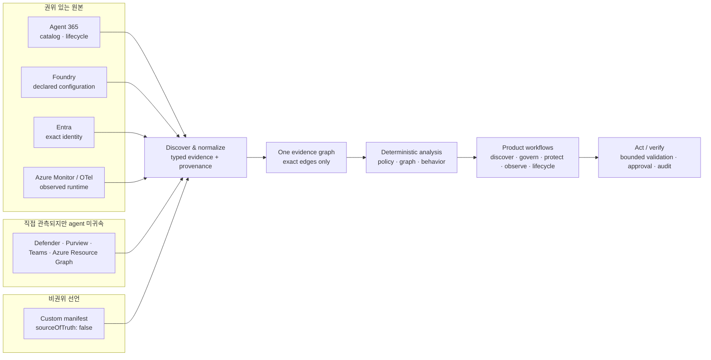

# Agent Sentinel

**여러 플랫폼에 흩어진 엔터프라이즈 AI 에이전트의 운영·보안·거버넌스 증거를 하나의 설명 가능한 그래프로 연결하는 통합 제어 계층입니다.**

Agent Sentinel을 사용하면 다음을 할 수 있습니다.

- **발견:** 어떤 에이전트가 어디에 있고 누가 소유하는지 한 인벤토리에서 확인
- **연결:** 에이전트·신원·도구·데이터·정책의 관계를 출처가 있는 증거로 추적
- **분석:** 결정론적 정책과 그래프 계산으로 노출 경로와 blast radius(영향 범위) 설명
- **검증:** 비파괴·제한적 검증과 remediation what-if로 변경 전후의 차이 확인
- **운영:** 증거 최신성, connector 상태, 릴리스 준비도, 수명주기를 같은 화면에서 판단

> **성숙도 · Release candidate repository** — 현재 Azure reference deployment는 Agent 365 read-only inventory를 ready/complete 상태로 제공하지만, 인증·정확한 identity correlation·대표 OTel 증거·write path는 아직 release gate를 통과하지 못했습니다. **아직 production release가 아닙니다.**

---

## Why Agent Sentinel

### 엔터프라이즈의 문제

하나의 조직에서도 AI agent estate(조직이 운영하는 모든 에이전트와 버전, 신원,
도구, 소유자, 환경의 집합)는 Microsoft Agent 365, Microsoft Foundry, Microsoft
Entra, Microsoft 365, Teams, 보안·데이터 거버넌스 제품, 자체 런타임에 나뉩니다.
각 관리 화면은 자기 플랫폼은 잘 보여 주지만, 다음 질문은 플랫폼 경계를 넘습니다.

- 이 에이전트는 **어떤 신원으로 실행**되고 무엇에 접근하는가?
- 발견된 위험은 선언된 가능성인가, 실제 runtime evidence(실행 증거)로 검증되었는가?
- 정책 예외와 승인, 변경 이력, rollback 근거가 같은 사실 집합을 가리키는가?
- 데이터가 없을 때 안전한 것인가, 아직 모르는 것인가?

Agent Sentinel은 이 조각들을 **evidence graph(증거 그래프)** 로 정규화합니다. 모든
노드·관계·판정은 출처, 신뢰도, 최신성, 관측 시각을 가지며, 지원되는 정확한 식별자가
없으면 관계를 만들지 않습니다.

### Before → After 예시

| 상황                                                     | Agent Sentinel 이전                                                                                             | Agent Sentinel 이후                                                                                    |
| -------------------------------------------------------- | --------------------------------------------------------------------------------------------------------------- | ------------------------------------------------------------------------------------------------------ |
| 보안 리더가 외부 전송 가능 에이전트의 영향 범위를 묻는다 | Foundry에서 agent 설정, Entra에서 service principal, Defender에서 alert, 운영팀에서 trace를 각각 찾아 수동 대조 | Exposure에서 동일 evidence graph의 경로·근거·최신성을 확인하고, 이론적 finding과 검증된 finding을 구분 |
| 플랫폼 소유자가 릴리스 가능 여부를 묻는다                | “connector가 연결됐다”는 보고와 실제 배포 이미지·인증·telemetry 상태가 섞임                                     | Demo Readiness와 릴리스 게이트에서 저장소 기능, 배포 상태, 누락 증거를 분리해 판단                     |
| 담당자가 정확한 identity ID를 찾지 못한다                | 이름·별칭으로 연결해 잘못된 권한 경로를 만들 위험                                                               | `RUNS_AS`를 생성하지 않고 unmatched 원인을 표시; 누락을 안전으로 간주하지 않음                         |

---

## Who it is for

| 사용자                            | Agent Sentinel에서 내리는 결정                                                                          |
| --------------------------------- | ------------------------------------------------------------------------------------------------------- |
| **Hackathon evaluator / judge**   | 제품이 실제 문제를 어떻게 풀고, demo evidence가 live·synthetic·unknown 중 무엇인지 판단                 |
| **Security leader / analyst**     | 어떤 exposure를 먼저 조사하고, 공격 경로와 영향 범위가 어떤 증거로 성립하는지 판단                      |
| **Agent platform owner / SRE**    | connector·snapshot·telemetry가 충분히 최신이고 완전한지, 무엇이 릴리스를 막는지 판단                    |
| **Governance / compliance owner** | 어떤 정책이 적용되고 어떤 예외·승인·감사 증거가 필요한지 판단                                           |
| **Agent owner / developer**       | agent가 어떤 control을 통과하지 못했고, 배포 전에 어떤 manifest·identity·telemetry를 고쳐야 하는지 판단 |
| **Approver / administrator**      | 제안된 변경의 근거·영향·rollback을 검토하고 승인 경계를 지킬지 판단                                     |

---

## How it works

### 1. Discover — 원본을 읽고 경계를 보존

읽기 전용 connector가 agent, identity, resource, policy, catalog, telemetry를 제한된
범위로 수집합니다. 각 source의 tenant·environment·project 경계와 provenance(출처
정보)를 보존합니다.

### 2. Correlate — 정확한 ID만 연결

타입이 지정된 공통 모델로 정규화한 뒤, provider가 제공한 정확한 식별자가 일치할
때만 `RUNS_AS` 같은 edge를 만듭니다. 이름·owner·alias·fuzzy text로 신원 관계를
추정하지 않습니다.

### 3. Analyze — 결정론적으로 계산

policy engine은 finding을, graph engine은 attack path와 blast radius를, behavior
engine은 충분한 OpenTelemetry(OTel) 측정값이 있을 때 drift·reliability·measured cost를
계산합니다. LLM은 기존 증거를 설명할 수 있지만 보안 사실이나 권한을 결정하지 않습니다.

### 4. Act / Verify — 먼저 미리 보고, 제한적으로 검증

사용자는 cited evidence를 확인하고 bounded validation(비파괴·시간·범위 제한 검증)과
remediation what-if를 수행합니다. 실제 변경은 인증·역할·승인·감사·rollback 조건을
통과해야 하며, 현재 공개 배포에서는 비활성입니다.



증거 종류는 다음처럼 다르게 취급합니다.

| 종류                           | 의미                                                          | Agent Sentinel의 처리                                                                         |
| ------------------------------ | ------------------------------------------------------------- | --------------------------------------------------------------------------------------------- |
| **Authoritative source**       | 해당 사실을 소유하는 원본 시스템의 레코드                     | 출처를 인용하고, 지원되는 exact ID가 있을 때만 다른 레코드와 연결                             |
| **Unattributed evidence**      | provider가 직접 반환했지만 특정 agent와 연결할 키가 없는 증거 | 독립 노드로 유지; agent 위험·건강·준수 상태로 임의 귀속하지 않음                              |
| **Non-authoritative manifest** | 운영자가 제공한 선언                                          | `sourceOfTruth: false`로 표시하고 권위 있는 source보다 우선하지 않으며, 실행 권한을 갖지 않음 |

---

## What you can see in the product

라우트 목록을 외우는 대신, 다음 workflow로 제품을 탐색할 수 있습니다.

| Workflow                | 주요 surface                                                              | 답하는 질문                                                                                |
| ----------------------- | ------------------------------------------------------------------------- | ------------------------------------------------------------------------------------------ |
| **Estate 발견**         | Overview, Agent inventory, Agent detail, Cloud resources, Connectors      | 무엇이 존재하고, 어디에서 왔으며, 어느 범위까지 보이는가?                                  |
| **노출 조사**           | Exposure list/detail, attack-path graph, Evidence drawer                  | finding이 왜 생겼고, 경로와 영향 범위는 무엇이며, 어떤 증거가 부족한가?                    |
| **거버넌스와 수명주기** | Governance, Work queue, Lifecycle, Trust catalog, Agent assurance catalog | 어떤 control·예외·승인·release/rollback 상태가 적용되는가?                                 |
| **관측과 최적화**       | Observability, Optimization                                               | evidence가 최신·완전한가, 측정된 drift·reliability·cost로 무엇을 개선할 수 있는가?         |
| **데모·릴리스 확인**    | Demo Readiness (`/demo-readiness`)                                        | Agent 365, connector binding, exact `RUNS_AS`, OTel, image identity가 실제로 준비되었는가? |

### 5-minute hackathon demo journey

1. **0:00 — Demo Readiness:** mock 성공으로 대체하지 않는 전체 readiness와 차단 원인을 먼저 보여 줍니다.
2. **0:45 — Overview → Agent inventory:** estate 규모와 source 상태를 확인하고 synthetic validation agent 하나를 선택합니다.
3. **1:30 — Agent detail:** declared configuration, identity, tool, evidence freshness를 함께 확인합니다.
4. **2:30 — Exposure detail:** 결정론적 finding, attack path, blast radius, cited evidence, bounded validation/what-if를 설명합니다.
5. **3:30 — Governance → Work queue:** 같은 finding이 policy posture와 승인·예외·감사 흐름으로 이어지는 모습을 보여 줍니다.
6. **4:15 — Observability → Lifecycle:** 누락·stale·insufficient evidence가 숨겨지지 않고 release blocker로 남는지 확인합니다.
7. **4:50 — Demo Readiness로 복귀:** 무엇이 repository-ready이고 무엇이 Azure에서 아직 미검증인지 요약합니다.

### Demo Readiness가 확인하는 것

- complete·live·source-bound Agent 365 package evidence와 deployment-managed connector binding
- 모든 대상 agent의 정확한 `RUNS_AS` edge, 그리고 **unmatched 0 / ambiguous 0**
- non-synthetic OTel invocation, trace/span provenance, measured token/cost provenance
- web/API/jobs의 기대 full Git SHA와 canonical image digest 일치

Package 수는 agent 수로 해석하지 않습니다. empty, unknown, stale, synthetic evidence는
ready로 승격되지 않습니다.

---

## Why it is different

### Agent 365와의 경계

Microsoft Agent 365는 자신이 관리하는 agent의 권위 있는 registry·administration plane입니다.
Agent Sentinel은 이를 대체하거나 agent 접근 권한을 부여하지 않습니다.

| 영역                             | Agent 365         | Agent Sentinel                                                      |
| -------------------------------- | ----------------- | ------------------------------------------------------------------- |
| Agent 등록·관리·entitlement      | 권위 있는 원본    | 읽고 인용하는 consumer                                              |
| Cross-platform inventory         | 관리 범위 중심    | Foundry·Entra·M365·Azure·custom runtime 증거를 한 graph로 상관 분석 |
| Attack path / blast radius       | 원본 관리 목적 밖 | 결정론적 graph 분석                                                 |
| Validation / remediation preview | 원본 관리 목적 밖 | bounded validation과 what-if                                        |
| Assurance                        | 플랫폼 상태       | Security·Governance·Lifecycle·Quality·Reliability·Cost의 독립 차원  |

### 제품 불변 원칙

- **Evidence-first deterministic core:** finding, edge, path, severity는 모델의 추측이 아니라 schema·policy·graph·threshold로 계산합니다.
- **No guessed safety:** 증거가 없으면 `unknown`, `partial`, `insufficient-data`, `unavailable`로 남깁니다.
- **Exact correlation only:** 권위 있는 exact ID가 없으면 관계를 만들지 않습니다.
- **Bounded validation:** 비파괴, read-only 또는 명시적으로 승인된 제한 범위에서만 검증합니다.
- **Explainable dimensions:** assurance 차원을 하나의 편안한 평균 점수로 숨기지 않고 각각의 coverage와 이유를 보여 줍니다.
- **Grounded AI boundary:** AI 설명은 제공된 evidence와 subgraph에 근거해야 하며, 보안 사실 생성이나 action 승인을 하지 않습니다.

---

## Production readiness

**현재 reference deployment는 live read-only 상태이지만 production release는 아닙니다.** 기준 URL은 `https://agent-sentinel-dadmh3cee9edbwha.b01.azurefd.net`입니다.

| 영역                      | Repository capability                                                                  | 검증된 현재 배포                                                                                                                                                                                                                                                                                                                                      | Release blocker                                                                                  |
| ------------------------- | -------------------------------------------------------------------------------------- | ----------------------------------------------------------------------------------------------------------------------------------------------------------------------------------------------------------------------------------------------------------------------------------------------------------------------------------------------------- | ------------------------------------------------------------------------------------------------ |
| **Release identity**      | full SHA·web/API/jobs digest 검증 도구 구현                                            | 세 구성요소 모두 SHA `dd7ff6a2f58944f135f4371cc36dffb49b1e27b8`; web `sha256:78f71224c06b8d1f3530c40265d9d27529c44079bb8a9381631f48271abde049`, API revision `api-as-m098047--p1dd7ff6a2` / `sha256:cf80f1587200a08a5ca981ba805a0f153d6e9d0cdca12cb18ad1c203e0dcb056`, jobs `sha256:360856accc536347ee1614bb258c08d8de6ab9dba3ac8af968085b2b86d2c40a` | 이 범주는 완료; 이후 변경은 새 full-SHA/digest 증거가 필요                                       |
| **Authentication / RBAC** | Entra JWT, MSAL, capability guard와 `Viewer`·`Analyst`·`Approver`·`Administrator` 구현 | replacement API/SPA 등록과 service principal 생성 완료; `AUTH_MODE=disabled`, `AGENT_SENTINEL_WRITE_ENABLED=false`; admin consent와 테스트 사용자 역할 할당 미완료                                                                                                                                                                                    | 활성 Entra application-administrator 역할로 Read consent/assignment 후 네 역할의 live token 검증 |
| **Agent 365**             | read-only deployment-managed connector와 persisted source health 구현                  | **ready + complete:** 308 packages → 302 agent-package nodes + 6 extension-package nodes + 308 live source-bound evidence records                                                                                                                                                                                                                     | 이 범주는 완료; package 수를 실행 agent 수로 해석하지 않음                                       |
| **Identity correlation**  | exact object/application/Agent Identity ID 진단과 `RUNS_AS` 생성 구현                  | authoritative Foundry agent 여섯 개에 usable exact identity ID가 없어 `RUNS_AS` 0                                                                                                                                                                                                                                                                     | 모든 대상 agent에 exact edge가 있고 unmatched·ambiguous가 모두 0이어야 함                        |
| **Runtime evidence**      | bounded Azure Monitor OTel query, drift·reliability·measured token/cost 분석 구현      | qualifying live OTel record 0; 상태는 `unknown` / `insufficient-data`                                                                                                                                                                                                                                                                                 | fresh·complete·unsampled non-synthetic spans와 exact trace/span/token/cost provenance 필요       |
| **Action safety**         | 역할·승인·감사·what-if·rollback foundation 구현                                        | live provider remediation 비활성; 공개 환경은 read-only posture                                                                                                                                                                                                                                                                                       | JWT와 reviewed Front Door mutation rule을 검증한 뒤 승인된 private reversible write만 별도 검증  |
| **Release review**        | exact-SHA 기반 deterministic release-review v2 구현                                    | 도구는 `dd7ff6a2` 배포에 포함됐지만 실제 Security·Accessibility·OneRAI·Release 승인은 없음                                                                                                                                                                                                                                                            | 실행된 증거 bundle과 네 human decision 필요                                                      |

Demo Readiness 결과는 **partial**입니다. Agent 365는 ready이지만 `RUNS_AS` 0, qualifying live OTel 0, authentication disabled, writes false가 그대로 blocker로 남습니다.

상세하고 날짜가 있는 상태는 [Current status](docs/current-status.md), 새 tenant 준비는 [New tenant bootstrap](docs/new-tenant-bootstrap.md), 제약은 [Known issues](docs/known-issues.md), connector별 상태는 [Connector availability](docs/connector-availability.md)를 기준으로 확인하십시오.

---

## Quick start

### 요구 사항

- Node.js 22 이상
- pnpm 10.15.1
- Linux 또는 WSL의 Linux file system

```bash
git clone https://github.com/<org>/agent-sentinel.git
cd agent-sentinel
pnpm install
pnpm dev
```

기본값은 deterministic mock connector이므로 다른 개발자는 Azure/Microsoft 365 계정이나 권한 없이 clone 후 제품 workflow를 재현할 수 있습니다. Live 재현은 별도의 tenant resource와 권한을 독립적으로 준비해야 하며 [New tenant bootstrap](docs/new-tenant-bootstrap.md)을 따라야 합니다.

- Web: `http://127.0.0.1:5173`
- API: `http://127.0.0.1:3001`

Live Foundry discovery는 `.env.example`의 `AGENT_SENTINEL_CONNECTOR=foundry`와
`FOUNDRY_*` 설정이 모두 필요합니다. 불완전한 live 설정은 mock으로 fallback하지 않고
startup을 실패시킵니다. 개발 방법은 [Development](docs/development.md)를 참고하십시오.

---

## Validation

```bash
pnpm format:check
pnpm lint
pnpm typecheck
pnpm test
pnpm build
pnpm test:e2e
pnpm validate
```

실제 provider 검증 script는 자동 CI에서 실행하지 않으며, 승인된 환경에서만 별도로
수행합니다. 검증 수치는 해당 full SHA와 실행 날짜가 함께 기록된 release evidence에서만
인용합니다.

### Post-deployment Demo Readiness verifier

Verifier는 credential이 포함되지 않은 `--url`, token 값이 아닌 `--token-env`, 그리고
web/API/jobs **모두의** full SHA와 digest를 요구하도록 사용합니다.

```bash
export AGENT_SENTINEL_BASE_URL='https://approved-front-door-host.example'
read -rsp 'Short-lived Viewer token: ' AGENT_SENTINEL_DEMO_TOKEN && echo
export AGENT_SENTINEL_DEMO_TOKEN

pnpm demo:verify -- \
  --url "$AGENT_SENTINEL_BASE_URL" \
  --token-env AGENT_SENTINEL_DEMO_TOKEN \
  --expected-web-sha "$WEB_SHA" \
  --expected-api-sha "$API_SHA" \
  --expected-jobs-sha "$JOBS_SHA" \
  --expected-web-digest "$WEB_DIGEST" \
  --expected-api-digest "$API_DIGEST" \
  --expected-jobs-digest "$JOBS_DIGEST"
```

Token, digest, tenant 정보는 문서·로그·shell history에 기록하지 않습니다. 상세 절차는
[Runbooks](docs/runbooks.md)의 Demo Readiness runbook을 따릅니다.

### Exact-SHA release review dry-run

`release-review:dry-run`은 Security·Accessibility·OneRAI·배포·connector·Demo Readiness
증거를 한 exact SHA에 묶고, 누락된 증거와 human decision을 `blocked`로 남깁니다. 로컬
Git과 제공된 sanitized JSON만 읽으며 배포, 승인, reviewer 연락, 외부 form 제출을 하지
않습니다.

```bash
SHA="$(git rev-parse HEAD)"

pnpm release-review:schema:check
pnpm release-review:dry-run -- \
  --dry-run \
  --sha "$SHA" \
  --input release-evidence/v2/templates/sanitized-input.template.json \
  --output release-evidence/generated \
  --timestamp '2026-09-14T01:00:00.000Z'
pnpm release-review:validate -- \
  --sha "$SHA" \
  "release-evidence/generated/release-review-v2-$SHA.json"
```

실제 axe/Playwright artifact가 없으면 Accessibility는 자동으로 blocked입니다. artifact를
사용할 때도 raw HTML, DOM, email, tenant/subscription ID, local path, payload를 넣지 않고
정규화 가능한 sanitized JSON만 `--accessibility`로 전달합니다. 입력 계약과 reviewer
절차는 [Release evidence](docs/release-evidence.md)를 참고하십시오.

---

## Deployment overview

Production candidate 이미지는 mutable tag가 아니라 `@sha256:<digest>`로 식별하고, private ACR에 접근 가능한 target VNet self-hosted runner에서 빌드합니다. 현재 reference deployment의 immutable 버전은 위 Production readiness 표에 기록되어 있으며, repository head `456d01f2`와 동일하지 않습니다.

1. 검증할 exact full Git SHA를 선택합니다.
2. web/API/jobs image를 빌드하고 각각의 canonical digest를 기록합니다.
3. 전체 Bicep 재적용 대신 reviewed surgical change와 `what-if`를 검토합니다.
4. **API → jobs → web** 순서로 배포하며 각 단계의 health·snapshot·same-origin 동작을 확인합니다.
5. `pnpm demo:verify`로 Agent 365, exact `RUNS_AS`, OTel, version/digest를 판정합니다.
6. 실패하면 저장한 이전 revision/digest로 **API → jobs → web** 순서로 rollback합니다.

현재 resource group에는 desired state와 drift가 있으므로 승인 없이 전체
`deployment group create`를 실행하지 않습니다. 자세한 내용은
[Deployment](docs/deployment.md)와 [Supply chain](docs/supply-chain.md)을 참고하십시오.

---

## Release criteria

다음 조건이 모두 증거로 확인되기 전에는 production release로 선언하지 않습니다.

- [ ] reviewed full SHA와 web/API/jobs digest가 실제 revision과 일치
- [ ] Entra `AUTH_MODE=jwt`, writes false, 로그인·로그아웃·anonymous `401`·Viewer `403` 검증
- [ ] `Viewer`·`Analyst`·`Approver`·`Administrator` 네 역할의 capability 경계 검증
- [x] Agent 365 source가 persisted snapshot에서 `ready + complete` (308 packages, 302 agent-package nodes, 6 extension-package nodes, 308 source-bound evidence records)
- [ ] 모든 대상 agent의 exact `RUNS_AS` edge 존재, unmatched 0, ambiguous 0
- [ ] representative non-synthetic OTel span과 trace/span/token/cost provenance 충족
- [ ] 공개 write는 차단되고, 필요한 경우 승인된 private reversible write만 검증
- [ ] exact-SHA bundle의 Security·Accessibility·OneRAI 증거가 pass이고 각 human decision이 실제 담당자에게 승인됨
- [ ] sanitized release evidence에 full SHA, image digests, config hash, check 결과 기록
- [ ] 이전 digest와 **API → jobs → web** rollback 절차 검증

---

## Repository structure

```text
apps/
  web/          React + Fluent UI product experience
  api/          Fastify API, read model, auth/RBAC boundary
  jobs/         discovery, correlation, policy evaluation, persistence

connectors/     Foundry, Agent 365, Entra, OTel, ARG, Defender, Purview,
                Teams, Power Platform, manifest, mock

packages/
  domain/       typed evidence, estate, correlation contracts
  connector-*/  connector contracts and runtime composition
  graph-engine/ attack path and blast radius
  policy-engine/ deterministic exposure policies
  behavior-engine/ drift, reliability, measured token economics
  persistence/  Cosmos-backed repositories
  ui/           shared accessible product primitives

infra/          Bicep and environment parameters
scripts/        validation, auth preflight, release evidence, demo verifier
docs/           product, architecture, security, operations, decisions
```

---

## Documentation

| 시작점           | 문서                                                                                                                                                                                               |
| ---------------- | -------------------------------------------------------------------------------------------------------------------------------------------------------------------------------------------------- |
| 제품 언어와 경계 | [Product overview](docs/product-overview.md) · [Domain context](docs/CONTEXT.md)                                                                                                                   |
| 현재 사실과 제약 | [Current status](docs/current-status.md) · [Known issues](docs/known-issues.md) · [Connector availability](docs/connector-availability.md)                                                         |
| 설계             | [Architecture](docs/architecture.md) · [Data model](docs/data-model.md) · [ADR 0002: evidence-first core](docs/adr/0002-evidence-first-deterministic-core.md)                                      |
| 보안과 인증      | [Security and authentication](docs/security-authentication.md)                                                                                                                                     |
| 개발과 운영      | [Development](docs/development.md) · [New tenant bootstrap](docs/new-tenant-bootstrap.md) · [Deployment](docs/deployment.md) · [Runbooks](docs/runbooks.md) · [Supply chain](docs/supply-chain.md) |
| 계획             | [Roadmap](docs/roadmap.md)                                                                                                                                                                         |

Agent Sentinel은 원본 관리 plane을 대신하지 않습니다. 서로 다른 원본의 증거를 정직하게
연결하고, 연결할 수 없는 것은 연결하지 않으며, 조직이 **발견 → 상관 분석 → 판단 → 검증**의
한 흐름으로 AI agent estate를 운영하도록 돕습니다.
