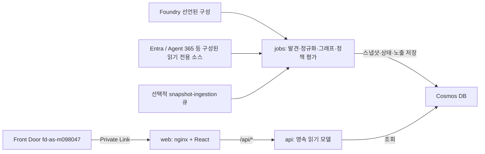

<a id="agent-sentinel"></a>

# Agent Sentinel 제품 명세

> 통합 AI 에이전트 운영·거버넌스·보안·수명주기 플랫폼

**문서의 역할:** 원래 제품 목표·요구사항·단계별 계획을 보존하는 명세다.
현재 구현·배포 완료를 뜻하지 않는 목표는 그대로 목표로 유지한다.
2026-09-15 코드 대조 기준은 `1129bbe8727ab9cb7a2e49a1f417a8e042d9ad94`,
실제 배포는 `7c1336bc7985ea7e383c335d631b7c705fffb97c`이다.
[현재 상태](docs/current-status.md)가 날짜별 현황의 기준 원천이며, 아래 구현 상태 표와
[아키텍처](docs/architecture.md)·[데이터 모델](docs/data-model.md)이 설계와 구현의 차이를 설명한다.

<a id="1-executive-summary"></a>

## 1. 핵심 요약

Agent Sentinel은 Microsoft와 타사 생태계 전반의 기업용 에이전트를 발견하고, 거버넌스를 적용하고, 보호하고, 관찰하고, 최적화하며 수명주기를 관리하기 위한 AI 에이전트 운영 및 보안 플랫폼이다.

Microsoft Agent 365, Microsoft Entra Agent ID, Microsoft Defender, Microsoft Purview, Copilot Studio, Microsoft Foundry는 이미 등록, ID, 모니터링, 보호, 거버넌스의 일부 영역에서 권위 있는 기능을 제공한다. Agent Sentinel은 이를 대체하지 않는다. 각 시스템의 증거를 연결하고 제어 평면 사이의 운영 공백을 메운다.

플랫폼이 지향하는 것은 운영 수명주기 전반의 다음 질문에 답하는 일이다.

1. **발견:** 어떤 에이전트, ID, 도구, MCP 서버, 소유자, 의존성이 존재하는가?
2. **거버넌스:** 승인과 소유권이 확보되어 있고, 규정을 준수하며 정책 범위 안에서 운영되는가?
3. **보호:** 어디에 도달할 수 있고 어떻게 악용될 수 있으며, 가장 안전한 대응은 무엇인가?
4. **관찰:** 정상적이고 효과적이며 안전하고 예상대로 동작하는가?
5. **최적화:** 어떤 권한, 모델, 워크플로, 비용, 미사용 자산을 변경해야 하는가?
6. **수명주기:** 조직이 안전하게 승격, 버전 관리, 승인, 운영, 폐기할 수 있는가?

증거 그래프는 에이전트, ID, 권한, 도구, MCP 서버, 데이터 소스, 소유자, 활동, 비용, 품질, 정책, 배포 이력을 연결한다. 보안 공격 경로 관리는 대표 차별점이자 심사 발표의 핵심이며, 더 넓은 운영 플랫폼은 이 프로젝트를 실제 배포 가능한 기업용 제품으로서 설득력 있게 만든다.

지향하는 포지셔닝:

> **기업 AI 에이전트 자산군을 위한 통합 운영 및 보안 제어 평면**

기억에 남을 보안 차별점:

> **AI 에이전트를 위한 Defender Attack Path + 노출 관리 + SOAR(보안 오케스트레이션·자동화·대응)**

<a id="2-decision-and-evidence-status"></a>

## 2. 결정 및 증거 현황

### 현재 구현 상태(2026-09-15)

| 영역                | 코드에 구현된 범위                                                               | 배포·관찰 사실                                                                                                  | 남은 목표·경계                                                                 |
| ------------------- | -------------------------------------------------------------------------------- | --------------------------------------------------------------------------------------------------------------- | ------------------------------------------------------------------------------ |
| 실행 구조           | `apps/web`, `apps/api`, `apps/jobs`와 공통 TypeScript 패키지                     | `fd-as-m098047` 뒤 세 앱은 `7c1336bc`; 핵심은 읽기 전용 인벤토리                                                | 최신 코드 `1129bbe8`은 미배포                                                  |
| 발견·카탈로그       | Foundry 및 선택적 공급자 커넥터, 영속 스냅샷, Catalog                            | Foundry 합성 검증 에이전트 6개; Agent 365 패키지 308개 = 에이전트 패키지 노드 302개 + 확장 패키지 제어 노드 6개 | 패키지·카탈로그는 실행 중인 에이전트 수나 개인별 사용 권한이 아님              |
| ID·로그인           | Entra 인벤토리, 정확한 ID 결합, MSAL/JWT와 네 역할                               | Entra 레코드 344개; `RUNS_AS` 0개; `AUTH_MODE=disabled`                                                         | 동의·역할 할당·실제 JWT 검증과 에이전트 측 정확한 런타임 ID 증거가 별도로 필요 |
| 개인화              | `/my-agents`, 기본 거부형 `/api/employee/agent-catalog`                          | 권위 있는 사용 권한 해석기 미구성                                                                               | 로그인만으로 `My agents`가 채워지지 않음                                       |
| 보호·그래프         | 결정론적 그래프·정책, `AS-POL-001..003` 노출 평가, 증거 기반 개선 조치 미리 보기 | 선언된 구성에 대한 실환경 읽기 모델; 기존 공격 경로 픽스처는 모의 전용                                          | 실제 악용·런타임 경로 검증·공급자 개선 조치 실행 증거 없음                     |
| 거버넌스·수명주기   | 사례·예외·전이·감사, 릴리스 준비도, 오프라인 release-review 도구                 | `AGENT_SENTINEL_WRITE_ENABLED=false`, 준비도 `partial`                                                          | 도구나 상태 전이는 실제 승격·롤백·폐기 또는 사람의 승인이 아님                 |
| 관찰·최적화         | OTel 읽기 어댑터, 결정론적 기준선·드리프트·실측 비용 분석                        | 런타임 증거 `unavailable`; 적격/조회 에이전트·증거 모두 0; OTel `degraded`/`not-queried`                        | 실제 호출·권위 있는 호출 비용·고객 절감·성과 증거 없음                         |
| 확장·개발 단계 검사 | 비권위적 매니페스트 어댑터, 오프라인 스캔/SARIF, 외부 런타임 SDK·ID 파일럿 도구  | 매니페스트 수집 차단; SDK·파일럿 도구와 Foundry `instance_identity` 지원은 미배포                               | 파일럿 승인·생성·SDK 채택·실제 계측 실행을 주장하지 않음                       |
| 검증·승인           | 자동 검사와 릴리스 증거 도구                                                     | 정식 Security·Accessibility·OneRAI·릴리스 승인 미기록                                                           | 과거 전체 검사 수는 원래 날짜/SHA에만 귀속; 최신 후보 전체 통과 선언 없음      |

2026-09-16 18:00 KST는 **내부 후보 동결 목표**이지 프로덕션 가동 승인일이 아니다.
현재 시연은 [인수인계의 5분 데모](docs/maintainer-handoff.md#5-minute-demo)를 따르며,
아래의 원래 7분 보안 시나리오나 장기 목표를 실환경 달성으로 발표하지 않는다.

<a id="21-is-there-already-an-identical-microsoft-internal-app"></a>

### 2.1 동일한 Microsoft 내부 앱이 이미 있는가?

2026-08-14 기준, 프로젝트 소유자가 접근할 수 있는 Microsoft 365 소스를 검색했으나 다음 기능을 모두 결합한 **정확히 일치하는 배포된 애플리케이션은 확인하지 못했다**.

- Microsoft 및 타사 에이전트 발견
- 에이전트→ID→도구→데이터 공격 경로 분석
- 영향 반경 계산
- 안전한 적대적 검증
- 제품 간 인시던트 재구성
- 사람의 승인을 거친 격리와 개선 조치
- 비용과 위험의 통합 우선순위 지정
- 신뢰성, 품질, 도입률, 비즈니스 성과의 상관관계 분석
- 플랫폼 간 릴리스, 예외, 드리프트, 폐기 워크플로
- 증거 기반 에이전트·MCP·도구 Trust Catalog(신뢰 카탈로그)

이러한 내부 프로젝트가 존재하지 않는다는 증거는 아니다. 검색 가시성은 권한, 인덱싱, 조직 정책, 기밀 프로젝트에 의해 제한된다. 프로젝트 등록 전에 HackBox/Innovation Studio를 검색하고 관련 Agent 365, Entra, Defender, Purview, Copilot Studio 이해관계자에게 확인해야 한다.

<a id="22-existing-overlap"></a>

### 2.2 기존 기능과의 중복

아래는 2026-08-14 기획 당시의 활용 후보와 중복 분석이다. 각 공급자의 전체 기능이
현재 커넥터로 수집된다는 뜻은 아니며, 실제 범위는 [커넥터 가용성](docs/connector-availability.md)을 따른다.

| 기존 기능                   | 기준 기록 시스템 후보              | Agent Sentinel의 활용 방식              |
| --------------------------- | ---------------------------------- | --------------------------------------- |
| 에이전트 레지스트리 및 관리 | Microsoft Agent 365                | 활용하되 재구현하지 않음                |
| 에이전트 ID 및 접근         | Microsoft Entra Agent ID           | ID 및 권한 증거 활용                    |
| 위협 탐지 및 인시던트       | Microsoft Defender                 | 보강 및 상관관계 분석                   |
| 데이터 보안 및 컴플라이언스 | Microsoft Purview                  | 레이블, DLP 발견 사항, 데이터 위험 활용 |
| Copilot 에이전트 수명주기   | Copilot Studio 관리 화면           | 발견 및 딥 링크 연결                    |
| Foundry 에이전트 원격 분석  | Microsoft Foundry 및 Azure Monitor | 추적, 평가, 비용 신호 수집              |
| 클라우드 리소스 인벤토리    | Azure Resource Graph               | 리소스 및 관계 발견                     |

<a id="23-defensible-product-gap"></a>

### 2.3 근거를 제시할 수 있는 제품 공백

프로젝트는 기존 시스템 사이의 공백에 집중할 때만 가치가 있다.

- 또 하나의 자산 목록이 아닌 제어 평면 간 관계 그래프
- 개별 알림이 아닌 에이전트 특화 공격 경로
- 일반적인 위험 점수가 아닌 증거 기반 영향 반경
- 구성 검사에 그치지 않는 지속적이고 안전한 검증
- 클릭 한 번의 파괴적 작업이 아닌 조율된 가역적 개선 조치
- 개방형 커넥터 계약을 통한 자사 및 타사 커버리지
- 각 시스템의 기본 관리 기능 복제가 아닌 제품 간 운영 인텔리전스
- 하나의 증거 모델에서 수명주기, 품질, 비용, 위험, 비즈니스 가치의 상관관계 분석
- 분리된 허용 목록이 아닌 승인된 에이전트·MCP·도구 Trust Catalog

<a id="3-product-goals"></a>

## 3. 제품 목표

<a id="31-primary-goals"></a>

### 3.1 주요 목표

- 에이전트 자산군의 지속적으로 갱신되는 인벤토리와 증거 그래프를 구축한다.
- 플랫폼 전반의 소유권, 신뢰, 수명주기, 배포 상태를 확립한다.
- ID, 데이터, 도구, MCP, 자율성, 릴리스, 품질, 비용에 중앙 관리 정책을 적용한다.
- 에이전트 또는 사용자가 제어하는 입력에서 민감한 작업이나 데이터에 이르는 악용 가능한 경로를 찾는다.
- 도달 가능성, 악용 가능성, 영향, 관찰된 활동으로 발견 사항의 우선순위를 지정한다.
- 안전한 비파괴 시뮬레이션으로 중요한 발견 사항을 검증한다.
- 모든 근거 증거를 포함한 인시던트 설명을 생성한다.
- 명시적 승인 후 가역적 개선 조치를 권고하고 실행한다.
- 신뢰성, 품질, 지연 시간, 사용량, 비용을 보안 및 비즈니스 영향과 연계한다.
- 적정 규모 조정, 권한 축소, 모델 라우팅, 폐기, 워크플로 개선을 권고한다.
- 승격, 승인, 버전 비교, 예외, 폐기 워크플로를 관리한다.
- 거버넌스가 적용되는 카탈로그로 신뢰할 수 있는 에이전트, MCP 서버, 도구, 커넥터를 게시한다.
- 어댑터를 통해 Microsoft 네이티브 및 타사 에이전트를 지원한다.

<a id="32-non-goals"></a>

### 3.2 목표에 포함하지 않는 사항

- Agent 365, Entra, Defender, Purview, Copilot Studio 대체.
- 범용 SIEM, DLP 엔진, ID 플랫폼 구축.
- 승인 없는 프로덕션 에이전트 자동 비활성화.
- 커넥터에 필요한 권한이 없는데도 완전한 발견을 주장하는 것.
- 검증 중 실제 비밀, 유해한 프롬프트, 파괴적인 도구 호출 전송.
- 컴플라이언스 인증 결정.
- 플랫폼 기본 제작 환경 대체 또는 범용 에이전트 빌더로의 전환.
- 회계 기준 기록 시스템 역할. Agent Sentinel은 운영 비용 신호의 상관관계를 분석한다.

<a id="4-target-personas"></a>

## 4. 대상 사용자

| 사용자 유형                | 주요 요구                                                    |
| -------------------------- | ------------------------------------------------------------ |
| CISO / 보안 책임자         | 전체 에이전트 노출과 비즈니스 영향 파악                      |
| SOC 분석가                 | 에이전트 관련 인시던트 조사 및 격리                          |
| ID 관리자                  | 과도하거나 오래된 에이전트 권한 탐지                         |
| AI 플랫폼 관리자           | 개발 플랫폼 전반의 에이전트 거버넌스                         |
| 에이전트 개발자            | 위험한 도구, 프롬프트, ID, 데이터 접근 수정                  |
| 데이터 보호 책임자         | 에이전트가 접근하거나 유출할 수 있는 민감 데이터 파악        |
| FinOps 담당자              | 비용이 크거나 방치되었거나 이상이 있는 에이전트 식별         |
| 비즈니스 프로세스 소유자   | 도입률, 성과, 신뢰성, 비즈니스 가치 파악                     |
| 컴플라이언스 / 위험 담당자 | 정책 준수 상태, 예외, 증거, 확인 진술 검토                   |
| 에이전트 이용자            | 명확한 신뢰 신호를 갖춘 승인된 에이전트, MCP 서버, 도구 검색 |

<a id="5-core-user-journeys"></a>

## 5. 핵심 사용자 여정

<a id="51-discover-shadow-and-unmanaged-agents"></a>

### 5.1 섀도 및 비관리 에이전트 발견

1. Microsoft 및 타사 소스를 연결한다.
2. 발견한 자산을 공통 모델로 정규화한다.
3. ID, 소유자, 도구, 데이터 소스, 원격 분석을 연결한다.
4. 소유자 없음, 미등록, 오래됨, 부분 관찰 상태의 에이전트를 표시한다.
5. 발견 신뢰도와 누락된 증거를 표시한다.

<a id="52-investigate-an-attack-path"></a>

### 5.2 공격 경로 조사

1. 분석가가 심각한 발견 사항을 연다.
2. 그래프가 다음과 같은 경로를 강조한다.

   `외부 사용자 입력 -> 영업 에이전트 -> 과도한 권한의 ID -> 원격 MCP 서버 -> 고객 데이터`

3. Agent Sentinel이 각 간선을 설명하고 증거 출처를 인용한다.
4. 영향 반경은 도달 가능한 데이터, 작업, 사용자, 하위 에이전트를 보여 준다.
5. 분석가는 안전한 검증을 실행하거나 최신 결과를 검토한다.

<a id="53-contain-an-incident"></a>

### 5.3 인시던트 격리

1. 정책 또는 원격 분석 신호가 발견 사항을 생성한다.
2. Agent Sentinel이 ID, 에이전트, 도구, 데이터 시스템의 관련 활동을 연계한다.
3. 예상 영향과 함께 작업의 우선순위를 권고한다.
4. 인가된 검토자가 하나 이상의 작업을 승인한다.
5. 시스템이 커넥터를 통해 실행하고 결과를 기록하며, 가능한 경우 롤백 타이머를 시작한다.

<a id="54-prevent-unsafe-publication"></a>

### 5.4 안전하지 않은 게시 방지

1. CI/CD가 에이전트 매니페스트 또는 인프라 계획을 제출한다.
2. Agent Sentinel이 권한, 도구, MCP 엔드포인트, 데이터 접근, 정책을 평가한다.
3. 풀 리퀘스트에 증거 기반 통과, 경고, 차단 결과를 제공한다.
4. 개발자에게 구체적인 최소 권한 및 아키텍처 권고를 제공한다.

<a id="55-operate-and-optimize-the-agent-estate"></a>

### 5.5 에이전트 자산군 운영 및 최적화

1. 운영 담당자가 공통 스코어카드에서 신뢰성, 지연 시간, 품질, 비용, 도입률, 보안을 검토한다.
2. Agent Sentinel이 반복적인 도구 재시도, 낮은 작업 완료율, 과도한 권한을 가진 고비용 에이전트를 식별한다.
3. 모델 라우팅, 재시도 정책 변경, 권한 축소, 소유자 승인 실험을 권고한다.
4. 소유자는 변경을 승격하기 전에 전후 품질, 비용, 위험을 비교한다.

<a id="56-manage-the-lifecycle"></a>

### 5.6 수명주기 관리

1. 개발자가 매니페스트, 소유자, ID, 도구, 테스트, 목표 비즈니스 성과와 함께 새 에이전트 버전을 등록한다.
2. 정책 검사와 검증 게이트가 릴리스 준비 상태를 판단한다.
3. 필요한 보안·데이터·비즈니스 승인자가 동일한 증거를 검토한다.
4. Agent Sentinel이 승격, 롤백, 예외, 폐기 이력을 기록한다.
5. 오래되거나 소유자가 없거나 중복되거나 미사용인 버전은 검토 및 폐기 워크플로에 들어간다.

<a id="57-discover-trusted-capabilities"></a>

### 5.7 신뢰할 수 있는 기능 발견

1. 에이전트 개발자가 Trust Catalog에서 승인된 MCP 서버나 도구를 검색한다.
2. 카탈로그는 소유자, 출처, 게시자, 권한, 데이터 처리, 검증 상태, 알려진 발견 사항, 사용량, 호환성을 표시한다.
3. 개발자가 접근을 요청하거나 에이전트 매니페스트에 기능을 추가한다.
4. Agent Sentinel이 배포 전에 새 관계를 평가한다.

<a id="6-differentiating-capabilities"></a>

## 6. 차별화 기능

<a id="61-agent-exposure-graph"></a>

### 6.1 에이전트 노출 그래프

이 절의 노드·간선 목록은 목표 모델이다. 현재 `GraphNode.kind`와 `GraphEdge.relationship`
열거형은 [데이터 모델](docs/data-model.md#graphnode)에 정의된 더 작은 집합이며,
아래 관계가 모두 현재 스키마에 존재하거나 실환경에서 관찰되었다고 가정하지 않는다.

다음 노드 타입을 모델링한다.

- 에이전트
- 에이전트 버전
- 사람인 소유자
- 서비스 주체 / 관리 ID / 에이전트 ID
- 권한 부여 및 역할 할당
- 도구, 함수, 플러그인, 커넥터, API
- MCP 서버
- 데이터 소스 및 민감 데이터 분류
- 환경, 구독, 리소스 그룹, 테넌트
- 정책
- 활동 이벤트
- 발견 사항 및 인시던트
- 개선 조치
- 모델 배포

주요 간선 타입:

- `OWNS`
- `DEPLOYED_IN`
- `RUNS_AS`
- `HAS_PERMISSION`
- `CAN_CALL`
- `CONNECTS_TO`
- `READS_FROM`
- `WRITES_TO`
- `DELEGATES_TO`
- `TRUSTS`
- `TRIGGERED_BY`
- `VIOLATES`
- `OBSERVED_IN`
- `REMEDIATED_BY`

모든 노드와 간선에는 다음이 포함되어야 한다.

- 소스 커넥터
- 소스 객체 ID
- 최초 및 마지막 관찰 타임스탬프
- 증거 URI 또는 불변 증거 참조
- 신뢰도 점수
- 데이터 최신성
- 민감도 수준

<a id="62-attack-path-engine"></a>

### 6.2 공격 경로 엔진

LLM 추론을 추가하기 전에 결정론적 그래프 규칙으로 시작한다.

가치가 높은 경로의 예:

- 신뢰할 수 없는 입력에서 민감 데이터 읽기로 이어지는 경로
- 신뢰할 수 없는 입력에서 영향이 큰 쓰기 작업으로 이어지는 경로
- 외부 MCP 서버에서 특권 에이전트 ID로 이어지는 경로
- 애플리케이션 권한은 있지만 소유자가 없는 에이전트
- 신뢰 경계를 넘는 에이전트 간 위임
- 민감 데이터 소스에서 외부 송신이 가능한 도구로 이어지는 경로
- 활성 자격 증명을 가진 오래된 에이전트
- 서로 무관한 여러 에이전트가 사용하는 공유 ID
- 자신의 지침, 도구, 정책 소스를 수정할 수 있는 에이전트
- 사람인 사용자에서 에이전트를 거쳐 승인 없이 특권 작업으로 이어지는 경로

위험 점수:

```text
risk =
  reachability
  * exploitability
  * business_impact
  * privilege_factor
  * data_sensitivity
  * activity_factor
  * confidence
  * compensating_control_discount
```

UI는 요인별 값과 증거를 보여 주어야 한다. 설명 없는 LLM 생성 점수를 제시해서는 안 된다.

<a id="63-blast-radius-analysis"></a>

### 6.3 영향 반경 분석

선택한 에이전트 또는 ID에 대해 다음을 계산한다.

- 도달 가능한 도구와 작업
- 도달 가능한 데이터 소스와 민감도
- 하위 에이전트
- 영향을 받는 사용자 또는 비즈니스 프로세스
- 환경 간 및 테넌트 간 경계
- 도달 가능한 최대 권한
- 도달 가능한 각 간선의 최근 사용량
- 어떤 간선 제거가 노출을 가장 크게 줄이는지

<a id="64-continuous-agent-validation"></a>

### 6.4 지속적인 에이전트 검증

격리되거나 명시적으로 승인된 환경에서 안전한 검증 팩을 실행한다.

초기 팩:

- 프롬프트 인젝션 저항성
- 문서 또는 도구 출력을 통한 간접 프롬프트 인젝션
- 도구 매개변수 조작
- MCP 기능 불일치
- 합성 카나리 데이터를 사용한 데이터 유출 시도
- 권한 상승 시도
- 에이전트 간 지침 오염
- 과도한 자율성 / 승인 검사 누락
- 민감한 출력 처리
- 비용 고갈 공격 및 폭주 루프 탐지

안전 요구사항:

- 기본적으로 합성 데이터만 사용
- 허용 목록에 있는 도구와 엔드포인트
- 프로덕션 쓰기 작업 금지
- 엄격한 시간·토큰·비용 예산
- 긴급 중지 스위치
- 전체 추적 캡처
- 위험도가 높은 팩에 대한 사람의 승인

<a id="65-response-orchestration"></a>

### 6.5 대응 오케스트레이션

초기 대응 작업:

- Agent Sentinel 커넥터 또는 게이트웨이 경로 비활성화
- 게이트웨이에서 원격 MCP 엔드포인트 차단
- 테스트 자격 증명 취소 또는 교체
- 테스트 역할 할당 제거
- Sentinel 정책 계층에서 에이전트 격리
- 선택한 도구에 승인 요구
- 실행 및 비용 할당량 축소
- 증거와 소유자 정보를 담은 티켓 생성
- 구성된 내부 워크플로를 통한 소유자 알림

프로덕션 작업은 다음 조건을 충족해야 한다.

- 명시적으로 승인됨
- 중단 영향을 최소화함
- 멱등적임
- 감사됨
- 대상 플랫폼이 롤백을 지원하면 되돌릴 수 있음
- RBAC 및 직무 분리로 보호됨

<a id="66-policy-as-code"></a>

### 6.6 코드형 정책

버전이 지정된 YAML 정책과 결정론적 평가 엔진을 사용한다.

다음 `AS-POL-004`는 원래 목표를 설명하는 정책 예시이며 현재 배포 정책이 아니다.
현재 실환경 노출 평가는 `@agent-sentinel/policy-engine`의 `AS-POL-001..003`을 사용한다.

```yaml
id: AS-POL-004
name: Sensitive data requires controlled egress
severity: critical
scope:
  environments: [prod]
when:
  all:
    - agent.canAccessDataSensitivity: [confidential, highly_confidential]
    - agent.hasExternalEgress: true
    - agent.hasApprovedEgressControl: false
then:
  finding: 'Sensitive data can reach an uncontrolled external endpoint.'
  recommendations:
    - block_external_endpoint
    - require_human_approval
    - reduce_data_permissions
```

정책 팩:

- 에이전트 ID 기준선
- 최소 권한
- MCP 신뢰 및 출처
- 데이터 접근 및 외부 송신
- 사람의 감독
- 로깅 및 추적 가능성
- 소유권 및 수명주기
- 비용 및 할당량
- 타사 에이전트 온보딩

<a id="67-incident-story-builder"></a>

### 6.7 인시던트 설명 생성기

타임스탬프가 있는 증거 기반 설명을 생성한다.

- 최초 트리거
- 에이전트 버전과 지침 집합
- 사용한 ID
- 호출한 도구
- 접근한 데이터
- 정책 결정
- 관련 Defender/Purview/Entra 신호
- 영향 반경
- 격리 작업
- 잔여 위험

LLM은 구조화된 증거 요약에만 사용한다. 중요한 모든 진술에는 증거 객체를 인용해야 한다.

<a id="68-developer-shift-left-integration"></a>

### 6.8 개발 단계의 조기 보안 통합

제공할 항목:

- 에이전트 매니페스트 및 커넥터 정의용 CLI 스캐너
- GitHub Actions 및 Azure DevOps 파이프라인 통합
- 풀 리퀘스트 주석
- SARIF 출력
- 로컬 정책 평가
- 최소 권한 변경 제안
- 새 노출 방지를 위한 기준선 비교

<a id="69-finops-and-sustainability"></a>

### 6.9 FinOps 및 지속 가능성

위험을 다음 항목과 연계한다.

- 토큰 및 모델 비용
- 도구 호출 비용
- 재시도 및 루프 이상
- 프로비저닝되었지만 유휴 상태인 에이전트
- 성공한 비즈니스 작업당 비용
- 프롬프트, 모델, 도구 변경 후 비용 급증

비용 최적화는 운영 차원 중 하나이다. 심사 발표의 중심은 계속 보안이다.

<a id="610-unified-operational-scorecard"></a>

### 6.10 통합 운영 스코어카드

모든 에이전트와 버전에 다차원 스코어카드를 제공한다.

- 보안 노출
- 거버넌스 준수
- 신뢰성 및 가용성
- 작업 품질 및 평가 결과
- 지연 시간
- 도입률 및 활성 사용자
- 비즈니스 성과 또는 작업 완료
- 성공 성과당 비용
- 소유권 및 수명주기 건전성
- 증거 커버리지 및 신뢰도

이 차원들을 설명 없는 숫자 하나로 합쳐서는 안 된다. 추세, 기여 요인, 증거, 목표 임계값,
최근 변경의 효과를 보여 준다.

<a id="611-lifecycle-and-release-governance"></a>

### 6.11 수명주기 및 릴리스 거버넌스

- 에이전트 등록 및 소유권 확인 진술
- 버전 계보 및 환경 승격
- 릴리스 준비 상태 검사
- 위험 및 환경별 필수 승인
- 소유자, 사유, 만료, 보완 통제가 있는 정책 예외
- 카나리 배포 및 롤백 증거
- 승인된 구성과 배포된 구성 사이의 드리프트 탐지
- 오래됨, 중복, 방치, 수명 종료 탐지
- ID, 자격 증명, 도구, 데이터 접근, 보존 증거를 포괄하는 폐기 워크플로

<a id="612-agent-mcp-and-tool-trust-catalog"></a>

### 6.12 에이전트·MCP·도구 신뢰 카탈로그

승인된 기능과 발견된 기능을 검색할 수 있는 카탈로그를 만든다.

- 게시자 및 소유자
- 출처 및 소스 리포지토리
- 지원 프로토콜 및 버전
- 요청 권한 및 데이터 접근
- 호스팅 위치 및 엔드포인트 신뢰
- 검증 이력 및 알려진 발견 사항
- 사용량 및 의존 에이전트
- 호환성 및 사용 중단 상태
- 테넌트, 환경, 지역, 사업부별 승인 범위
- 증거 기반 설명을 갖춘 신뢰 등급

카탈로그는 생태계 전반의 신뢰, 노출, 검증, 사용량, 수명주기 증거를 연계하여 플랫폼 기본 카탈로그를 보완한다.

<a id="613-recommendation-and-automation-engine"></a>

### 6.13 권고 및 자동화 엔진

다음 영역에서 우선순위가 있는 증거 기반 권고를 생성한다.

- 최소 권한
- 소유권 및 수명주기 정리
- 보안 격리
- 신뢰성 및 재시도 동작
- 모델 및 라우팅 선택
- 프롬프트, 도구, 워크플로 품질
- 비용 및 용량
- 정책 개선 조치

각 권고에는 다음이 포함되어야 한다.

- 생성 이유
- 증거 및 신뢰도
- 예상 보안·품질·비용·운영 영향
- 필요한 승인
- 실행 계획 및 롤백
- 변경 후 검증

자동화 수준:

1. 관찰만 수행
2. 권고
3. 시뮬레이션 / 가정 분석
4. 승인 후 실행
5. 명시적으로 승인된 정책 경계 안에서 자동 개선 조치

<a id="7-proposed-architecture"></a>

## 7. 제안 아키텍처와 현재 구현

아래 그림은 현재 코드의 핵심 읽기 경로만 나타낸다. 제안했던 MCP 게이트웨이,
일반 이벤트 기반 오케스트레이션, 공급자 개선 조치 실행은 이 경로에 구현된 것으로
그리지 않는다. 그 기능 목표는 앞 절과 단계별 계획에 남긴다.



<a id="71-recommended-implementation-stack"></a>

### 7.1 현재 구현 스택과 원래 선택지

현재 TypeScript 모노레포 구현은 다음과 같다.

- **웹:** React, TypeScript, Vite, Fluent UI
- **API:** Node.js, TypeScript, Fastify
- **워커:** `apps/jobs`는 Azure Container App이다. 시작 시·주기적 발견 및 선택적 `snapshot-ingestion` 큐 수신을 수행하며 Container Apps Job이나 Azure Functions가 아니다.
- **인증:** Microsoft Entra ID/MSAL/JWT 코드가 있으나 현재 배포는 비활성화
- **운영 데이터:** API/jobs의 실환경 읽기 모델은 Azure Cosmos DB SQL API; 모의 모드는 인메모리
- **그래프:** 스냅샷의 타입 지정 노드·간선 배열과 TypeScript 그래프 탐색. PostgreSQL 재귀 쿼리·Gremlin·Neo4j가 현재 코어가 아님
- **이벤트:** Azure Service Bus 계약과 선택적 스냅샷 수집 트리거. 모든 기능이 이벤트 버스로 연결된 것은 아님
- **원격 분석:** OpenTelemetry/Application Insights 통합 및 읽기 어댑터. 제품 자체 로그와 분석 가능한 외부 에이전트 호출 증거는 별개
- **비밀:** 지원되는 Azure 접근의 Managed Identity와 Key Vault 구성
- **배포:** Azure Container Apps 및 Bicep
- **정책 엔진:** 별도 TypeScript 패키지의 결정론적 규칙
- **테스트:** Vitest, Playwright, 커넥터 계약 테스트

PostgreSQL 우선, 이후 필요 시 Gremlin/Neo4j·Redis·Functions를 검토한다는 원래 제안은
과거 설계 선택지다. 현재 Cosmos DB 문서 저장과 별도의 PostgreSQL·AI Search 어댑터
존재를 혼동하지 않는다. 전용 그래프 데이터베이스나 캐시 도입은 여전히 검증된 필요에 따른 후속 결정이다.

<a id="72-monorepo-layout"></a>

### 7.2 모노레포 구성

현재 경로의 주요 구성이다. 원래 제안의 `worker-ingestion`, `worker-analysis`,
`remediation-sdk`, `infrastructure/bicep`는 현재 디렉터리가 아니다.

```text
agent-sentinel/
  apps/
    web/
    api/
    jobs/
  packages/
    domain/
    connector-sdk/
    policy-engine/
    graph-engine/
    persistence/
    connector-runtime/
    behavior-engine/
    messaging/
    search/
    runtime-instrumentation/
    shift-left-scanner/
    scenarios/
    ui/
  connectors/
    mock/
    entra-identity/
    azure-resource-graph/
    foundry/
    agent365/
    power-platform/
    defender-cloud-apps/
    purview/
    teams-distribution/
    azure-monitor-otel/
    manifest/
  tools/
  scripts/
  infra/
    modules/
    environments/
    auth/
  docs/
    adr/
```

<a id="73-azure-subscription-deployment-profile"></a>

### 7.3 Azure 구독 배포 프로필

이 절의 리소스 후보·인수 기준은 원래 설계 목표다. 현재 참조 배포의
Front Door는 `fd-as-m098047`, Application Gateway는 `appgw-as-m098047`,
ACR은 프라이빗 `acrm098047`이며 대상 리소스 그룹의 VM은 0개다.
실제 토폴로지와 컨테이너 선택은 [현재 아키텍처](docs/architecture.md)를 따른다.
후보 표에서 확장 리소스로 분류했던 Cosmos DB와 Front Door는 현재 핵심 경로에 사용된다.

프로젝트는 Microsoft가 제공한 Azure 구독을 적극적으로 활용할 수 있다. 프로젝트 자체에서 정한 비용 상한, SKU 제한, 아키텍처 제한, Azure 서비스 수 최소화 요구는 없다. 제품 품질, 기술 적합성, 확장성, 보안, 데모 가치를 기준으로 리소스를 선택한다.

구독에 실제 적용된 Azure Policy 할당, RBAC 권한, 지역 가용성, 할당량, 보안 통제, 조직 요구사항이 기준이다. 구현 시 추가 제한을 임의로 만들지 말고 이러한 제약을 확인하고 보고해야 한다.

가능하면 Bicep으로 리소스를 프로비저닝하여 환경을 재현할 수 있게 한다. 자동화할 수 없는 미리 보기 서비스나 조직 워크플로는 수동 구성해도 되지만 반드시 문서화해야 한다.

<a id="core-resources"></a>

#### 핵심 리소스

| 리소스                                        | 용도                                                            | 가능한 구성                                  |
| --------------------------------------------- | --------------------------------------------------------------- | -------------------------------------------- |
| Azure Container Registry                      | 애플리케이션 및 워커 이미지 저장                                | 필요한 기능을 기준으로 사용 가능한 계층 선택 |
| Azure Container Apps 환경                     | API, 웹 콘솔, MCP 게이트웨이, 워커 호스팅                       | 소비 또는 워크로드 프로필                    |
| Azure Container Apps jobs                     | 예약된 발견, 그래프 구축, 검증                                  | 이벤트 또는 일정 트리거                      |
| Azure Database for PostgreSQL Flexible Server | 운영 데이터, 증거 그래프, 발견 사항, 감사 메타데이터            | 대상 아키텍처에 따라 컴퓨팅 및 HA 선택       |
| Azure Service Bus                             | 수집, 정규화, 분석, 개선 조치의 결합도 분리                     | Standard 또는 Premium                        |
| Azure Storage 계정                            | 검증 아티팩트, 합성 픽스처, 내보내기, 배달 못한 메시지 페이로드 | Standard LRS                                 |
| Azure Key Vault                               | 커넥터 구성 및 페더레이션을 사용하지 않는 비밀                  | 일시 삭제를 사용하는 RBAC 모드               |
| Log Analytics 워크스페이스                    | 중앙 운영 로그                                                  | 개발용 짧은 보존 기간                        |
| Application Insights                          | 분산 추적, 실패, 데모 상태                                      | 워크스페이스 기반                            |
| Microsoft Entra 앱 등록                       | 웹 사용자 및 커넥터 인증                                        | UI/API ID와 커넥터 ID 분리                   |
| 사용자 할당 관리 ID                           | 암호 없는 Azure 리소스 접근                                     | 수집 ID와 개선 조치 ID 분리                  |
| Azure Monitor 알림                            | 커넥터 실패, 큐 적체, 검증 실패, 보안 이벤트                    | 프로젝트 팀 범위로 제한한 작업 그룹          |

<a id="expansion-resources"></a>

#### 확장 리소스

구현을 개선할 수 있다면 코딩 에이전트는 다음 서비스 또는 다른 Azure 서비스를 선택할 수 있다.

| 리소스                                  | 사용 조건                                                                         |
| --------------------------------------- | --------------------------------------------------------------------------------- |
| Microsoft Foundry 프로젝트 및 모델 배포 | 인시던트 요약 또는 검증 분류를 활성화하는 경우                                    |
| Azure AI Search                         | 대규모 증거 모음의 전체 텍스트 또는 하이브리드 검색 필요성이 측정으로 확인된 경우 |
| Azure Cosmos DB                         | PostgreSQL 그래프 탐색이 측정된 규모 또는 지연 시간 목표를 충족하지 못하는 경우   |
| Azure Cache for Redis                   | 반복 그래프·정책 쿼리로 입증된 병목이 발생하는 경우                               |
| Azure API Management                    | 외부 커넥터 온보딩, 할당량, 관리형 API 노출이 데모에 포함되는 경우                |
| Azure Managed Grafana                   | 더 풍부한 서비스 간 운영 대시보드가 필요한 경우                                   |
| Azure Front Door 및 WAF                 | 공개 다중 지역 접근이 필요한 경우                                                 |
| Microsoft Defender for Cloud            | 클라우드 보안 상태 및 워크로드 보호 정보를 보강하는 경우                          |

이 목록은 모든 선택지를 망라하지 않는다. 코딩 에이전트는 현재 Azure 서비스를 조사하고, 불안정성을 어댑터 뒤에 격리할 수 있다면 미리 보기 서비스도 포함하여 구독에서 사용할 수 있는 최선의 아키텍처를 권고해야 한다.

<a id="environment-strategy"></a>

#### 환경 전략

다음 환경에 별도의 매개변수 파일과 리소스 이름을 사용한다.

- `local`: 애플리케이션 의존성을 로컬 또는 컨테이너에서 실행한다. 클라우드 커넥터는 모의를 사용할 수 있다.
- `dev`: 합성 데이터를 사용하는 공유 Azure 개발 환경.
- `demo`: 녹화와 심사에 사용하는 안정적인 변경 통제 환경.

신뢰성, 규모 테스트, 심사 준비에 도움이 되면 프로덕션과 유사한 환경을 구축할 수 있다. 데이터, 환경, 권한, 처리 방식이 해당 목적으로 명시적으로 승인되지 않았다면 실제 고객 데이터나 Microsoft 프로덕션 데이터를 수집하지 않는다.

<a id="identity-and-access"></a>

#### ID 및 접근

- 클라이언트 비밀보다 워크로드 ID 페더레이션과 관리 ID를 우선한다.
- 발견에는 읽기 전용 ID를 사용하고, 개선 조치에는 별도의 더 제한적인 ID를 사용한다.
- 개선 조치 권한은 합성 개발/데모 환경에만 부여한다.
- Graph, Agent 365, Copilot Studio, Defender, Purview 권한은 커넥터별로 분리한다.
- 동의를 요청하기 전에 필요한 모든 위임 또는 애플리케이션 권한을 문서화한다.
- 구독 자격 증명, 테넌트 비밀, 액세스 토큰을 리포지토리 파일, 코딩 에이전트 프롬프트, 컨테이너 이미지, 샌드박스 환경에 넣지 않는다.

<a id="infrastructure-baseline"></a>

#### 인프라 기준선

해당되는 경우 Bicep 배포는 다음을 지원해야 한다.

- 구독, 위치, 환경, 명명 접두사 매개변수 수신.
- 일관된 태그 적용: `project`, `environment`, `owner`, `costCenter`, `expiresOn`.
- 지원 리소스의 진단 설정 활성화.
- 선택한 보안 아키텍처와 테넌트 정책에 따른 프라이빗 네트워킹, 프라이빗 엔드포인트, 관리형 가상 네트워크 또는 공개 엔드포인트 지원.
- 비밀이 아닌 출력만 내보내기.
- 전용 리소스 그룹의 완전한 철거 지원.
- 리소스 그룹 또는 리소스 범위로 충분하면 광범위한 구독 범위 역할 할당 회피.

다음은 **2026-08-14 설계 당시의 배포 명령 예제**다.
`infrastructure/bicep` 경로는 현재 저장소 경로가 아니므로 그대로 실행하지 않는다.
실제 절차는 [배포 안내](docs/deployment.md)를 따르며, 현재 환경은 관련 없는 플랫폼
드리프트가 있어 전체 Bicep 적용 대신 검토된 제한적 변경이 필요하다.

```powershell
az deployment sub what-if `
  --location koreacentral `
  --template-file infrastructure\bicep\main.bicep `
  --parameters infrastructure\bicep\parameters\dev.bicepparam

az deployment sub create `
  --location koreacentral `
  --template-file infrastructure\bicep\main.bicep `
  --parameters infrastructure\bicep\parameters\dev.bicepparam
```

코딩 에이전트는 첫 배포 전에 대상 구독과 테넌트를 확인해야 한다. 중요한 인프라 변경에는 `what-if`를 사용하고, 발견한 Azure Policy, RBAC, 할당량, 공급자 등록, 지역, SKU 제약을 명확히 보고해야 한다.

특히 폭주 에이전트 탐지를 위해 비용 가시성을 제품 기능으로 구현할 수 있지만, 비용 최적화는 이 해커톤 프로젝트의 아키텍처 승인 조건이 아니다.

<a id="azure-acceptance-criteria"></a>

#### Azure 인수 기준

- 새로 인가된 개발자가 문서화된 명령으로 dev 환경을 배포할 수 있다.
- Managed Identity가 지원하는 Azure 간 호출에 애플리케이션 비밀이 필요하지 않다.
- 종단 간 데모가 상관관계로 연결된 Application Insights 추적을 생성한다.
- 커넥터 실패와 Service Bus 적체가 보인다.
- 과금되는 프로젝트 리소스를 남기지 않고 환경을 삭제할 수 있다.
- 외부 Microsoft API를 사용할 수 없으면 시드 데이터가 있는 모의 모드로 데모를 계속한다.

<a id="8-connector-contract"></a>

## 8. 커넥터 계약

모든 Microsoft 미리 보기 API와 사용할 수 없는 API는 어댑터 뒤에 격리해야 한다.
제품은 모의 커넥터로도 시연 가능한 상태를 유지해야 한다.

아래 인터페이스는 원래 설계 예시다. 현재 구현 계약은
`packages/connector-sdk/src/index.ts`의 `AgentConnector`이며 `descriptor`,
`discover(): Promise<EstateSnapshot>`, `getEvidence(evidenceId: string)` 등을 사용한다.
공급자 페이지 매김은 커넥터 내부에서 제한하며, 실환경 실패를 모의 데이터로 자동 대체하지 않는다.

```ts
export interface AgentConnector {
  readonly id: string
  readonly capabilities: ConnectorCapability[]

  testConnection(): Promise<ConnectionTestResult>
  discover(cursor?: string): Promise<DiscoveryPage>
  getEvidence(reference: EvidenceReference): Promise<Evidence>
  streamEvents?(checkpoint?: string): AsyncIterable<AgentEvent>
  execute?(action: RemediationRequest, approval: ApprovalContext): Promise<RemediationResult>
}
```

각 커넥터는 다음을 공개해야 한다.

- 지원 기능
- 필요한 권한
- API 버전
- 미리 보기 또는 GA(일반 공급) 상태
- 호출 속도 제한
- 마지막 동기화 성공 시각
- 알려진 사각지대
- 개선 조치가 읽기 전용인지, 시뮬레이션인지, 실행 가능한지 여부

<a id="9-domain-model"></a>

## 9. 도메인 모델

목표 엔터티 목록(현재 TypeScript 타입·테이블 목록이 아님):

```text
AgentAsset
AgentVersion
Identity
Permission
Tool
McpServer
DataAsset
Owner
Environment
Evidence
ActivityEvent
Policy
PolicyEvaluation
Finding
AttackPath
ValidationRun
Incident
Approval
RemediationAction
CostObservation
QualityObservation
ReliabilityObservation
UsageObservation
BusinessOutcome
LifecycleState
Release
ReleaseGate
PolicyException
Attestation
CatalogEntry
TrustAssessment
AccessRequest
Recommendation
Experiment
OutcomeVerification
ConnectorState
```

핵심 불변 조건:

- 증거 없는 발견 사항은 존재하지 않는다.
- 출처와 관찰 시각 없는 그래프 관계는 존재하지 않는다.
- 인가 맥락 없이 개선 조치를 실행하지 않는다.
- 미리 보기 API 데이터는 눈에 띄게 표시한다.
- 데이터가 없으면 안전하다고 암묵적으로 간주하지 않고 신뢰도를 낮춘다.
- 모든 쿼리에 테넌트와 환경 경계를 강제한다.
- 행위자, 사유, 타임스탬프, 증거 없이 수명주기 전이가 발생하지 않는다.
- 기여 요인과 증거 없는 신뢰 등급이나 권고는 존재하지 않는다.
- 플랫폼 기본 객체 식별자는 권위 있는 원천 시스템으로 계속 추적할 수 있어야 한다.

<a id="10-security-and-responsible-ai-requirements"></a>

## 10. 보안 및 책임 있는 AI 요구사항

<a id="101-threat-model"></a>

### 10.1 위협 모델

수집한 모든 에이전트 콘텐츠, 프롬프트, 도구 출력, 문서, MCP 메타데이터를 신뢰할 수 없는 입력으로 취급한다.

다음 위협으로부터 보호한다.

- 분석가에게 렌더링되는 증거의 프롬프트 인젝션
- 시스템 지침이 포함된 도구 출력
- 테넌트 간 데이터 유출
- 커넥터 자격 증명 탈취
- 위조 원격 분석
- 오염된 그래프 관계
- 인가되지 않은 개선 조치
- 승인 위조
- 민감한 프롬프트 또는 추적 보존
- LLM이 생성한 인시던트 환각

<a id="102-mandatory-controls"></a>

### 10.2 필수 통제

- 테넌트 격리
- 최소 권한 커넥터 권한
- 가능한 모든 곳에서 Managed Identity 사용
- 로그에 비밀 미포함
- 전송 중 및 저장 시 암호화
- 원래 RBAC 책임 분리 목표: Viewer(조회자), Analyst(분석가), Approver(승인자), Connector Admin(커넥터 관리자), Policy Admin(정책 관리자). 현재 구현 역할은 `Viewer`, `Analyst`, `Approver`, `Administrator` 네 개이며 관리 책임은 `Administrator`의 `configure` 기능으로 묶인다. 별도 관리자 역할은 후속 설계 목표이고 현재 배포 로그인은 비활성화다.
- 조사와 프로덕션 개선 조치 승인 분리
- 변조 여부를 확인할 수 있는 감사 로그
- 구성 가능한 증거 보존 기간
- LLM 사용 전 민감 정보 삭제
- 지역별 배포 선택지
- 커넥터 상태 및 데이터 최신성 표시기

<a id="103-responsible-ai"></a>

### 10.3 책임 있는 AI

- LLM 출력은 참고용이며 권위 있는 판단이 아니다.
- 위험 결정에는 결정론적 증거와 정책을 사용한다.
- 설명은 입력과 불확실성을 드러낸다.
- 검증에는 실제 개인정보나 기밀 데이터를 사용하지 않는다.
- 영향이 큰 작업에는 사람의 승인이 필요하다.
- 사용자는 위험에 이의를 제기하고, 표시를 억제하고, 수용한 위험을 문서화할 수 있다.

<a id="11-product-surfaces"></a>

## 11. 제품 화면

웹 콘솔은 심사에 중요한 제품 접점이지 나중에 덧붙이는 관리 도구가 아니다. 비공개 미리 보기에 진입할 수 있을 만큼 신뢰할 수 있는 Microsoft 기업용 보안 제품의 모습과 동작을 갖춰야 한다.

<a id="110-production-quality-ux-direction"></a>

### 11.0 프로덕션 품질의 UX 방향

시각적 방향:

- 기존 제품 화면을 복제하지 않으면서 Fluent UI 디자인 언어와 Microsoft 보안 제품 관례를 사용한다.
- 일반적인 스타트업 대시보드가 아닌 절제되고 정보 밀도가 높은 기업용 인터페이스를 만든다.
- 밝은 테마와 어두운 테마를 지원하며, 어두운 모드는 실시간 보안 데모에 최적화한다.
- 고정 왼쪽 탐색, 명령 모음, 페이지 제목 및 범위, 전역 검색, 환경 선택기, 알림 센터, 사용자 메뉴를 사용한다.
- 8픽셀 간격 체계, 일관된 타이포그래피 계층, 의미 기반 색상 토큰, 재사용 가능한 표면/입체감 토큰을 사용한다.
- 빨간색은 조치 가능한 심각한 노출에만 사용한다. 제품 전체를 빨갛게 만들지 않는다.
- 특히 공격 경로 제거와 검증 진행 등 상태 전이를 설명할 때만 모션을 절제해서 사용한다.
- 제품 마크, 파비콘, 빈 상태 일러스트 스타일, 발표에 적합한 색상 팔레트를 포함한 일관된 Agent Sentinel 시각 정체성을 구축한다.

제품 신뢰성 요구사항:

- 모든 페이지에 로딩, 빈 상태, 부분 구성, 오래된 데이터, 권한 거부, 커넥터 저하, 오류 상태가 있어야 한다.
- 레이아웃이 갑자기 바뀌지 않도록 스켈레톤 로딩을 사용한다.
- 필터, 정렬, 검색, 페이지 매김 또는 가상화, 저장된 보기, 딥 링크가 동작해야 한다.
- 테넌트, 환경, 시간 범위, 마지막 새로 고침, 데이터 최신성, 미리 보기 상태, 커넥터 커버리지를 표시한다.
- 가능한 경우 필터와 선택 상태를 URL에 보존한다.
- 핵심 요약을 먼저 보여 주고 증거와 원시 기술 세부사항은 요청 시 공개하는 점진적 공개 방식을 사용한다.
- 파괴적이거나 영향이 큰 작업에는 영향 미리 보기, 적절한 경우 직접 입력 확인, 승인 상태, 실행 진행, 결과, 롤백 수단이 필요하다.
- 현실적인 합성 이름, 타임스탬프, 소유자, 활동, 인시던트, 정책 데이터를 사용한다. `foo`, `test`, lorem ipsum 자리표시자는 피하되, 합성·모의·미관찰 증거 레이블은 반드시 명확히 유지한다.
- 동작하지 않는 컨트롤은 표시하지 않는다. 기능을 사용할 수 없으면 미리 보기, 시뮬레이션, 권한 필요, 추후 제공 상태를 명확히 표시한다.
- 브라우저 경고창, 기본 표시 방식으로 쓰는 원시 JSON, 설명 없는 ID, 디버그 추적, 스타일을 적용하지 않은 컴포넌트 라이브러리 기본값을 피한다.

접근성:

- WCAG 2.2 AA를 목표로 한다.
- 키보드 탐색, 눈에 보이는 포커스, 화면 읽기 프로그램 레이블, 모션 감소, 색상에 의존하지 않는 상태 표시를 지원한다.
- 그래프 발견 사항과 심각도를 접근 가능한 테이블이나 목록으로도 제공한다.
- 밝은 테마와 어두운 테마 모두에서 대비를 확인한다.

반응형 범위:

- 1440x900 및 1920x1080 데스크톱 화면에 심사 경험을 최적화한다.
- 사용 가능한 태블릿 레이아웃을 지원한다.
- 모바일은 읽기 전용 인시던트 분류를 제공할 수 있지만 주 데모의 필수 범위는 아니다.

<a id="111-executive-overview"></a>

### 11.1 경영진 개요

- 플랫폼 및 환경별 전체 에이전트 수
- 관리형 에이전트와 섀도 에이전트 비교
- 심각한 공격 경로
- 노출 추세
- 도달 가능한 민감 데이터
- 검증된 발견 사항과 이론적 발견 사항 비교
- 평균 격리 시간
- 위험 가중 비용

<a id="112-exposure-graph"></a>

### 11.2 노출 그래프

- 대화형 그래프
- 경로 설명 패널
- 증거 및 최신성
- 영향 반경 모드
- 가정 분석을 통한 간선 제거
- 에이전트 버전 비교

노출 그래프는 대표 사용자 경험이다.

- 에이전트, ID, 도구, MCP 서버, 데이터, 사용자, 통제에 명확한 도형과 아이콘을 사용한다.
- 확대/축소, 이동, 선택 항목에 맞추기, 미니맵, 범례, 키보드 선택, 점진적 클러스터링을 제공한다.
- 활성 공격 경로에만 애니메이션을 적용하고 관련 없는 그래프 요소는 덜 강조한다.
- 노드나 간선을 선택하면 출처, 신뢰도, 최신성, 활동, 정책 맥락이 있는 증거 서랍을 연다.
- `공격 경로`, `영향 반경`, `비즈니스 흐름`, `개선 조치 후` 보기를 제공한다.
- 심사위원이 그래프 위치를 잃지 않고 개선 조치 전후를 비교할 수 있게 한다.
- 설명과 키보드 사용을 위해 그래프와 동기화된 접근 가능한 경로 목록을 제공한다.

<a id="113-findings"></a>

### 11.3 발견 사항

- 심각도, 신뢰도, 검증 상태, 비즈니스 영향
- 소유자 및 영향받는 자산
- 증거 타임라인
- 권장 수정 사항
- 표시 억제 및 수용 위험 워크플로

<a id="114-validation-lab"></a>

### 11.4 검증 실험실

- 대상 및 검증 팩 선택
- 안전 예산 및 범위
- 실시간 추적
- 예상 통제와 관찰된 통제 비교
- 재현 가능한 결과 묶음

<a id="115-incident-response"></a>

### 11.5 인시던트 대응

- 인시던트 설명
- 상관관계로 연결된 신호
- 위험 감소와 중단 영향에 따라 우선순위를 매긴 후보 작업
- 승인 및 실행 상태
- 롤백

<a id="116-connector-health"></a>

### 11.6 커넥터 상태

- 커버리지
- 권한
- API 상태
- 데이터 지연
- 오류 및 사각지대

<a id="117-agent-estate-and-operations"></a>

### 11.7 에이전트 자산군 및 운영

- 플랫폼, 환경, 소유자, ID, 신뢰, 수명주기 분류를 갖춘 통합 인벤토리
- 버전, 의존성, 정책, 노출, 품질, 활동, 비용, 비즈니스 성과를 결합한 Agent 360 페이지
- 소유권, 오래된 자산, 섀도 에이전트, 중복 기능 큐
- 신뢰성, 지연 시간, 작업 완료, 평가, 도입률, 비용 추세
- 모델, 프롬프트, 도구, 권한, 정책 업데이트 후 변화를 보여 주는 변경 상관관계
- 일괄 검토 및 할당 워크플로

<a id="118-governance-and-policy-center"></a>

### 11.8 거버넌스 및 정책 센터

- 정책 라이브러리 및 코드형 정책 편집기
- 할당 범위 및 상속
- 컴플라이언스 상태 및 증거
- 예외, 만료, 보완 통제, 확인 진술
- 릴리스 게이트 및 승인 템플릿
- 강제 적용 전 정책 변경 시뮬레이션
- 개발자 안내 및 개선 조치 추적

<a id="119-lifecycle-and-release-center"></a>

### 11.9 수명주기 및 릴리스 센터

- 버전 계보 및 환경 비교
- 릴리스 준비 상태 체크리스트
- 검증 및 승인 게이트
- 승격, 카나리, 롤백, 폐기 워크플로
- 구성 드리프트
- 만료 예정 자격 증명, 예외, 소유자, 의존성, 사용 중단된 기능
- 버전별 전체 운영 이력

<a id="1110-trust-catalog"></a>

### 11.10 신뢰 카탈로그

- 승인된 에이전트, MCP 서버, 도구, 모델, 커넥터 검색 및 탐색
- 신뢰 등급, 소유자, 게시자, 출처, 권한, 데이터 처리
- 검증 상태, 알려진 발견 사항, 사용량, 의존 에이전트
- 접근 요청, 검토 요청, 승인, 제한, 사용 중단, 교체 작업
- 기능 나란히 비교

<a id="1111-optimization-center"></a>

### 11.11 최적화 센터

- 보안, 신뢰성, 품질, 도입률, 비용, 지속 가능성 권고
- 예상 영향 및 신뢰도
- 가정 분석 비교
- 실험 및 단계적 배포 추적
- 승인 및 실행
- 변경 후 검증된 성과

<a id="1112-design-system-and-storybook"></a>

### 11.12 디자인 시스템 및 Storybook

페이지가 늘어나기 전에 Agent Sentinel UI 패키지와 Storybook을 만든다.

필수 재사용 컴포넌트:

- 앱 셸 및 탐색
- 페이지 헤더 및 명령 모음
- KPI 카드 및 추세 표시기
- 심각도 및 신뢰도 배지
- 데이터 최신성 표시기
- 커넥터 상태 카드
- 필터 모음 및 저장된 보기 선택기
- 증거 서랍
- 타임라인
- 공격 경로 그래프 기본 요소
- 승인 패널
- 개선 조치 영향 비교
- 빈 상태, 로딩, 저하, 거부, 오류 상태
- 토스트 및 알림 센터

다음 항목의 디자인 토큰을 유지한다.

- 색상 및 의미 기반 상태
- 타이포그래피
- 간격
- 모서리 반경
- 입체감
- 모션
- 그래프 노드 및 간선 타입

Storybook에는 의미 있는 모든 상태의 접근성 검사와 현실적인 합성 픽스처가 포함되어야 한다.

<a id="1113-ux-validation"></a>

### 11.13 UX 검증

- 개별 페이지를 다듬기 전에 전체 7분 데모의 저충실도 와이어프레임을 만든다.
- 대표 그래프와 개선 조치 전이를 초기에 클릭 가능한 프로토타입으로 구현한다.
- 프로젝트를 본 적 없는 동료와 최소 3회의 관찰형 데모 리허설을 진행한다.
- 사용자가 주저하는 지점, 설명이 필요한 레이블, 해설 없이 보안 이야기를 이해하는지 기록한다.
- 심각한 경로 식별, 증거 확인, 대응 선택, 영향 반경 감소 확인에 걸리는 시간을 측정한다.
- 부가 기능을 추가하기 전에 혼란스러운 상호작용과 시각적 계층을 수정한다.

<a id="12-phased-delivery-plan"></a>

## 12. 단계별 제공 계획

아래 기간과 단계는 원래 기획 순서이며 현재 완료율이나 새 일정이 아니다.
동결 범위와 남은 외부 게이트는 2절의 현재 상태 표를 따른다.

<a id="phase-0-technical-feasibility-spike"></a>

### 0단계: 기술 실현 가능성 검증

목표: 2~3일

- 에이전트 3개, ID 2개, MCP 서버 2개, 데이터 소스 3개로 모의 자산군을 구축한다.
- 공통 도메인 모델을 구현한다.
- 재귀 공격 경로 쿼리를 입증한다.
- 모의 커넥터를 통해 안전한 개선 조치 하나를 구현한다.
- 개발 테넌트에서 접근 가능한 실제 API를 확인한다.

완료 기준:

- 완전한 공격 경로 하나를 발견하고 설명할 수 있다.
- 승인된 개선 조치로 그래프 간선 하나를 제거할 수 있다.
- API 접근이 없으면 도메인 코드를 바꾸지 않고 명시적 모의 구현으로 대체할 수 있다.

<a id="phase-1-demonstrable-vertical-slice"></a>

### 1단계: 시연 가능한 수직 기능 단위

목표: 1주

- Entra 및 Azure Resource Graph 커넥터
- 접근할 수 없는 경우 Agent 365/Copilot Studio/Foundry 모의 커넥터
- 인벤토리 및 노출 그래프
- 결정론적 정책 10개
- 위험 점수화 및 영향 반경
- 증거가 포함된 발견 사항 상세
- 승인 기반 개선 조치 시뮬레이션
- 취약한 샘플 에이전트와 수정된 샘플 에이전트

<a id="phase-2-security-differentiation"></a>

### 2단계: 보안 차별화

목표: 1~2주

- MCP 게이트웨이 또는 프록시 원격 분석
- 외부 MCP 신뢰 정책
- 안전한 프롬프트 인젝션 검증
- 합성 카나리 데이터
- 인시던트 설명 생성기
- 개선 조치 가정 분석
- 변조 여부를 확인할 수 있는 감사 추적

<a id="phase-3-agent-operations-platform"></a>

### 3단계: 에이전트 운영 플랫폼

목표: 1~2주

- Agent 360 운영 스코어카드
- 신뢰성, 지연 시간, 품질, 도입률, 비즈니스 성과 원격 분석
- 비용 및 폭주 루프 탐지
- 수명주기 등록, 버전 계보, 릴리스 게이트, 폐기
- 정책 예외 및 확인 진술
- 에이전트, MCP 서버, 도구, 커넥터용 Trust Catalog
- 가정 분석을 포함한 우선순위별 최적화 권고

<a id="phase-4-ecosystem-expansion"></a>

### 4단계: 생태계 확장

목표: 1~2주

- OpenTelemetry 수집
- 타사 커넥터 SDK
- CLI 및 CI 정책 검사
- SARIF 보고
- 에이전트 버전 비교
- 카탈로그 접근 요청 및 승인 워크플로
- 플랫폼 간 구성 드리프트
- 권고 실행 및 성과 검증

<a id="phase-5-hackathon-hardening"></a>

### 5단계: 해커톤 안정화

목표: 마지막 주

- 안정적인 스크립트 기반 데모
- 시드 데이터가 있는 백업 데이터셋
- 오프라인/모의 모드
- 성능 및 실패 테스트
- 위협 모델 및 책임 있는 AI 검토
- 명확한 제품 중복 설명 슬라이드
- 고객 가치 및 로드맵 슬라이드
- 3분 및 7분 데모 버전
- 모든 심사 화면의 프로덕션 품질 시각 검토
- 완전한 로딩, 빈 상태, 오래됨, 거부, 저하, 오류 상태
- 재사용 제품 컴포넌트의 Storybook 커버리지
- 주 데모 경로의 접근성 검토
- 1440x900 및 1920x1080 반응형 검증
- 데모 리허설 발견 사항을 레이블, 계층, 전이에 반영
- 발견·거버넌스·보호·관찰·최적화·수명주기의 폭을 보여 주는 제품 둘러보기 데이터
- 대표 보안 시나리오에서 부가 기능으로 우회하지 않도록 유지

<a id="13-recommended-demo"></a>

## 13. 권장 데모

이 절은 원래 목표한 **합성 보안 시나리오**다. 실제 배포의 `RUNS_AS`는 0개이며,
현재 URL에서 아래 검증·실행 순서가 성립한다고 발표해서는 안 된다.
현재 내부 후보 데모는 2절에 연결한 인수인계 절차로 제한한다.

<a id="131-scenario"></a>

### 13.1 시나리오

영업 조사 에이전트가 과도한 권한의 ID를 사용한다. 기밀 고객 데이터를 조회하고 승인되지 않은 원격 MCP 서버를 호출할 수 있다. 외부 소스에서 가져온 문서에는 간접 프롬프트 인젝션이 포함되어 있다.

<a id="132-demo-sequence"></a>

### 13.2 데모 순서

1. 경영진 대시보드에 많은 에이전트가 있지만 검증된 심각한 경로는 하나뿐임을 보여 준다.
2. 에이전트를 열고 다음을 표시한다.

   `외부 문서 -> 영업 에이전트 -> 특권 ID -> 기밀 CRM 데이터 -> 미승인 MCP 서버`

3. 모든 간선의 증거와 계산된 영향 반경을 보여 준다.
4. 합성 고객 데이터로 안전한 검증을 실행한다.
5. 카나리 값이 시뮬레이션된 외부 엔드포인트에 도달하여 발견 사항이 이론적 상태에서 검증됨으로 바뀐다.
6. Agent Sentinel이 인시던트 설명을 생성한다.
7. 권장 대응을 선택한다.
   - MCP 경로 차단
   - CRM 접근에 승인 요구
   - 광범위한 권한을 범위가 제한된 권한으로 교체
8. 승인자가 대응을 확인한다.
9. 그래프가 재계산되어 비즈니스 중단을 최소화하면서 공격 경로가 제거되었음을 보여 준다.
10. 검증을 다시 실행하여 비즈니스 워크플로는 계속 성공하고 유출은 실패함을 보여 준다.

<a id="133-winning-moment"></a>

### 13.3 결정적인 장면

가장 강렬한 시각적 장면은 빨간 경고가 아니다. 되돌릴 수 있고 중단 영향을 최소화한 개선 조치 후,
그래프가 악용 가능한 빨간 경로에서 안전한 초록색 워크플로로 바뀌는 장면이다.

<a id="14-judging-narrative"></a>

## 14. 심사 발표 이야기

<a id="innovation"></a>

### 혁신

- 공통 증거 모델이 발견, 거버넌스, 보안, 관찰 가능성, 최적화, 수명주기를 포괄
- 분산된 제어 평면을 아우르는 에이전트 특화 노출 그래프
- 검증을 통해 이론적 구성 위험을 입증된 증거로 전환
- 개방형 커넥터 아키텍처로 비Microsoft 에이전트 지원
- Trust Catalog가 출처, 권한, 검증, 노출, 사용량, 수명주기를 연계
- 보안·품질·비용을 따로 최적화하지 않고 여러 차원에 걸친 영향을 보여 주는 권고

<a id="customer-value"></a>

### 고객 가치

- 조사 시간 단축
- 수천 개 에이전트 중 소수의 악용 가능한 경로에 우선순위 부여
- 안전하지 않은 에이전트 배포 방지
- 이해 가능하고 감사 가능한 개선 조치
- 플랫폼 팀에 소유권, 품질, 신뢰성, 비용, 위험, 릴리스 준비 상태를 보는 단일 운영 관점 제공
- 개발자가 승인된 에이전트, MCP 서버, 도구를 재사용하도록 지원
- 오래되거나 중복되거나 가치가 낮거나 과도한 권한을 가진 에이전트 식별

<a id="microsoft-alignment"></a>

### Microsoft 방향성과의 부합

- Agent 365와 경쟁하지 않고 확장
- Entra ID, Defender 보안, Purview 데이터 거버넌스, Azure, Foundry 원격 분석 활용
- 안전한 AI 전환 시연
- 여러 Microsoft 플랫폼의 연계 도입 촉진
- Microsoft 및 타사 에이전트 생태계에 확장 가능한 제어 평면 제공

<a id="feasibility"></a>

### 실현 가능성

- 결정론적 규칙과 그래프 탐색이 핵심 가치 제공
- 커넥터가 미리 보기 및 사용할 수 없는 API 격리
- 모의 모드가 안정적인 데모 보장
- 기능을 점진적으로 제공 가능

<a id="15-success-metrics"></a>

## 15. 성공 지표

아래는 측정할 목표다. 현재 실사용자 연구·고객 절감·권위 있는 호출 비용·실환경 개선 조치
성공의 측정 기록은 없으며, 합성 데모 수치를 고객 성과나 릴리스 승인으로 제시하지 않는다.

기술:

- 커넥터별 발견 커버리지
- 증거 최신성
- 공격 경로 쿼리 지연 시간
- 검증된 테스트 사례의 오탐률
- 개선 조치 성공률 및 롤백률
- 커넥터 실패 복구 시간

비즈니스:

- 제거된 심각한 경로
- 평균 조사 시간
- 평균 격리 시간
- 권한 축소
- 소유자와 ID가 있는 에이전트 비율
- 검증을 통과한 프로덕션 에이전트 비율
- 폭주하거나 방치된 에이전트에서 절감한 비용
- 완전한 수명주기 및 릴리스 증거를 갖춘 에이전트 비율
- 권고 이후 신뢰성 및 작업 완료 개선
- 오래되거나 중복되거나 미승인인 자산 감소
- 카탈로그 재사용 및 승인된 기능 온보딩 시간 절감
- 정책 예외 경과 기간 및 기한 내 종결

데모 인수 기준:

- 전체 데모가 7분 이내에 실행된다.
- 어떤 단계도 불안정한 외부 서비스에 의존하지 않는다.
- 모든 위험 진술에 눈에 보이는 증거가 있다.
- 최소 하나의 실제 Microsoft 데이터 커넥터를 사용한다.
- 최소 하나의 타사 또는 개방형 표준 통합을 보여 준다.
- 의도한 워크플로를 망가뜨리지 않으면서 개선 조치가 영향 반경을 눈에 띄게 줄인다.
- 브라우저 확대/축소를 바꾸지 않아도 1440x900 및 1920x1080에서 심사 경로가 프로덕션 수준으로 보인다.
- 로딩, 빈 상태, 오래됨, 저하, 거부, 오류, 승인, 실행, 성공, 롤백 상태가 의도적으로 설계되어 있다.
- 주 데모에 작동하지 않는 컨트롤, 자리표시자 텍스트, 원시 디버그 출력, 깨진 레이아웃, 설명 없는 식별자가 없다.
- 심각한 공격 경로와 개선 조치 결과를 해설 없이 시각적으로 이해할 수 있다.
- 주 데모 경로를 키보드로 조작할 수 있으며 색상에만 의존하지 않는다.

<a id="16-risks-and-mitigations"></a>

## 16. 위험 및 완화 방안

| 위험                                | 완화 방안                                                                                                                  |
| ----------------------------------- | -------------------------------------------------------------------------------------------------------------------------- |
| Agent 365와 인벤토리·거버넌스 중복  | Agent 365를 권위 있는 소스로 취급하고, 제어 평면 간 증거, 운영 상관관계, 공격 경로, 검증, 권고, 수명주기 워크플로로 차별화 |
| 미리 보기 또는 사용할 수 없는 API   | 어댑터 경계, 기능 플래그, 시드 데이터가 있는 모의 커넥터                                                                   |
| 과도한 범위                         | 수직 기능 단위를 보호하고 통합을 교체 가능한 어댑터로 취급                                                                 |
| 실제 보안 가치 없는 그래프 시각화   | 모든 데모 경로에 증거, 악용 가능성, 개선 조치 요구                                                                         |
| 안전하지 않은 레드팀 동작           | 합성 데이터, 격리된 실험실, 허용 목록, 예산, 긴급 중지 스위치                                                              |
| 자동 개선 조치로 인한 중단          | 승인, 시험 실행, 영향 미리 보기, 멱등성, 롤백                                                                              |
| LLM이 환각으로 만든 발견 사항       | 결정론적 정책 엔진 사용, LLM은 인용이 있는 요약으로 제한                                                                   |
| 내부 유일성을 입증하지 못함         | 이해관계자 및 HackBox 검토 수행, 유일성을 주장하지 않고 공백 제시                                                          |
| 프로젝트 파일에 기밀 내부 증거 포함 | 공개 문서 또는 민감 정보를 제거한 메타데이터만 사용                                                                        |

<a id="17-gono-go-gates"></a>

## 17. 진행 여부 판단 게이트

<a id="continue-with-the-project-if"></a>

### 프로젝트를 계속할 조건

- 접근 가능한 증거에서 유용한 공격 경로를 도출할 수 있다.
- 그래프가 인벤토리 테이블 이상의 가치를 보여 준다.
- 최소 하나의 안전한 검증이 재현 가능한 증거를 만든다.
- 최소 하나의 가역적 대응이 경로를 바꾼다.

<a id="pivot-if"></a>

### 방향을 전환할 조건

- 사용 가능한 데이터로 의미 있는 관계를 확립할 수 없다.
- 프로젝트가 기존 대시보드 위에 얹은 대시보드에 그친다.
- 안전하게 검증할 수 없다.
- 개선 조치를 시뮬레이션하거나 실행할 수 없다.

방향 전환이 필요하면 커넥터 SDK, 증거 그래프, 정책 엔진, 검증 실험실은 유지한다.
더 좁은 범위의 MCP 보안 게이트웨이나 에이전트 CI 보안 스캐너에 재사용할 수 있다.

<a id="18-initial-engineering-backlog"></a>

## 18. 초기 엔지니어링 백로그

아래 체크박스는 **초기 기획 기록**으로 보존한다. 미체크가 현재 미구현을 뜻하지 않으며,
현재 완료·부분 구현·미배포 상태는 2절과 연결된 현황 기록으로 판단한다.
기존 모노레포·커넥터·역할·스토리북을 이 목록 때문에 다시 만들지 않는다.

<a id="p0"></a>

### P0 우선순위

- [ ] TypeScript 모노레포 및 공통 린트/테스트 구성을 초기화한다.
- [ ] Agent Sentinel 시각적 방향, 디자인 토큰, 아이콘 체계, 데스크톱 레이아웃 그리드를 정의한다.
- [ ] Storybook 및 공통 UI 컴포넌트 패키지를 만든다.
- [ ] 전체 7분 데모의 와이어프레임을 제작한다.
- [ ] 클릭 가능한 노출 그래프 및 개선 조치 전이 프로토타입을 만든다.
- [ ] 도메인 엔터티 및 증거 불변 조건을 정의한다.
- [ ] 커넥터 및 개선 조치 SDK 계약을 만든다.
- [ ] 시드 데이터가 있는 모의 커넥터와 취약한 영업 에이전트 데이터셋을 만든다.
- [ ] PostgreSQL 스키마 및 마이그레이션을 구현한다.
- [ ] 그래프 관계 수집을 구현한다.
- [ ] 결정론적 정책 엔진을 구현한다.
- [ ] 공격 경로 탐색 및 설명 가능성을 구현한다.
- [ ] 영향 반경 계산을 구현한다.
- [ ] 노출 그래프 UI를 만든다.
- [ ] 발견 사항 및 증거 UI를 만든다.
- [ ] 승인 및 개선 조치 시뮬레이션을 구현한다.
- [ ] 감사 이벤트를 추가한다.
- [ ] 종단 간 데모 테스트를 추가한다.
- [ ] 주 데모 경로의 로딩, 빈 상태, 오래됨, 저하, 거부, 오류 상태를 구현한다.
- [ ] 주 데모 경로의 접근성 검사 및 키보드 커버리지를 추가한다.

<a id="p1"></a>

### P1 우선순위

- [ ] Entra 커넥터.
- [ ] Azure Resource Graph 커넥터.
- [ ] Foundry/Azure Monitor 원격 분석 커넥터.
- [ ] MCP 게이트웨이 원격 분석.
- [ ] 안전한 검증 오케스트레이터.
- [ ] 합성 카나리 서비스.
- [ ] 증거 인용이 있는 인시던트 설명 생성기.
- [ ] RBAC.
- [ ] 커넥터 상태 대시보드.
- [ ] Agent 360 운영 스코어카드.
- [ ] 소유권, 섀도, 오래됨, 중복 에이전트 큐.
- [ ] 신뢰성, 품질, 도입률, 지연 시간, 비용 원격 분석 모델.
- [ ] 수명주기 상태 머신 및 버전 계보.
- [ ] 릴리스 준비 상태 및 정책 예외 워크플로.
- [ ] 에이전트·MCP·도구 Trust Catalog.
- [ ] 영향과 신뢰도를 포함한 최적화 권고 모델.

<a id="p2"></a>

### P2 우선순위

- [ ] 지원되고 인가된 경우 Agent 365 커넥터.
- [ ] 지원되고 인가된 경우 Copilot Studio 커넥터.
- [ ] Defender 및 Purview 정보 보강.
- [ ] OpenTelemetry 수집.
- [ ] 타사 커넥터 예시.
- [ ] CLI, SARIF, GitHub Actions, Azure DevOps 통합.
- [ ] FinOps 분석.
- [ ] 에이전트 버전 비교.
- [ ] 구성 드리프트 탐지.
- [ ] 카탈로그 승인 및 접근 요청 워크플로.
- [ ] 카나리 승격, 롤백, 폐기 워크플로.
- [ ] 권고 실행 및 변경 후 검증.

<a id="19-instructions-for-vs-code-copilot"></a>

## 19. VS Code Copilot용 지침

이 명세를 **제품 목표**의 기준 원천으로 사용한다. 현재 구현 계약과 운영 상태는
[현재 상태](docs/current-status.md) 및 연결된 아키텍처·데이터 모델을 우선한다.

구현 규칙:

1. 현재 코드와 완료된 범위를 확인한 뒤 남은 티켓에서 시작한다. 0단계와 P0는 초기 착수 기록이다.
2. 모든 플랫폼 통합은 타입이 지정된 커넥터 인터페이스 뒤에 유지한다.
3. API 엔드포인트나 권한을 만들어 내지 않는다. 사용할 수 없는 통합은 모의 어댑터로 표시한다.
4. LLM을 추가하기 전에 결정론적 그래프 및 정책 동작을 구현한다.
5. 발견 사항과 관계에 증거 참조를 요구한다.
6. 모든 개선 조치 실행에 승인 객체를 요구한다.
7. 테스트와 데모에는 합성 데이터를 사용한다.
8. 정책 규칙과 그래프 탐색의 단위 테스트를 추가한다.
9. 모든 커넥터에 계약 테스트를 추가한다.
10. 취약 상태에서 개선 조치 완료까지의 전체 데모에 종단 간 테스트를 추가한다.
11. 테넌트 격리와 RBAC를 UI뿐 아니라 도메인 및 영속성 계층에 유지한다.
12. 미리 보기 API, 필요한 권한, 커넥터 사각지대를 문서화한다.
13. 제품의 여섯 축인 발견, 거버넌스, 보호, 관찰, 최적화, 수명주기를 모두 보존한다.
14. 더 넓은 플랫폼을 지원하는 공통 도메인 기본 요소를 설계하면서 보호를 대표 수직 기능 단위로 유지한다.

다음은 초기 착수 때의 Copilot 프롬프트이며, 기존 구현을 재초기화하는 현재 작업 지시가 아니다.

```text
agent-sentinel-product-spec.md를 읽는다. 명세에 기술된 0단계 TypeScript
모노레포 기반을 만든다. 다음 공격 경로 하나에 대해 도메인 패키지,
커넥터 SDK, 시드 데이터가 있는 모의 커넥터, PostgreSQL 스키마,
결정론적 정책 엔진, 테스트를 구현한다.

외부 문서 -> 영업 에이전트 -> 과도한 권한의 ID ->
기밀 CRM 데이터 -> 미승인 MCP 서버.

문서화되지 않은 Microsoft API를 구현하지 않는다. 실제 API를 사용할 수
없으면 타입이 지정된 모의 어댑터를 사용한다. 모든 그래프 간선과 발견 사항에는
증거, 출처, 신뢰도, 관찰 타임스탬프가 포함되어야 한다.
```

<a id="20-coding-agent-development-workflow"></a>

## 20. 코딩 에이전트 개발 워크플로

<a id="201-recommended-approach"></a>

### 20.1 권장 접근법

체계적인 코딩 에이전트 워크플로를 사용하되, Agent Sentinel이 특정 에이전트 실행 프레임워크에 의존하게 하지 않는다.

권장 순서:

1. VS Code Copilot 또는 사용 가능한 코딩 에이전트를 주 구현 에이전트로 사용한다.
2. 이 문서를 제품 목표의 기준 원천으로 유지하고 현재 구현·배포 사실은 `docs/current-status.md`와 대조한다.
3. 각 단계를 명시적인 인수 기준이 있는 작은 수직 기능 티켓으로 전환한다.
4. 실패 테스트→통과→리팩터링 순환으로 한 번에 티켓 하나를 구현한다.
5. 각 기능 단위가 끝날 때 테스트, 타입 검사, 린트, 관련 데모 경로를 실행한다.
6. 명세와 엔지니어링 표준 모두에 비추어 변경을 검토한다.
7. 중요한 아키텍처 결정을 ADR로 기록한다.
8. 병렬 작업이 측정 가능한 가치를 제공할 때만 샌드박스 오케스트레이션을 도입한다.

개발 시스템은 실행 중인 자율 에이전트 수가 아니라 피드백 품질을 최적화해야 한다.

<a id="202-matt-pocock-skills"></a>

### 20.2 Matt Pocock 스킬

Matt Pocock의 조합 가능한 엔지니어링 스킬은 명세 정합성, 도메인 언어, 작은 단계, TDD, 독립 검토를 강조하므로 이 프로젝트에 적합하다.

리포지토리:

- <https://github.com/mattpocock/skills>

유용한 스킬:

- `grill-with-docs`: 요구사항을 비판적으로 검토하고 공통 도메인 언어를 확립한다.
- `to-spec`: 합의된 대화를 구현 명세로 바꾼다.
- `to-tickets`: 작은 수직 기능 티켓과 의존성을 만든다.
- `implement`: 선택한 명세 또는 티켓을 구현한다.
- `tdd`: 안정적인 경계에서 실패 테스트→통과→리팩터링을 강제한다.
- `domain-modeling`: Agent Sentinel 용어와 불변 조건을 정교화한다.
- `code-review`: 명세 충실도와 코드 품질을 독립적으로 검토한다.
- `diagnosing-bugs`: 통제된 디버깅 순환을 적용한다.
- `improve-codebase-architecture`: 아키텍처 퇴화를 주기적으로 식별한다.

현재 코딩 에이전트가 스킬 설치 프로그램을 지원하면 관련 스킬만 설치한다.

```powershell
npx skills@latest add mattpocock/skills
```

지침을 무작정 설치하거나 복사하지 않는다. 선택한 스킬 파일을 검토하고 사용 버전이나 커밋을 고정하며, 리포지토리 보안 정책 또는 이 명세와 충돌하지 않는지 확인한다.

Matt Pocock 스킬을 사용할 수 없거나 선택한 코딩 에이전트와 호환되지 않으면, 에이전트 기본 지침으로 같은 워크플로를 재현한다.

- 구현 전에 명확히 한다.
- 공통 용어집과 ADR을 유지한다.
- 독립적으로 테스트 가능한 수직 기능 단위로 작업을 나눈다.
- 동작을 바꾸기 전에 실패하는 테스트를 작성한다.
- 각 기능 단위 이후 자동 피드백을 요구한다.
- 명세 검토와 코드 품질 검토를 별도로 수행한다.

<a id="203-sandcastle-usage"></a>

### 20.3 Sandcastle 사용

Sandcastle은 격리된 샌드박스와 브랜치에서 코딩 에이전트를 오케스트레이션한다.

- <https://github.com/mattpocock/sandcastle>

0단계에 포함하지 **않는다**. 제품 아키텍처가 안정되기 전에 Docker 또는 다른 샌드박스 공급자,
워크트리 관리, 브랜치 오케스트레이션, 에이전트 자격 증명, 병합 동작이 추가되기 때문이다.

다음 조건을 모두 충족할 때만 Sandcastle 또는 동등한 실행 프레임워크를 도입한다.

- 리포지토리에 결정론적 설정, 테스트, 린트, 타입 검사 명령이 있다.
- 같은 핵심 파일을 수정하지 않고 티켓을 독립적으로 구현할 수 있다.
- 팀에 무인 또는 병렬 실행이 필요하다.
- 팀이 사용하는 코딩 에이전트가 지원되거나 안전하게 통합할 수 있다.
- 자동 브랜치 생성과 병합이 리포지토리 정책을 준수한다.
- 비밀과 Microsoft 테넌트 자격 증명을 신뢰할 수 없는 샌드박스에 복사하지 않는다.

이후의 적절한 사용 예:

- 별도 브랜치에서 독립적인 읽기 전용 커넥터 구현.
- 커넥터 계약 테스트 생성.
- 구현 에이전트 실행 후 별도 검토 에이전트 실행.
- 격리된 환경에서 버그 재현.
- 주 브랜치를 오염시키지 않고 두 가지 UI 또는 저장소 접근법 탐색.

부적절한 사용 예:

- 여러 독립 에이전트로 초기 도메인 모델 정의.
- 정책 엔진, 그래프 엔진, 공통 타입의 병렬 수정.
- 샌드박스에서 프로덕션 테넌트 자격 증명 사용.
- 보안에 민감한 개선 조치 코드 자동 병합.

<a id="204-tool-decision-matrix"></a>

### 20.4 도구 선택 매트릭스

| 프로젝트 단계           | 권장 실행 방식                                                     |
| ----------------------- | ------------------------------------------------------------------ |
| 도메인 모델 및 0단계    | 주 코딩 에이전트 하나, 대화형 검토, 오케스트레이션 프레임워크 없음 |
| 첫 수직 기능 단위       | 주 코딩 에이전트 하나와 TDD 및 종단 간 피드백                      |
| 독립 커넥터             | 병렬 샌드박스 에이전트는 선택 사항                                 |
| 보안에 민감한 개선 조치 | 주 에이전트와 필수 사람 검토 및 독립 코드 검토                     |
| UI 대안 및 프로토타입   | 병렬로 격리된 프로토타입이 유용                                    |
| 해커톤 안정화           | 기능을 동결하고 테스트, 검토, 결함에만 에이전트 사용               |

<a id="205-master-prompt-for-any-coding-agent"></a>

### 20.5 모든 코딩 에이전트용 기본 프롬프트

다음은 초기 구축용 프롬프트 참조다. 현재 작업에 재사용할 때는 이미 구현된 0단계를
다시 만들지 말고 현재 상태·작업 범위·남은 인수 기준을 먼저 반영한다.

```text
당신은 Agent Sentinel의 주 구현 에이전트다.

먼저 agent-sentinel-product-spec.md를 끝까지 읽고 제품의 기준 원천으로
삼는다. 다음 제품 경계를 이해하기 전에는 코딩을 시작하지 않는다.
Agent Sentinel은 Agent 365, Entra, Defender, Purview, Copilot Studio,
Microsoft Foundry를 보완한다. 기본 관리 기능을 재구현하는 대신 각 시스템의
권위 있는 데이터를 활용한다. 발견, 거버넌스, 보호, 관찰, 최적화, 수명주기를
포괄하는 플랫폼 간 운영 및 보안 제어 평면을 제공한다.
보호는 대표 구현 단위이지 제품 경계 전체가 아니다.

구현 전:

1. 리포지토리, 사용 가능한 도구, 기존 지침, 빌드 명령, 테스트를 살펴본다.
2. Matt Pocock의 조합 가능한 엔지니어링 스킬이 이미 설치되어 있고
   이 코딩 에이전트와 호환되는지 확인한다. 유용한 스킬은
   grill-with-docs, to-spec, to-tickets, implement, tdd, domain-modeling,
   code-review, diagnosing-bugs이다.
3. 스킬을 사용할 수 있으면 선별해서 사용한다.
   애플리케이션이 스킬에 의존하게 하지 않는다.
4. 사용할 수 없으면 동등한 기본 워크플로를 만든다.
   명확화 -> 도메인 용어집 및 ADR -> 수직 기능 티켓 ->
   실패 테스트·통과·리팩터링 -> 자동 검증 -> 독립적인 명세 및 코드 검토.
5. 0단계에는 Sandcastle이나 다른 오케스트레이션 프레임워크를 설치하지 않는다.
   작업을 안전하게 병렬화할 수 있고 리포지토리에 결정론적인 설정 및 검증 명령이
   있을 때만 이후 도입을 권고한다.

작업 계획:

- 0단계와 P0를 작은 수직 기능 티켓으로 전환한다.
- 모든 티켓에 의존성과 인수 기준을 명시한다.
- 다음 종단 간 핵심 경로 하나부터 시작한다.
  외부 문서 -> 영업 에이전트 -> 과도한 권한의 ID ->
  기밀 CRM 데이터 -> 미승인 MCP 서버.
- 티켓을 완료할 때마다 실행 가능한 애플리케이션을 유지한다.

엔지니어링 규칙:

- Microsoft 및 타사 통합은 타입이 지정된 커넥터 계약 뒤에 유지한다.
- 문서화되지 않은 API, 권한, 제품 동작을 만들어 내지 않는다.
- 실제 접근이 불가능하면 타입이 지정된 모의 커넥터를 사용한다.
- LLM을 추가하기 전에 결정론적 정책, 증거 그래프, 위험 요인, 공격 경로를 구현한다.
- 모든 자산, 관계, 발견 사항, 인시던트 주장은 증거, 출처, 신뢰도, 최신성,
  관찰 타임스탬프를 인용해야 한다.
- 데이터가 없으면 신뢰도를 낮춰야 하며 안전하다는 뜻으로 해석해서는 안 된다.
- 모든 개선 조치에는 인가, 승인, 감사 레코드, 멱등적 결과가 필요하다.
  기본적으로 시뮬레이션을 사용한다.
- 테스트와 데모에는 합성 데이터만 사용한다.
- UI 아래 계층에서 테넌트 격리와 RBAC를 강제한다.
- 테넌트 자격 증명을 코딩 에이전트, 컨테이너, 로그, 프롬프트,
  테스트 픽스처, 샌드박스 공급자에게 노출하지 않는다.
- 웹 콘솔을 핵심 프로덕션 제품으로 취급한다. 페이지별 UI를 복제하기 전에
  디자인 토큰, Storybook, 현실적인 픽스처, 접근성, 반응형 데스크톱 레이아웃,
  모든 운영 상태를 확립한다.
- 작동하지 않는 컨트롤, 일반적인 템플릿 대시보드, 자리표시자 문구,
  브라우저 경고창, 스타일 없는 라이브러리 기본값, 원시 JSON을
  심사 경험으로 제공하지 않는다.
- 대표 상호작용을 우선한다. 빨간 공격 경로를 살펴보고 검증한 뒤,
  대응을 미리 보고 개선 조치를 승인하며, 맥락을 잃지 않고
  같은 그래프가 안전한 상태로 전환되는 것을 확인한다.

피드백 요구사항:

- 모든 동작 변경에 실패 테스트→통과→리팩터링을 사용한다.
- 구현 중에는 관련성이 있는 가장 좁은 범위의 테스트를 실행한다.
- 티켓을 완료하기 전에 기존의 모든 타입 검사, 린트, 테스트,
  종단 간 데모를 실행한다.
- 최종 diff를 두 번 검토한다. 먼저 원래 명세와 인수 기준에 비추어 검토하고,
  이어서 보안, 정확성, 유지보수성, 리포지토리 관례에 비추어 검토한다.
- 검증되지 않은 인수 기준이 하나라도 있으면 완료를 주장하지 않는다.

먼저 다음을 제시한다.

1. 리포지토리 확인 사항
2. 제안 도메인 용어집
3. ADR이 필요한 아키텍처 결정
4. 0단계 수직 기능 티켓 그래프
5. 처음 작성할 실패 테스트
6. UI 디자인 시스템 계획 및 7분 데모 경로의 와이어프레임

이 항목을 제시한 뒤 사람의 입력이 필요한 결정이 없으면 구현을 진행한다.
```

<a id="206-parallel-agent-prompt"></a>

### 20.6 병렬 에이전트 프롬프트

1단계 이후에만, 구현 파일을 공유하지 않는 작업에만 사용한다.

```text
이 티켓을 격리된 코딩 에이전트에 안전하게 위임할 수 있는지 평가한다.
공통 도메인 타입, 인가, 테넌트 격리, 개선 조치 의미 체계, 그래프 불변 조건,
다른 활성 티켓과 같은 파일을 변경한다면 위임을 거부한다.

안전한 경우:

- 격리된 브랜치 또는 워크트리를 만든다.
- 명세 해당 절, 커넥터 계약, 티켓 인수 기준, 관련 테스트,
  합성 픽스처만 제공한다.
- 테넌트 자격 증명이나 기밀 데이터를 제공하지 않는다.
- 테스트, 타입 검사, 린트, 간결한 인계 내용을 요구한다.
- 자동 병합하지 않는다.
- 통합 전에 독립적인 명세 및 보안 검토를 실행한다.
```

<a id="21-public-references-to-validate-during-implementation"></a>

## 21. 구현 중 확인할 공개 참고 자료

제품명, API, 라이선스, 미리 보기 상태는 자주 바뀐다. 커넥터를 코딩하기 전에 다시 확인한다.

- Microsoft Agent 365: <https://www.microsoft.com/en-us/microsoft-agent-365>
- Microsoft Entra Agent ID 발표: <https://www.microsoft.com/en-us/security/blog/2025/05/19/microsoft-entra-agent-id-secure-and-manage-ai-agents/>
- Microsoft Entra 문서: <https://learn.microsoft.com/en-us/entra/>
- Microsoft Defender 문서: <https://learn.microsoft.com/en-us/defender/>
- Microsoft Purview 문서: <https://learn.microsoft.com/en-us/purview/>
- Microsoft Copilot Studio 문서: <https://learn.microsoft.com/en-us/microsoft-copilot-studio/>
- Microsoft Foundry 문서: <https://learn.microsoft.com/en-us/azure/ai-foundry/>
- Azure Resource Graph 문서: <https://learn.microsoft.com/en-us/azure/governance/resource-graph/>
- OpenTelemetry: <https://opentelemetry.io/docs/>
- Model Context Protocol: <https://modelcontextprotocol.io/>

<a id="22-final-product-statement"></a>

## 22. 최종 제품 선언

아래는 지향하는 제품 선언이며 현재 배포의 기능 완료 진술이 아니다.

> Agent Sentinel은 AI 에이전트, ID, 도구, MCP 서버, 데이터, 소유자, 정책,
> 활동, 품질, 비용, 수명주기가 어떻게 연결되는지 지속적으로 매핑한다.
> 기업에 하나의 증거 중심 플랫폼을 제공하여 Microsoft 및 타사 생태계 전반의
> 에이전트를 발견하고, 거버넌스를 적용하고, 보호하고, 관찰하고, 최적화하며,
> 릴리스하고 폐기할 수 있게 한다. 대표 보안 기능은 어떤 공격 경로가 악용 가능한지
> 안전하게 입증하고, 사람이 승인한 대응 중 중단 영향을 최소화하는 대응을 조율한다.
