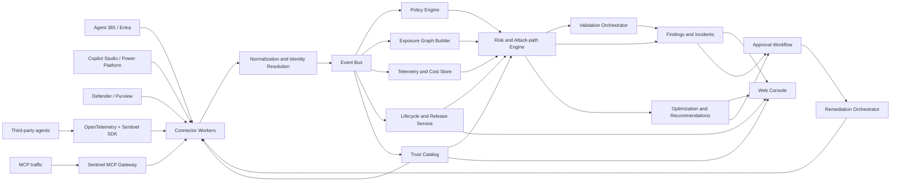

# Agent Sentinel

> Unified AI Agent Operations, Governance, Security, and Lifecycle Platform

## 1. Executive summary

Agent Sentinel is an AI Agent Operations and Security Platform for discovering, governing, protecting, observing, optimizing, and managing the lifecycle of enterprise agents across Microsoft and third-party ecosystems.

Microsoft Agent 365, Microsoft Entra Agent ID, Microsoft Defender, Microsoft Purview, Copilot Studio, and Microsoft Foundry already provide authoritative capabilities for parts of registration, identity, monitoring, protection, and governance. Agent Sentinel does not replace them. It connects their evidence and fills the operational gaps between control planes.

The platform answers the full operational lifecycle:

1. **Discover:** What agents, identities, tools, MCP servers, owners, and dependencies exist?
2. **Govern:** Are they approved, owned, compliant, and operating within policy?
3. **Protect:** What can they reach, how could they be abused, and what is the safest response?
4. **Observe:** Are they healthy, effective, secure, and behaving as expected?
5. **Optimize:** Which permissions, models, workflows, costs, and unused assets should change?
6. **Lifecycle:** Can the organization safely promote, version, approve, operate, and retire them?

An evidence graph connects agents, identities, permissions, tools, MCP servers, data sources, owners, activity, cost, quality, policy, and deployment history. Security attack-path management is the flagship differentiator and judging narrative, while the broader operating platform makes the project credible as a deployable enterprise product.

The intended positioning is:

> **The unified operations and security control plane for the enterprise AI agent estate**

The memorable security wedge is:

> **Defender Attack Path + Exposure Management + SOAR for AI agents**

## 2. Decision and evidence status

### 2.1 Is there already an identical Microsoft internal app?

As of 2026-08-14, searches across the Microsoft 365 sources available to the project owner did **not identify an exact deployed application** that combines all of the following:

- Microsoft and third-party agent discovery
- Agent-to-identity-to-tool-to-data attack-path analysis
- Blast-radius calculation
- Safe adversarial validation
- Cross-product incident reconstruction
- Human-approved containment and remediation
- Unified cost and risk prioritization
- Reliability, quality, adoption, and business outcome correlation
- Cross-platform release, exception, drift, and retirement workflows
- Evidence-backed Agent, MCP, and Tool Trust Catalog

This is not proof that no such internal project exists. Search visibility is limited by permissions, indexing, organizational policy, and confidential projects. Before project registration, search HackBox/Innovation Studio and contact relevant Agent 365, Entra, Defender, Purview, and Copilot Studio stakeholders.

### 2.2 Existing overlap

| Existing capability               | Likely system of record             | Agent Sentinel treatment                     |
| --------------------------------- | ----------------------------------- | -------------------------------------------- |
| Agent registry and administration | Microsoft Agent 365                 | Consume; do not recreate                     |
| Agent identity and access         | Microsoft Entra Agent ID            | Consume identity and permission evidence     |
| Threat detection and incidents    | Microsoft Defender                  | Enrich and correlate                         |
| Data security and compliance      | Microsoft Purview                   | Consume labels, DLP findings, and data risk  |
| Copilot agent lifecycle           | Copilot Studio admin surfaces       | Discover and deep-link                       |
| Foundry agent telemetry           | Microsoft Foundry and Azure Monitor | Ingest traces, evaluations, and cost signals |
| Cloud resource inventory          | Azure Resource Graph                | Discover resources and relationships         |

### 2.3 Defensible product gap

The project is valuable only if it focuses on the gap between existing systems:

- Cross-plane relationship graph rather than another asset list
- Agent-specific attack paths rather than isolated alerts
- Evidence-backed blast radius rather than a generic risk score
- Continuous safe validation rather than configuration-only checks
- Coordinated, reversible remediation rather than a one-click destructive action
- First-party and third-party coverage through an open connector contract
- Cross-product operational intelligence rather than duplicating each system's native administration
- Lifecycle, quality, cost, risk, and business value correlated in one evidence model
- An approved Agent, MCP, and Tool Trust Catalog rather than disconnected allow lists

## 3. Product goals

### 3.1 Primary goals

- Build a continuously updated inventory and evidence graph of the agent estate.
- Establish ownership, trust, lifecycle, and deployment status across platforms.
- Apply centrally managed policy to identity, data, tools, MCP, autonomy, release, quality, and cost.
- Find exploitable paths from an agent or user-controlled input to sensitive actions or data.
- Prioritize findings using reachability, exploitability, impact, and observed activity.
- Validate important findings through safe, non-destructive simulations.
- Generate an incident narrative with all supporting evidence.
- Recommend and execute reversible remediation after explicit approval.
- Correlate reliability, quality, latency, usage, and cost with security and business impact.
- Recommend rightsizing, permission reduction, model routing, retirement, and workflow improvements.
- Manage promotion, approval, version comparison, exception, and retirement workflows.
- Publish trusted Agents, MCP servers, tools, and connectors through a governed catalog.
- Support Microsoft-native and third-party agents through adapters.

### 3.2 Non-goals

- Replacing Agent 365, Entra, Defender, Purview, or Copilot Studio.
- Building a general SIEM, DLP engine, or identity platform.
- Automatically disabling production agents without approval.
- Claiming complete discovery when connectors lack required permissions.
- Sending real secrets, harmful prompts, or destructive tool calls during validation.
- Making compliance certification decisions.
- Replacing platform-native authoring experiences or becoming a general-purpose agent builder.
- Acting as the accounting system of record; Agent Sentinel correlates operational cost signals.

## 4. Target personas

| Persona                   | Primary need                                                          |
| ------------------------- | --------------------------------------------------------------------- |
| CISO / security leader    | Understand aggregate agent exposure and business impact               |
| SOC analyst               | Investigate and contain an agent-related incident                     |
| Identity administrator    | Detect excessive or stale agent permissions                           |
| AI platform administrator | Govern agents across development platforms                            |
| Agent developer           | Fix risky tools, prompts, identities, and data access                 |
| Data protection officer   | Understand which sensitive data an agent can access or exfiltrate     |
| FinOps owner              | Identify expensive, abandoned, or anomalous agents                    |
| Business process owner    | Understand adoption, outcomes, reliability, and business value        |
| Compliance / risk owner   | Review policy posture, exceptions, evidence, and attestations         |
| Agent consumer            | Find approved agents, MCP servers, and tools with clear trust signals |

## 5. Core user journeys

### 5.1 Discover shadow and unmanaged agents

1. Connect Microsoft and third-party sources.
2. Normalize discovered assets into a common model.
3. Match identities, owners, tools, data sources, and telemetry.
4. Flag unowned, unregistered, stale, or partially observed agents.
5. Display discovery confidence and missing evidence.

### 5.2 Investigate an attack path

1. Analyst opens a critical finding.
2. The graph highlights a path such as:

   `External user input -> Sales agent -> overprivileged identity -> remote MCP server -> customer data`

3. Agent Sentinel explains each edge and cites its evidence source.
4. Blast radius shows reachable data, actions, users, and downstream agents.
5. The analyst runs a safe validation or reviews the latest result.

### 5.3 Contain an incident

1. A policy or telemetry signal creates a finding.
2. Agent Sentinel correlates related activity from identity, agent, tool, and data systems.
3. It recommends ranked actions with predicted impact.
4. An authorized reviewer approves one or more actions.
5. The system executes through a connector, records the result, and starts a rollback timer where possible.

### 5.4 Prevent unsafe publication

1. CI/CD submits an agent manifest or infrastructure plan.
2. Agent Sentinel evaluates permissions, tools, MCP endpoints, data access, and policy.
3. The pull request receives an evidence-backed pass, warning, or block result.
4. Developers get specific least-privilege and architecture recommendations.

### 5.5 Operate and optimize the agent estate

1. The operations owner reviews reliability, latency, quality, cost, adoption, and security in a shared scorecard.
2. Agent Sentinel identifies a high-cost agent with repeated tool retries, weak task completion, and excessive permissions.
3. It recommends model routing, retry-policy changes, permission reduction, and an owner-approved experiment.
4. The owner compares before-and-after quality, cost, and risk before promoting the change.

### 5.6 Manage the lifecycle

1. A developer registers a new agent version with manifest, owner, identity, tools, tests, and intended business outcome.
2. Policy checks and validation gates produce a release readiness decision.
3. Required security, data, and business approvers review the same evidence.
4. Agent Sentinel records promotion, rollback, exception, and retirement history.
5. Stale, unowned, duplicated, or unused versions enter a review and decommission workflow.

### 5.7 Discover trusted capabilities

1. An agent developer searches the Trust Catalog for an approved MCP server or tool.
2. The catalog displays owner, provenance, publisher, permissions, data handling, validation status, known findings, usage, and compatibility.
3. The developer requests access or adds the capability to an agent manifest.
4. Agent Sentinel evaluates the new relationship before deployment.

## 6. Differentiating capabilities

### 6.1 Agent Exposure Graph

Model the following node types:

- Agent
- Agent version
- Human owner
- Service principal / managed identity / agent identity
- Permission grant and role assignment
- Tool, function, plugin, connector, or API
- MCP server
- Data source and sensitive data classification
- Environment, subscription, resource group, and tenant
- Policy
- Activity event
- Finding and incident
- Remediation action
- Model deployment

Important edge types:

- `OWNS`
- `DEPLOYED_IN`
- `RUNS_AS`
- `HAS_PERMISSION`
- `CAN_CALL`
- `CONNECTS_TO`
- `READS_FROM`
- `WRITES_TO`
- `DELEGATES_TO`
- `TRUSTS`
- `TRIGGERED_BY`
- `VIOLATES`
- `OBSERVED_IN`
- `REMEDIATED_BY`

Every node and edge must include:

- Source connector
- Source object ID
- First and last observed timestamps
- Evidence URI or immutable evidence reference
- Confidence score
- Data freshness
- Sensitivity level

### 6.2 Attack-path engine

Start with deterministic graph rules before adding LLM reasoning.

Example high-value paths:

- Untrusted input to sensitive data read
- Untrusted input to high-impact write action
- External MCP server to privileged agent identity
- Agent with application permissions and no owner
- Agent-to-agent delegation that crosses trust boundaries
- Sensitive data source to tool capable of external egress
- Stale agent with active credentials
- Shared identity used by multiple unrelated agents
- Agent that can modify its own instructions, tools, or policy source
- Human user to agent to privileged action without approval

Risk score:

```text
risk =
  reachability
  * exploitability
  * business_impact
  * privilege_factor
  * data_sensitivity
  * activity_factor
  * confidence
  * compensating_control_discount
```

The UI must show factor values and evidence. Never present an unexplained LLM-generated score.

### 6.3 Blast-radius analysis

For a selected agent or identity, calculate:

- Reachable tools and actions
- Reachable data sources and sensitivity
- Downstream agents
- Users or business processes affected
- Cross-environment and cross-tenant boundaries
- Maximum privilege reachable
- Recent usage of each reachable edge
- Which edge removal most reduces exposure

### 6.4 Continuous Agent Validation

Run safe validation packs in isolated or explicitly approved environments.

Initial packs:

- Prompt-injection resistance
- Indirect prompt injection through documents or tool output
- Tool parameter manipulation
- MCP capability mismatch
- Data exfiltration attempt using synthetic canary data
- Privilege escalation attempt
- Cross-agent instruction contamination
- Excessive autonomy / missing approval check
- Sensitive output handling
- Denial-of-wallet and runaway loop detection

Safety requirements:

- Synthetic data only by default
- Allow-listed tools and endpoints
- No production write operations
- Strict time, token, and cost budgets
- Kill switch
- Full trace capture
- Human approval for higher-risk packs

### 6.5 Response orchestration

Initial response actions:

- Disable an Agent Sentinel connector or gateway route
- Block a remote MCP endpoint at the gateway
- Revoke or rotate test credentials
- Remove a test role assignment
- Quarantine an agent in the Sentinel policy layer
- Require approval for selected tools
- Reduce execution and cost quotas
- Open a ticket with evidence and owner information
- Notify the owner through a configured internal workflow

Production actions must be:

- Explicitly approved
- Least disruptive
- Idempotent
- Audited
- Reversible where the target platform supports rollback
- Protected by RBAC and separation of duties

### 6.6 Policy as code

Use versioned YAML policies with a deterministic evaluation engine.

```yaml
id: AS-POL-004
name: Sensitive data requires controlled egress
severity: critical
scope:
  environments: [prod]
when:
  all:
    - agent.canAccessDataSensitivity: [confidential, highly_confidential]
    - agent.hasExternalEgress: true
    - agent.hasApprovedEgressControl: false
then:
  finding: 'Sensitive data can reach an uncontrolled external endpoint.'
  recommendations:
    - block_external_endpoint
    - require_human_approval
    - reduce_data_permissions
```

Policy packs:

- Agent identity baseline
- Least privilege
- MCP trust and provenance
- Data access and egress
- Human oversight
- Logging and traceability
- Ownership and lifecycle
- Cost and quota
- Third-party agent onboarding

### 6.7 Incident story builder

Produce a timestamped, evidence-backed narrative:

- Initial trigger
- Agent version and instruction set
- Identity used
- Tools invoked
- Data accessed
- Policy decisions
- Related Defender/Purview/Entra signals
- Blast radius
- Containment actions
- Remaining risk

Use an LLM only to summarize structured evidence. Every material statement must cite an evidence object.

### 6.8 Developer shift-left integration

Provide:

- CLI scanner for agent manifests and connector definitions
- GitHub Actions and Azure DevOps pipeline integration
- Pull-request annotations
- SARIF output
- Local policy evaluation
- Suggested least-privilege changes
- Baseline comparison to prevent new exposure

### 6.9 FinOps and sustainability

Correlate risk with:

- Token and model cost
- Tool invocation cost
- Retry and loop anomalies
- Idle but provisioned agents
- Cost per successful business action
- Cost spikes after prompt, model, or tool changes

Cost optimization is one operating dimension. Security remains the primary judging story.

### 6.10 Unified operational scorecard

Provide a multi-dimensional scorecard for every agent and version:

- Security exposure
- Governance compliance
- Reliability and availability
- Task quality and evaluation results
- Latency
- Adoption and active users
- Business outcome or task completion
- Cost per successful outcome
- Ownership and lifecycle health
- Evidence coverage and confidence

Never collapse these dimensions into one unexplained number. Show trends, contributing factors, evidence, target thresholds, and the effect of recent changes.

### 6.11 Lifecycle and release governance

- Agent registration and ownership attestation
- Version lineage and environment promotion
- Release readiness checks
- Required approvals by risk and environment
- Policy exceptions with owner, reason, expiry, and compensating controls
- Canary deployment and rollback evidence
- Drift detection between approved and deployed configuration
- Stale, duplicate, abandoned, and end-of-life detection
- Retirement workflow covering identity, credentials, tools, data access, and retained evidence

### 6.12 Agent, MCP, and Tool Trust Catalog

Create a searchable catalog of approved and discovered capabilities:

- Publisher and owner
- Provenance and source repository
- Supported protocols and versions
- Requested permissions and data access
- Hosting location and endpoint trust
- Validation history and known findings
- Usage and dependent agents
- Compatibility and deprecation status
- Approval scope by tenant, environment, geography, or business unit
- Trust tier with an evidence-backed explanation

The catalog complements platform-native catalogs by correlating trust, exposure, validation, usage, and lifecycle evidence across ecosystems.

### 6.13 Recommendation and automation engine

Generate ranked, evidence-backed recommendations across:

- Least privilege
- Ownership and lifecycle cleanup
- Security containment
- Reliability and retry behavior
- Model and routing selection
- Prompt, tool, and workflow quality
- Cost and capacity
- Policy remediation

Each recommendation must include:

- Why it was generated
- Evidence and confidence
- Expected security, quality, cost, and operational impact
- Required approval
- Execution plan and rollback
- Post-change verification

Automation levels:

1. Observe only
2. Recommend
3. Simulate / what-if
4. Execute after approval
5. Auto-remediate within an explicitly approved policy boundary

## 7. Proposed architecture



### 7.1 Recommended implementation stack

Prefer a TypeScript monorepo to maximize hackathon development speed:

- **Web:** React, TypeScript, Vite, Fluent UI
- **API:** Node.js, TypeScript, Fastify
- **Workers:** Azure Container Apps jobs by default; Azure Functions when an event-triggered connector is simpler
- **Authentication:** Microsoft Entra ID with MSAL
- **Operational data:** Azure Database for PostgreSQL
- **Graph:** PostgreSQL tables initially; optional Azure Cosmos DB Gremlin or Neo4j adapter later
- **Events:** Azure Service Bus
- **Cache:** Azure Cache for Redis when required
- **Telemetry:** OpenTelemetry and Application Insights
- **Secrets:** Managed Identity and Azure Key Vault
- **Deployment:** Azure Container Apps and Bicep
- **Policy engine:** JSON/YAML rules implemented as a separate package
- **Testing:** Vitest, Playwright, and contract tests for connectors

Do not introduce a graph database in the first iteration unless relational recursive queries fail the measured workload.

### 7.2 Monorepo layout

```text
agent-sentinel/
  apps/
    web/
    api/
    worker-ingestion/
    worker-analysis/
    cli/
  packages/
    domain/
    connector-sdk/
    policy-engine/
    graph-engine/
    risk-engine/
    remediation-sdk/
    telemetry/
    ui-components/
  connectors/
    mock/
    entra/
    azure-resource-graph/
    foundry/
    copilot-studio/
    defender/
    purview/
    otel/
    mcp-gateway/
  infrastructure/
    bicep/
    policies/
    dashboards/
  samples/
    vulnerable-sales-agent/
    safe-sales-agent/
  docs/
    architecture/
    threat-model/
    demo/
```

### 7.3 Azure subscription deployment profile

The project may actively use the Microsoft-provided Azure subscription. There is no project-imposed cost ceiling, SKU restriction, architecture restriction, or requirement to minimize the number of Azure services. Select resources based on product quality, technical suitability, scalability, security, and demo value.

The subscription's actual Azure Policy assignments, RBAC permissions, regional availability, quotas, security controls, and organizational requirements are authoritative. The implementation must discover and report these constraints rather than inventing additional restrictions.

Provision resources through Bicep where practical so the environment is repeatable. Manual configuration is acceptable for preview services or organizational workflows that cannot be automated, but it must be documented.

#### Core resources

| Resource                                      | Purpose                                                                     | Possible configuration                                 |
| --------------------------------------------- | --------------------------------------------------------------------------- | ------------------------------------------------------ |
| Azure Container Registry                      | Store application and worker images                                         | Select an available tier based on required features    |
| Azure Container Apps environment              | Host API, web console, MCP gateway, and workers                             | Consumption or workload profiles                       |
| Azure Container Apps jobs                     | Scheduled discovery, graph building, and validation                         | Event or schedule triggered                            |
| Azure Database for PostgreSQL Flexible Server | Operational data, evidence graph, findings, and audit metadata              | Select compute and HA based on the target architecture |
| Azure Service Bus                             | Decouple ingestion, normalization, analysis, and remediation                | Standard or Premium                                    |
| Azure Storage account                         | Validation artifacts, synthetic fixtures, exports, and dead-letter payloads | Standard LRS                                           |
| Azure Key Vault                               | Connector configuration and non-federated secrets                           | RBAC mode with soft delete                             |
| Log Analytics workspace                       | Central operational logs                                                    | Short development retention                            |
| Application Insights                          | Distributed traces, failures, and demo health                               | Workspace based                                        |
| Microsoft Entra app registrations             | Authenticate web users and connectors                                       | Separate UI/API and connector identities               |
| User-assigned managed identities              | Passwordless Azure resource access                                          | Separate ingestion and remediation identities          |
| Azure Monitor alerts                          | Connector failures, queue backlog, validation failures, and security events | Action group scoped to the project team                |

#### Expansion resources

The coding agent may select these or other Azure services whenever they improve the implementation:

| Resource                                       | Use when                                                                            |
| ---------------------------------------------- | ----------------------------------------------------------------------------------- |
| Microsoft Foundry project and model deployment | Incident summarization or validation classification is enabled                      |
| Azure AI Search                                | Full-text or hybrid search over large evidence collections is measured as necessary |
| Azure Cosmos DB                                | PostgreSQL graph traversal fails measured scale or latency goals                    |
| Azure Cache for Redis                          | Repeated graph or policy queries create a demonstrated bottleneck                   |
| Azure API Management                           | External connector onboarding, quotas, or managed API exposure is part of the demo  |
| Azure Managed Grafana                          | A richer cross-service operational dashboard is needed                              |
| Azure Front Door and WAF                       | Public multi-region access is required                                              |
| Microsoft Defender for Cloud                   | Cloud security posture and workload protection enrichment                           |

This list is not exhaustive. The coding agent should research current Azure services and recommend the strongest architecture available in the subscription, including preview services when their instability is isolated behind adapters.

#### Environment strategy

Use separate parameter files and resource names for:

- `local`: application dependencies run locally or in containers; cloud connectors may use mocks.
- `dev`: shared Azure development environment with synthetic data.
- `demo`: stable, change-controlled environment used for recording and judging.

A production-like environment may be built when it improves reliability, scale testing, or judging readiness. Do not ingest real customer or Microsoft production data unless the data, environment, permissions, and handling are explicitly approved for that purpose.

#### Identity and access

- Prefer workload identity federation and managed identities over client secrets.
- Use a read-only identity for discovery and a separate, more restricted identity for remediation.
- Grant remediation permissions only in the synthetic development/demo environment.
- Keep Graph, Agent 365, Copilot Studio, Defender, and Purview permissions connector-specific.
- Document every required delegated or application permission before requesting consent.
- Do not place subscription credentials, tenant secrets, or access tokens in repository files, coding-agent prompts, container images, or sandbox environments.

#### Infrastructure baseline

Where applicable, the Bicep deployment should:

- Accept subscription, location, environment, and naming prefix parameters.
- Apply consistent tags: `project`, `environment`, `owner`, `costCenter`, and `expiresOn`.
- Enable diagnostic settings for supported resources.
- Support private networking, private endpoints, managed virtual networks, or public endpoints according to the selected security architecture and tenant policy.
- Export only non-secret outputs.
- Support complete teardown of the dedicated resource group.
- Avoid broad subscription-scope role assignments when resource-group or resource scope is sufficient.

Recommended commands:

```powershell
az deployment sub what-if `
  --location koreacentral `
  --template-file infrastructure\bicep\main.bicep `
  --parameters infrastructure\bicep\parameters\dev.bicepparam

az deployment sub create `
  --location koreacentral `
  --template-file infrastructure\bicep\main.bicep `
  --parameters infrastructure\bicep\parameters\dev.bicepparam
```

The coding agent must confirm the intended subscription and tenant before the first deployment. It should use `what-if` for material infrastructure changes and clearly report any Azure Policy, RBAC, quota, provider-registration, region, or SKU constraint encountered.

Cost visibility may be implemented as a product feature, especially for detecting runaway agents, but cost optimization is not an architectural gate for this hackathon project.

#### Azure acceptance criteria

- A new authorized developer can deploy the dev environment using documented commands.
- No application secret is required for Azure-to-Azure calls supported by Managed Identity.
- The end-to-end demo produces correlated Application Insights traces.
- Connector failure and Service Bus backlog are visible.
- The environment can be deleted without leaving billable project resources.
- The demo continues in seeded mock mode if an external Microsoft API is unavailable.

## 8. Connector contract

All Microsoft preview APIs and unavailable APIs must be isolated behind adapters. The product must remain demonstrable with mock connectors.

```ts
export interface AgentConnector {
  readonly id: string
  readonly capabilities: ConnectorCapability[]

  testConnection(): Promise<ConnectionTestResult>
  discover(cursor?: string): Promise<DiscoveryPage>
  getEvidence(reference: EvidenceReference): Promise<Evidence>
  streamEvents?(checkpoint?: string): AsyncIterable<AgentEvent>
  execute?(action: RemediationRequest, approval: ApprovalContext): Promise<RemediationResult>
}
```

Each connector must publish:

- Supported capabilities
- Required permissions
- API version
- Preview or GA status
- Rate limits
- Last successful synchronization
- Known blind spots
- Whether remediation is read-only, simulated, or executable

## 9. Domain model

Minimum entities:

```text
AgentAsset
AgentVersion
Identity
Permission
Tool
McpServer
DataAsset
Owner
Environment
Evidence
ActivityEvent
Policy
PolicyEvaluation
Finding
AttackPath
ValidationRun
Incident
Approval
RemediationAction
CostObservation
QualityObservation
ReliabilityObservation
UsageObservation
BusinessOutcome
LifecycleState
Release
ReleaseGate
PolicyException
Attestation
CatalogEntry
TrustAssessment
AccessRequest
Recommendation
Experiment
OutcomeVerification
ConnectorState
```

Key invariants:

- No finding exists without evidence.
- No graph relationship exists without source and observation time.
- No remediation executes without authorization context.
- Preview API data is visibly marked.
- Missing data lowers confidence rather than silently implying safety.
- Tenant and environment boundaries are enforced on every query.
- No lifecycle transition occurs without actor, reason, timestamp, and evidence.
- No trust tier or recommendation exists without contributing factors and evidence.
- Platform-native object identifiers remain traceable to their authoritative systems.

## 10. Security and Responsible AI requirements

### 10.1 Threat model

Treat all ingested agent content, prompts, tool output, documents, and MCP metadata as untrusted input.

Protect against:

- Prompt injection in evidence rendered to analysts
- Tool output containing instructions for the system
- Cross-tenant data leakage
- Connector credential theft
- Forged telemetry
- Poisoned graph relationships
- Unauthorized remediation
- Approval spoofing
- Sensitive prompt or trace retention
- LLM-generated incident hallucinations

### 10.2 Mandatory controls

- Tenant isolation
- Least-privilege connector permissions
- Managed Identity wherever possible
- No secrets in logs
- Encryption in transit and at rest
- RBAC roles: Viewer, Analyst, Approver, Connector Admin, Policy Admin
- Separation of investigation and production remediation approval
- Tamper-evident audit log
- Configurable evidence retention
- Redaction before LLM use
- Regional deployment option
- Connector health and data freshness indicators

### 10.3 Responsible AI

- LLM output is advisory, not authoritative.
- Risk decisions use deterministic evidence and policies.
- Explanations expose inputs and uncertainty.
- Validation avoids real personal or confidential data.
- Human approval is required for impactful actions.
- Users can contest, suppress, and document accepted risk.

## 11. Product surfaces

The web console is a judging-critical product surface, not an administrative afterthought. It must look and behave like a credible Microsoft enterprise security product that could enter private preview.

### 11.0 Production-quality UX direction

Visual direction:

- Use Fluent UI design language and Microsoft security-product conventions without copying an existing product screen.
- Create a restrained, information-dense enterprise interface rather than a generic startup dashboard.
- Support light and dark themes, with dark mode optimized for the live security demo.
- Use a persistent left navigation, command bar, page title and scope, global search, environment selector, notification center, and user menu.
- Use an 8-pixel spacing system, consistent typography hierarchy, semantic color tokens, and reusable surface/elevation tokens.
- Reserve red for actionable critical exposure. Do not turn the entire product red.
- Use motion sparingly to explain state transitions, especially attack-path removal and validation progress.
- Build a coherent Agent Sentinel visual identity, including product mark, favicon, empty-state illustration style, and presentation-safe color palette.

Product credibility requirements:

- Every page must have loading, empty, partially configured, stale data, permission denied, degraded connector, and error states.
- Use skeleton loading instead of layout jumps.
- Filters, sorting, search, pagination or virtualization, saved views, and deep links must work.
- Display tenant, environment, time range, last refresh, data freshness, preview status, and connector coverage.
- Preserve filter and selection state in the URL where practical.
- Use progressive disclosure: executive summary first, evidence and raw technical detail on demand.
- Destructive or high-impact actions require an impact preview, typed confirmation where appropriate, approval state, execution progress, result, and rollback affordance.
- Use realistic synthetic names, timestamps, owners, activity, incidents, and policy data. Avoid `foo`, `test`, placeholder lorem ipsum, or conspicuous demo-only labels.
- Do not show controls that have no behavior. If a feature is unavailable, show a clear preview, simulated, permission-required, or coming-later state.
- Avoid browser alerts, raw JSON as the primary presentation, unexplained IDs, debug traces, and unstyled component-library defaults.

Accessibility:

- Target WCAG 2.2 AA.
- Support keyboard navigation, visible focus, screen-reader labels, reduced motion, and non-color status indicators.
- Ensure graph findings and severity are also available in an accessible table or list.
- Check contrast in both light and dark themes.

Responsive scope:

- Optimize the judged experience for 1440x900 and 1920x1080 desktop displays.
- Support a usable tablet layout.
- Mobile may provide read-only incident triage, but is not required for the primary demo.

### 11.1 Executive overview

- Total agents by platform and environment
- Managed versus shadow agents
- Critical attack paths
- Exposure trend
- Sensitive data reachable
- Validated versus theoretical findings
- Mean time to contain
- Risk-weighted cost

### 11.2 Exposure graph

- Interactive graph
- Path explanation panel
- Evidence and freshness
- Blast-radius mode
- What-if edge removal
- Compare agent versions

The exposure graph is the signature experience:

- Use clear shapes and icons for agents, identities, tools, MCP servers, data, users, and controls.
- Provide zoom, pan, fit-to-selection, minimap, legend, keyboard selection, and progressive clustering.
- Animate only the active attack path; de-emphasize unrelated graph elements.
- Selecting a node or edge opens an evidence drawer with source, confidence, freshness, activity, and policy context.
- Offer `Attack path`, `Blast radius`, `Business flow`, and `After remediation` views.
- Let judges compare before and after remediation without losing graph position.
- Provide a synchronized accessible path list for narration and keyboard use.

### 11.3 Findings

- Severity, confidence, validation status, and business impact
- Owner and affected assets
- Evidence timeline
- Recommended fixes
- Suppression and accepted-risk workflow

### 11.4 Validation lab

- Select target and validation pack
- Safety budget and scope
- Live trace
- Expected versus observed controls
- Reproducible result bundle

### 11.5 Incident response

- Incident narrative
- Correlated signals
- Candidate actions ranked by risk reduction and disruption
- Approval and execution status
- Rollback

### 11.6 Connector health

- Coverage
- Permissions
- API status
- Data lag
- Errors and blind spots

### 11.7 Agent estate and operations

- Unified inventory with platform, environment, owner, identity, trust, and lifecycle facets
- Agent 360 page combining versions, dependencies, policy, exposure, quality, activity, cost, and business outcome
- Ownership, stale asset, shadow agent, and duplicate capability queues
- Reliability, latency, task completion, evaluation, adoption, and cost trends
- Change correlation showing what happened after a model, prompt, tool, permission, or policy update
- Bulk review and assignment workflows

### 11.8 Governance and policy center

- Policy library and policy-as-code editor
- Assignment scope and inheritance
- Compliance posture and evidence
- Exceptions, expiry, compensating controls, and attestations
- Release gates and approval templates
- Simulation of policy changes before enforcement
- Developer guidance and remediation tracking

### 11.9 Lifecycle and release center

- Version lineage and environment comparison
- Release readiness checklist
- Validation and approval gates
- Promotion, canary, rollback, and retirement workflows
- Configuration drift
- Expiring credentials, exceptions, owners, dependencies, and deprecated capabilities
- Complete operational history for each version

### 11.10 Trust Catalog

- Search and browse approved Agents, MCP servers, tools, models, and connectors
- Trust tier, owner, publisher, provenance, permissions, and data handling
- Validation status, known findings, usage, and dependent agents
- Request access, request review, approve, restrict, deprecate, and replace actions
- Side-by-side capability comparison

### 11.11 Optimization center

- Security, reliability, quality, adoption, cost, and sustainability recommendations
- Expected impact and confidence
- What-if comparison
- Experiment and rollout tracking
- Approval and execution
- Verified outcome after change

### 11.12 Design system and Storybook

Create an Agent Sentinel UI package and Storybook before page proliferation.

Required reusable components:

- App shell and navigation
- Page header and command bar
- KPI card and trend indicator
- Severity and confidence badges
- Data freshness indicator
- Connector status card
- Filter bar and saved view selector
- Evidence drawer
- Timeline
- Attack-path graph primitives
- Approval panel
- Remediation impact comparison
- Empty, loading, degraded, denied, and error states
- Toast and notification center

Maintain design tokens for:

- Color and semantic status
- Typography
- Spacing
- Radius
- Elevation
- Motion
- Graph node and edge types

Storybook must include accessibility checks and realistic synthetic fixtures for all meaningful states.

### 11.13 UX validation

- Create low-fidelity wireframes for the complete seven-minute demo before polishing individual pages.
- Build the signature graph and remediation transition as a clickable prototype early.
- Run at least three observed demo rehearsals with colleagues who have not seen the project.
- Record where users hesitate, which labels require explanation, and whether the security story is understood without narration.
- Measure time to identify the critical path, inspect evidence, choose a response, and confirm reduced blast radius.
- Fix confusing interaction and visual hierarchy before adding secondary features.

## 12. Phased delivery plan

### Phase 0: Technical feasibility spike

Target: 2-3 days

- Build mock estate with three agents, two identities, two MCP servers, and three data sources.
- Implement the common domain model.
- Prove recursive attack-path queries.
- Implement one safe remediation through the mock connector.
- Confirm which real APIs are accessible in the development tenant.

Exit criteria:

- One complete attack path is discoverable and explainable.
- One graph edge can be removed through an approved remediation.
- Missing API access can be replaced by an explicit mock without changing domain code.

### Phase 1: Demonstrable vertical slice

Target: 1 week

- Entra and Azure Resource Graph connectors
- Mock Agent 365/Copilot Studio/Foundry connectors if access is unavailable
- Inventory and exposure graph
- Ten deterministic policies
- Risk scoring and blast radius
- Finding details with evidence
- Approval-based remediation simulation
- Vulnerable and fixed sample agent

### Phase 2: Security differentiation

Target: 1-2 weeks

- MCP gateway or proxy telemetry
- External MCP trust policy
- Safe prompt-injection validation
- Synthetic canary data
- Incident story builder
- What-if remediation analysis
- Tamper-evident audit trail

### Phase 3: Agent operations platform

Target: 1-2 weeks

- Agent 360 operational scorecard
- Reliability, latency, quality, adoption, and business outcome telemetry
- Cost and runaway-loop detection
- Lifecycle registration, version lineage, release gates, and retirement
- Policy exceptions and attestations
- Trust Catalog for Agents, MCP servers, tools, and connectors
- Ranked optimization recommendations with what-if analysis

### Phase 4: Ecosystem expansion

Target: 1-2 weeks

- OpenTelemetry ingestion
- Third-party connector SDK
- CLI and CI policy checks
- SARIF reporting
- Agent version comparison
- Catalog access request and approval workflow
- Cross-platform configuration drift
- Recommendation execution and outcome verification

### Phase 5: Hackathon hardening

Target: final week

- Stable scripted demo
- Seeded backup dataset
- Offline/mock mode
- Performance and failure testing
- Threat model and Responsible AI review
- Clear product overlap slide
- Customer-value and roadmap slides
- Three-minute and seven-minute demo variants
- Production-quality visual pass across all judged screens
- Complete loading, empty, stale, denied, degraded, and error states
- Storybook coverage for reusable product components
- Accessibility review for the primary demo path
- Responsive verification at 1440x900 and 1920x1080
- Demo rehearsal findings incorporated into labels, hierarchy, and transitions
- Product-tour data showing Discover, Govern, Protect, Observe, Optimize, and Lifecycle breadth
- Security flagship scenario kept free of secondary feature detours

## 13. Recommended demo

### 13.1 Scenario

A sales research agent uses an overprivileged identity. It can query confidential customer data and call an unapproved remote MCP server. A document retrieved from an external source contains an indirect prompt injection.

### 13.2 Demo sequence

1. Executive dashboard shows many agents but only one critical validated path.
2. Open the agent and display:

   `External document -> sales agent -> privileged identity -> confidential CRM data -> unapproved MCP server`

3. Show evidence for every edge and the calculated blast radius.
4. Run a safe validation using synthetic customer data.
5. The canary value reaches the simulated external endpoint, converting the finding from theoretical to validated.
6. Agent Sentinel generates an incident narrative.
7. Select a recommended response:
   - block the MCP route,
   - require approval for CRM access,
   - replace the broad permission with a scoped permission.
8. An approver confirms the response.
9. The graph recalculates and shows the attack path removed with minimal business disruption.
10. Re-run validation and show that the business workflow still succeeds while exfiltration fails.

### 13.3 Winning moment

The strongest visual is not the red alert. It is the graph changing from an exploitable red path to a safe green workflow after a reversible, least-disruptive remediation.

## 14. Judging narrative

### Innovation

- A shared evidence model spans discovery, governance, security, observability, optimization, and lifecycle
- Agent-specific exposure graph across fragmented control planes
- Validation converts theoretical configuration risk into demonstrated evidence
- Open connector architecture supports non-Microsoft agents
- Trust Catalog correlates provenance, permissions, validation, exposure, usage, and lifecycle
- Recommendations show cross-dimensional impact rather than optimizing security, quality, or cost in isolation

### Customer value

- Reduces investigation time
- Prioritizes the few exploitable paths among thousands of agents
- Prevents unsafe agent deployment
- Makes remediation understandable and auditable
- Gives platform teams one operating view for ownership, quality, reliability, cost, risk, and release readiness
- Helps developers reuse approved Agents, MCP servers, and tools
- Identifies stale, duplicated, low-value, and overprivileged agents

### Microsoft alignment

- Extends Agent 365 rather than competing with it
- Uses Entra identity, Defender security, Purview data governance, Azure, and Foundry telemetry
- Demonstrates secure AI transformation
- Creates pull-through across multiple Microsoft platforms
- Provides an extensible control plane for Microsoft and third-party agent ecosystems

### Feasibility

- Deterministic rules and graph traversal provide the core value
- Connectors isolate preview and unavailable APIs
- Mock mode guarantees a reliable demo
- Features can be delivered incrementally

## 15. Success metrics

Technical:

- Discovery coverage by connector
- Evidence freshness
- Attack-path query latency
- False-positive rate on validated test cases
- Remediation success and rollback rate
- Connector failure recovery time

Business:

- Critical paths removed
- Mean time to investigate
- Mean time to contain
- Privilege reduction
- Percentage of agents with owners and identities
- Percentage of production agents passing validation
- Cost saved from runaway or abandoned agents
- Percentage of agents with complete lifecycle and release evidence
- Reliability and task completion improvement after recommendations
- Reduction in stale, duplicated, and unapproved assets
- Catalog reuse and time saved onboarding approved capabilities
- Policy exception age and on-time closure

Demo acceptance:

- Complete demo runs in under seven minutes.
- No step depends on an unstable external service.
- Every risk statement has visible evidence.
- At least one real Microsoft data connector is used.
- At least one third-party or open-standard integration is shown.
- Remediation visibly reduces blast radius without breaking the intended workflow.
- The judged path looks production-ready at 1440x900 and 1920x1080 without browser zoom changes.
- Loading, empty, stale, degraded, denied, error, approval, execution, success, and rollback states are intentionally designed.
- No dead controls, placeholder text, raw debug output, broken layout, or unexplained identifier appears in the primary demo.
- The critical attack path and remediation outcome can be understood visually without narration.
- The primary demo path is keyboard operable and does not rely on color alone.

## 16. Risks and mitigations

| Risk                                             | Mitigation                                                                                                                                                                          |
| ------------------------------------------------ | ----------------------------------------------------------------------------------------------------------------------------------------------------------------------------------- |
| Agent 365 overlaps with inventory and governance | Treat Agent 365 as an authoritative source; differentiate through cross-plane evidence, operational correlation, attack paths, validation, recommendations, and lifecycle workflows |
| Preview or unavailable APIs                      | Adapter boundaries, capability flags, and seeded mock connectors                                                                                                                    |
| Excessive scope                                  | Protect the vertical slice; treat integrations as replaceable adapters                                                                                                              |
| Graph visualization without real security value  | Require evidence, exploitability, and remediation for every demo path                                                                                                               |
| Unsafe red-team behavior                         | Synthetic data, isolated lab, allow lists, budgets, and kill switch                                                                                                                 |
| Automatic remediation causes disruption          | Approval, dry run, impact preview, idempotency, and rollback                                                                                                                        |
| LLM hallucinated findings                        | Deterministic policy engine; LLM limited to cited summaries                                                                                                                         |
| No proof of internal uniqueness                  | Conduct stakeholder and HackBox review; present gap rather than claiming uniqueness                                                                                                 |
| Confidential internal evidence in project files  | Use public documentation or sanitized metadata only                                                                                                                                 |

## 17. Go/no-go gates

### Continue with the project if:

- A useful attack path can be derived from accessible evidence.
- The graph shows value beyond an inventory table.
- At least one safe validation produces reproducible evidence.
- At least one reversible response changes the path.

### Pivot if:

- Available data cannot establish meaningful relationships.
- The project becomes only a dashboard over existing dashboards.
- Validation cannot be performed safely.
- Remediation cannot be simulated or executed.

If a pivot is required, retain the connector SDK, evidence graph, policy engine, and validation lab. They are reusable for a narrower MCP security gateway or agent CI security scanner.

## 18. Initial engineering backlog

### P0

- [ ] Initialize TypeScript monorepo and shared lint/test configuration.
- [ ] Define the Agent Sentinel visual direction, design tokens, iconography, and desktop layout grid.
- [ ] Create Storybook and the shared UI component package.
- [ ] Produce wireframes for the complete seven-minute demo.
- [ ] Build a clickable exposure-graph and remediation-transition prototype.
- [ ] Define domain entities and evidence invariants.
- [ ] Create connector and remediation SDK contracts.
- [ ] Build seeded mock connector and vulnerable sales-agent dataset.
- [ ] Implement PostgreSQL schema and migrations.
- [ ] Implement graph relationship ingestion.
- [ ] Implement deterministic policy engine.
- [ ] Implement attack-path traversal and explainability.
- [ ] Implement blast-radius calculation.
- [ ] Build exposure graph UI.
- [ ] Build finding and evidence UI.
- [ ] Implement approval and remediation simulation.
- [ ] Add audit events.
- [ ] Add end-to-end demo test.
- [ ] Implement loading, empty, stale, degraded, denied, and error states for the primary demo path.
- [ ] Add accessibility checks and keyboard coverage for the primary demo path.

### P1

- [ ] Entra connector.
- [ ] Azure Resource Graph connector.
- [ ] Foundry/Azure Monitor telemetry connector.
- [ ] MCP gateway telemetry.
- [ ] Safe validation orchestrator.
- [ ] Synthetic canary service.
- [ ] Incident story builder with evidence citations.
- [ ] RBAC.
- [ ] Connector health dashboard.
- [ ] Agent 360 operational scorecard.
- [ ] Ownership, shadow, stale, and duplicate-agent queues.
- [ ] Reliability, quality, adoption, latency, and cost telemetry model.
- [ ] Lifecycle state machine and version lineage.
- [ ] Release readiness and policy exception workflows.
- [ ] Agent, MCP, and Tool Trust Catalog.
- [ ] Optimization recommendation model with impact and confidence.

### P2

- [ ] Agent 365 connector when supported and authorized.
- [ ] Copilot Studio connector when supported and authorized.
- [ ] Defender and Purview enrichment.
- [ ] OpenTelemetry ingestion.
- [ ] Third-party connector examples.
- [ ] CLI, SARIF, GitHub Actions, and Azure DevOps integration.
- [ ] FinOps analytics.
- [ ] Agent version comparison.
- [ ] Configuration drift detection.
- [ ] Catalog approval and access request workflows.
- [ ] Canary promotion, rollback, and retirement workflows.
- [ ] Recommendation execution and post-change verification.

## 19. Instructions for VS Code Copilot

Use this specification as the product source of truth.

Implementation rules:

1. Start with Phase 0 and the P0 backlog.
2. Keep all platform integrations behind typed connector interfaces.
3. Do not invent API endpoints or permissions. Mark unavailable integrations as mock adapters.
4. Implement deterministic graph and policy behavior before adding an LLM.
5. Require evidence references for findings and relationships.
6. Require an approval object for every remediation execution.
7. Use synthetic data in tests and demos.
8. Add unit tests for policy rules and graph traversal.
9. Add contract tests for every connector.
10. Add an end-to-end test for the full vulnerable-to-remediated demo.
11. Keep tenant isolation and RBAC in the domain and persistence layers, not only the UI.
12. Document preview APIs, required permissions, and connector blind spots.
13. Preserve all six product pillars: Discover, Govern, Protect, Observe, Optimize, and Lifecycle.
14. Keep Protect as the flagship vertical slice while designing shared domain primitives that support the broader platform.

Suggested first Copilot task:

```text
Read agent-sentinel-product-spec.md. Create the Phase 0 TypeScript monorepo
foundation described in the specification. Implement the domain package,
connector SDK, seeded mock connector, PostgreSQL schema, deterministic policy
engine, and tests for one attack path:

external document -> sales agent -> overprivileged identity ->
confidential CRM data -> unapproved MCP server.

Do not implement undocumented Microsoft APIs. Use typed mock adapters where
real APIs are unavailable. Every graph edge and finding must include evidence,
source, confidence, and observation timestamps.
```

## 20. Coding-agent development workflow

### 20.1 Recommended approach

Use a disciplined coding-agent workflow, but do not make Agent Sentinel depend on a particular agent harness.

Recommended order:

1. Use VS Code Copilot or the available coding agent as the primary implementation agent.
2. Keep this document as the product source of truth.
3. Convert each phase into small vertical-slice tickets with explicit acceptance criteria.
4. Implement one ticket at a time using a red-green-refactor loop.
5. Run tests, type checking, linting, and the relevant demo path after every slice.
6. Review each change against both the specification and engineering standards.
7. Record important architectural decisions as ADRs.
8. Introduce sandbox orchestration only when parallel work provides measurable value.

The development system should optimize feedback quality, not the number of autonomous agents running.

### 20.2 Matt Pocock skills

Matt Pocock's composable engineering skills are suitable for this project because they emphasize specification alignment, domain language, small steps, TDD, and independent review.

Repository:

- <https://github.com/mattpocock/skills>

Useful skills:

- `grill-with-docs`: challenge requirements and establish shared domain language.
- `to-spec`: turn a resolved conversation into an implementation specification.
- `to-tickets`: create small vertical-slice tickets and dependencies.
- `implement`: implement a selected specification or ticket.
- `tdd`: enforce red-green-refactor at stable seams.
- `domain-modeling`: refine Agent Sentinel terminology and invariants.
- `code-review`: independently review specification fidelity and code quality.
- `diagnosing-bugs`: apply a controlled debugging loop.
- `improve-codebase-architecture`: periodically identify architectural deterioration.

If the current coding agent supports the skills installer, install only the relevant skills:

```powershell
npx skills@latest add mattpocock/skills
```

Do not install or copy instructions blindly. Review the selected skill files, pin the version or commit used, and ensure they do not conflict with repository security policy or this specification.

If Matt Pocock's skills are unavailable or incompatible with the selected coding agent, reproduce the same workflow using native agent instructions:

- Clarify before implementation.
- Maintain a shared glossary and ADRs.
- Split work into independently testable vertical slices.
- Write a failing test before changing behavior.
- Require automated feedback after every slice.
- Perform a specification review and a code-quality review separately.

### 20.3 Sandcastle usage

Sandcastle orchestrates coding agents in isolated sandboxes and branches:

- <https://github.com/mattpocock/sandcastle>

Do **not** make it part of Phase 0. It adds Docker or another sandbox provider, worktree management, branch orchestration, agent credentials, and merge behavior before the product architecture is stable.

Introduce Sandcastle or an equivalent harness only when all of these are true:

- The repository has deterministic setup, test, lint, and type-check commands.
- Tickets can be implemented independently without modifying the same core files.
- The team needs unattended or parallel execution.
- The coding agent used by the team is supported or can be integrated safely.
- Automatic branches and merges comply with repository policy.
- Secrets and Microsoft tenant credentials are not copied into untrusted sandboxes.

Good later uses:

- Implementing independent read-only connectors in separate branches.
- Generating connector contract tests.
- Running an implementation agent followed by a separate review agent.
- Reproducing bugs in an isolated environment.
- Exploring two UI or storage approaches without polluting the main branch.

Poor uses:

- Defining the initial domain model through several independent agents.
- Parallel edits to the policy engine, graph engine, and shared types.
- Running production tenant credentials in a sandbox.
- Automatically merging security-sensitive remediation code.

### 20.4 Tool decision matrix

| Project stage                  | Recommended execution                                                  |
| ------------------------------ | ---------------------------------------------------------------------- |
| Domain model and Phase 0       | One primary coding agent, interactive review, no orchestration harness |
| First vertical slice           | One primary coding agent with TDD and end-to-end feedback              |
| Independent connectors         | Parallel sandbox agents are optional                                   |
| Security-sensitive remediation | Primary agent plus mandatory human and independent code review         |
| UI alternatives and prototypes | Parallel isolated prototypes are useful                                |
| Hackathon hardening            | Freeze features; use agents for tests, review, and defects only        |

### 20.5 Master prompt for any coding agent

Copy the following prompt into VS Code Copilot or another coding agent:

```text
You are the lead implementation agent for Agent Sentinel.

First, read agent-sentinel-product-spec.md completely. Treat it as the product
source of truth. Do not begin coding until you understand the product boundary:
Agent Sentinel complements Agent 365, Entra, Defender, Purview, Copilot Studio,
and Microsoft Foundry. It consumes their authoritative data instead of
recreating native administration. It provides a cross-platform operations and
security control plane spanning Discover, Govern, Protect, Observe, Optimize,
and Lifecycle. Protect is the flagship implementation slice, not the entire
product boundary.

Before implementation:

1. Inspect the repository, available tools, existing instructions, build
   commands, and tests.
2. Determine whether Matt Pocock's composable engineering skills are already
   installed and compatible with this coding agent. Useful skills include
   grill-with-docs, to-spec, to-tickets, implement, tdd, domain-modeling,
   code-review, and diagnosing-bugs.
3. If those skills are available, use them selectively. Do not make the
   application depend on them.
4. If they are unavailable, create an equivalent native workflow:
   clarification -> domain glossary and ADRs -> vertical-slice tickets ->
   red-green-refactor -> automated validation -> independent spec and code
   reviews.
5. Do not install Sandcastle or another orchestration harness during Phase 0.
   Recommend it later only if work can be safely parallelized and the repository
   has deterministic setup and validation commands.

Plan the work:

- Convert Phase 0 and P0 into small vertical-slice tickets.
- State the dependency and acceptance criteria for every ticket.
- Start with one end-to-end tracer bullet:
  external document -> sales agent -> overprivileged identity ->
  confidential CRM data -> unapproved MCP server.
- Preserve a runnable application after every completed ticket.

Engineering rules:

- Keep Microsoft and third-party integrations behind typed connector contracts.
- Never invent undocumented APIs, permissions, or product behavior.
- Use a typed mock connector when real access is unavailable.
- Implement deterministic policies, evidence graphs, risk factors, and attack
  paths before adding an LLM.
- Every asset, relationship, finding, and incident claim must cite evidence,
  source, confidence, freshness, and observation timestamps.
- Missing data must reduce confidence; it must never imply safety.
- Every remediation requires authorization, approval, audit records, and an
  idempotent result. Use simulation by default.
- Use only synthetic data in tests and demos.
- Enforce tenant isolation and RBAC below the UI layer.
- Do not expose tenant credentials to coding agents, containers, logs, prompts,
  test fixtures, or sandbox providers.
- Treat the web console as a first-class production product. Establish design
  tokens, Storybook, realistic fixtures, accessibility, responsive desktop
  layouts, and all operational states before duplicating page-specific UI.
- Do not ship dead controls, generic template dashboards, placeholder copy,
  browser alerts, unstyled library defaults, or raw JSON as the judged
  experience.
- Prioritize the signature interaction: inspect a red attack path, validate it,
  preview a response, approve remediation, and see the same graph transition to
  a safe state without losing context.

Feedback requirements:

- Use red-green-refactor for each behavior change.
- Run the narrowest relevant test during implementation.
- Run all existing type checks, linting, tests, and the end-to-end demo before
  completing a ticket.
- Review the final diff twice: first against the originating specification and
  acceptance criteria, then against security, correctness, maintainability, and
  repository conventions.
- Do not claim completion if any acceptance criterion is unverified.

Start by presenting:

1. Repository findings
2. Proposed domain glossary
3. Architectural decisions that need ADRs
4. Phase 0 vertical-slice ticket graph
5. The first failing test you will write
6. The UI design-system plan and wireframes for the seven-minute demo path

After presenting these items, proceed with implementation unless a decision
requires human input.
```

### 20.6 Parallel-agent prompt

Use this only after Phase 1 and only for work that does not share implementation files:

```text
Evaluate whether this ticket is safe to delegate to an isolated coding agent.
Reject delegation if it changes shared domain types, authorization,
tenant-isolation, remediation semantics, graph invariants, or the same files as
another active ticket.

If safe:

- Create an isolated branch or worktree.
- Provide only the specification section, connector contract, ticket acceptance
  criteria, relevant tests, and synthetic fixtures.
- Do not provide tenant credentials or confidential data.
- Require tests, type checking, linting, and a concise handoff.
- Do not auto-merge.
- Run independent specification and security reviews before integration.
```

## 21. Public references to validate during implementation

Product names, APIs, licensing, and preview status change frequently. Revalidate them before coding a connector.

- Microsoft Agent 365: <https://www.microsoft.com/en-us/microsoft-agent-365>
- Microsoft Entra Agent ID announcement: <https://www.microsoft.com/en-us/security/blog/2025/05/19/microsoft-entra-agent-id-secure-and-manage-ai-agents/>
- Microsoft Entra documentation: <https://learn.microsoft.com/en-us/entra/>
- Microsoft Defender documentation: <https://learn.microsoft.com/en-us/defender/>
- Microsoft Purview documentation: <https://learn.microsoft.com/en-us/purview/>
- Microsoft Copilot Studio documentation: <https://learn.microsoft.com/en-us/microsoft-copilot-studio/>
- Microsoft Foundry documentation: <https://learn.microsoft.com/en-us/azure/ai-foundry/>
- Azure Resource Graph documentation: <https://learn.microsoft.com/en-us/azure/governance/resource-graph/>
- OpenTelemetry: <https://opentelemetry.io/docs/>
- Model Context Protocol: <https://modelcontextprotocol.io/>

## 22. Final product statement

> Agent Sentinel continuously maps how AI agents, identities, tools, MCP
> servers, data, owners, policies, activity, quality, cost, and lifecycle
> connect. It gives enterprises one evidence-driven platform to discover,
> govern, protect, observe, optimize, release, and retire agents across
> Microsoft and third-party ecosystems. Its flagship security capability safely
> proves which attack paths are exploitable and coordinates the
> least-disruptive human-approved response.
