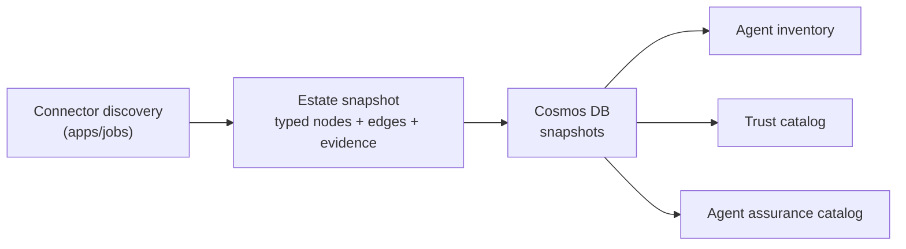
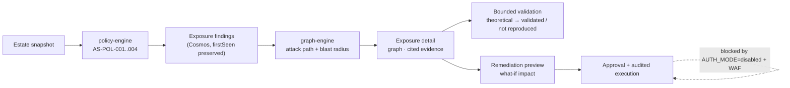

# Product overview

Agent Sentinel is a cross-platform control plane for AI agent **operations, governance, security, optimization, and lifecycle**. It consumes authoritative records from the platforms that own agents and correlates them into a single typed evidence graph. It does not recreate or replace the native administration of those platforms.

Last reviewed **2026-08-23**.

---

## The problem

An enterprise agent estate is spread across Microsoft Agent 365, Microsoft Copilot Studio, Microsoft Foundry, Microsoft 365 and SharePoint, Microsoft Teams distribution, and in-house or third-party runtimes. Each platform answers questions about its own agents well and answers nothing about the others. Nobody can answer, across the whole estate:

- Which agents exist, who owns them, and which are still in service?
- Which agent can reach sensitive data, and through which sequence of steps?
- Which finding is theoretical and which one has been validated?
- What would actually change if we applied this remediation?
- Is this agent safe enough for an employee to use for this task?

Agent Sentinel answers those five questions from one evidence set.

---

## Product pillars

| Pillar        | Question it answers                                                 | Primary surface                |
| ------------- | ------------------------------------------------------------------- | ------------------------------ |
| **Discover**  | What agents exist, on which platform, owned by whom?                | Agent inventory, Trust catalog |
| **Govern**    | Which policies apply, what is excepted, what is approved?           | Governance                     |
| **Protect**   | Where is the exposure, is it real, and what reduces it?             | Exposure list, detail, graph   |
| **Observe**   | How fresh, complete, and trustworthy is the evidence?               | Observability                  |
| **Optimize**  | What bounded, evidence-backed change is worth making?               | Optimization                   |
| **Lifecycle** | Which version is running, is it release-ready, when does it retire? | Lifecycle                      |

---

## Personas

| Persona                          | Goal                                                                                             | Surfaces used                                                   | Current fit                                                                                       |
| -------------------------------- | ------------------------------------------------------------------------------------------------ | --------------------------------------------------------------- | ------------------------------------------------------------------------------------------------- |
| **Security analyst**             | Triage exposure, understand the attack path, validate or dismiss a finding, propose remediation. | Exposure list and detail, graph, evidence drawer, Observability | **Current.** Live Cosmos-backed findings from Foundry declared configuration.                     |
| **Agent platform owner / SRE**   | Keep discovery healthy, know which connectors are degraded, know which evidence is stale.        | Connectors, Observability, Overview                             | **Current.** Connector readiness and measured connection health are implemented.                  |
| **Governance / compliance lead** | Prove which policies are enforced, where exceptions live, and which agents fail a control.       | Governance, Trust catalog, Lifecycle                            | **Current for posture.** The approval work queue is in progress.                                  |
| **Agent owner (business unit)**  | See only their agents, understand what is blocking release, and act on scoped recommendations.   | Agent inventory (filtered), Agent detail, Optimization          | **Current for read.** Owner-scoped personalization is blocked on authenticated login.             |
| **Employee / agent consumer**    | Decide whether a discoverable agent is trustworthy enough to use for a specific task.            | Agent assurance catalog                                         | **Current for assurance overlay.** Entitlement personalization is blocked on Entra.               |
| **Approver / Administrator**     | Authorize a remediation and keep an audit trail; configure the control plane.                    | Exposure detail, Settings                                       | **Code foundation complete, blocked.** See [Auth states](security-authentication.md#auth-states). |

---

## Core workflows

### 1. Discover and inventory

The ingestion loop in `apps/jobs` runs at startup and then every `DISCOVERY_INTERVAL_MS` (default 300000 ms), and can also be triggered on demand through the `snapshot-ingestion` Service Bus queue. Each tick discovers, snapshots, evaluates policy, upserts findings, and resolves findings that are no longer present.

### 2. Detect, validate, and remediate exposure

Deterministic policies currently shipped:

| Policy       | Name                                            | Severity |
| ------------ | ----------------------------------------------- | -------- |
| `AS-POL-001` | Unapproved external transfer or send            | critical |
| `AS-POL-002` | Overprivileged employee lookup without approval | high     |
| `AS-POL-003` | Mutation tool without approval                  | high     |
| `AS-POL-004` | Sensitive data requires controlled egress       | critical |

Findings carry `validationStatus` of `theoretical`, `validated`, or `mitigated`, and a `sourceMode` of `mock` or `foundry` so provenance is never ambiguous.

### 3. Govern and assure

Governance posture is derived from the same Cosmos-backed findings the Exposure surface uses, so a posture tile always deep-links to the exact filtered findings that produced it. There is no separate governance scoring store to drift out of sync.

### 4. Assess an agent

Each agent gets an assurance scorecard with **six independent dimensions**, each with its own posture, coverage, and plain-language explanation:

| Dimension       | Source today                                         | State                                                                  |
| --------------- | ---------------------------------------------------- | ---------------------------------------------------------------------- |
| **Security**    | Live exposure findings for that agent                | **Current.** Reports `unknown` when live exposures fail to load.       |
| **Governance**  | Policy posture and approval evidence                 | **Current.**                                                           |
| **Lifecycle**   | Release-readiness checks over declared configuration | **Current.**                                                           |
| **Quality**     | Evaluation results                                   | **Unknown by design** — no evaluation connector is connected.          |
| **Reliability** | Runtime availability and failure telemetry           | **Unknown by design** — no runtime telemetry connector.                |
| **Cost**        | Agent-level token usage and cost telemetry           | **Unknown by design** — see [token economics](#token-economics-scope). |

Dimensions are deliberately **not** collapsed into a single number. An unknown dimension stays visibly unknown; it is never averaged away into a comfortable score.

---

## Inventory vs Assurance catalog vs Trust catalog

Three surfaces list agents. They answer different questions for different audiences and must not be conflated.

|                     | **Agent inventory**                                         | **Agent assurance catalog**                                         | **Trust catalog**                                                      |
| ------------------- | ----------------------------------------------------------- | ------------------------------------------------------------------- | ---------------------------------------------------------------------- |
| Route               | `/agent-inventory`                                          | `/agent-catalog`                                                    | `/trust-catalog`                                                       |
| Audience            | Security, platform, and governance operators                | Employees and agent consumers                                       | Security architects and reviewers                                      |
| Question            | _"What does the organization run?"_                         | _"Is this agent safe enough for me to use?"_                        | _"What is this component made of and what may it do?"_                 |
| Scope               | Every discovered agent, all environments                    | Discoverable agents presented as an assurance overlay               | Agents, MCP servers, tools, models, and connectors                     |
| Columns             | Platform, ownership, environment, trust, readiness, version | Availability, assurance posture, owner, platform                    | Provenance, permissions, dependencies, validation, exposure, lifecycle |
| Authoritative store | The source platform, never Agent Sentinel                   | Agent 365 or the publishing platform                                | The source platform                                                    |
| Current gap         | Only the Foundry connector supplies live records            | Entitlement personalization is blocked on authenticated Entra login | Runtime usage evidence requires a telemetry connector                  |

The assurance catalog is explicitly an **overlay**. Agent 365 or the publishing platform remains the authoritative store and access-control plane; Agent Sentinel adds assurance context and never grants, revokes, or brokers access.

---

## Differentiation from Microsoft Agent 365

Agent 365 is an authoritative registry and administration plane for the agents it governs. Agent Sentinel is a **consumer** of that record, catalogued in the connector list as `m365-agent-registry` with lifecycle state `authorization-required` and ownership model `consumes`.

| Concern                                    | Agent 365                         | Agent Sentinel                                                              |
| ------------------------------------------ | --------------------------------- | --------------------------------------------------------------------------- |
| Agent registration and administration      | **Authoritative**                 | Reads and cites; never writes                                               |
| Identity and entitlement of an agent       | Authoritative via Microsoft Entra | Reads and cites; correlates into the graph                                  |
| Cross-platform correlation                 | Scoped to agents it governs       | **Differentiator** — one graph across Foundry, Copilot Studio, M365, custom |
| Deterministic attack path and blast radius | Not provided                      | **Differentiator**                                                          |
| Bounded safe validation                    | Not provided                      | **Differentiator**                                                          |
| Remediation what-if preview                | Not provided                      | **Differentiator**                                                          |
| Per-agent explainable assurance dimensions | Not provided                      | **Differentiator**                                                          |
| Cross-domain governance workflow           | Scoped to its own administration  | **Differentiator** — one evidence set for security, platform, and business  |

The same boundary applies to Microsoft Entra, Microsoft Defender, and Microsoft Purview. Agent Sentinel enriches; it never becomes the system of record.

---

## AI and LLM boundary

This boundary is a product invariant, not an implementation detail. It is recorded in [ADR 0002](adr/0002-evidence-first-deterministic-core.md).

| Concern                                         | Owner                                |
| ----------------------------------------------- | ------------------------------------ |
| Whether a finding exists                        | Deterministic policy engine          |
| Which attack path and blast radius are real     | Deterministic graph traversal        |
| What an authorized action is permitted to do    | Role and capability guards           |
| Plain-language explanation of existing evidence | **GPT-5.6 Terra advisory narrative** |

Concretely:

- The advisory service is grounded: the model is given only the finding, its cited evidence, and the affected sub-graph, and its output is schema-validated. A narrative that cannot be grounded in the supplied evidence is rejected as an `AdvisoryGroundingError`.
- Model input and output pass through a redaction layer that strips keys, tokens, JWTs, SAS signatures, credentials, and email addresses.
- The model deployment is pinned (`gpt-5.6-terra`, `GlobalStandard`, `NoAutoUpgrade`) so narratives are repeatable.
- When no advisory deployment is configured, a deterministic mock provider is used. On the public Azure edge, advisory output is **mock** until corporate Entra and WAF activation.
- The language model never establishes security truth and never authorizes an action.

---

## Live evidence today

The estate is **synthetic only**. Six purpose-built Microsoft Foundry validation agents run on GPT-5.6 Terra:

| Agent                       | Designed to exercise                             |
| --------------------------- | ------------------------------------------------ |
| `sales-research-vulnerable` | Uncontrolled egress from a sensitive data reader |
| `procurement-gated`         | Approval-gated mutation as the safe control case |
| `customer-support-safe`     | Read-only knowledge access as the clean baseline |
| `hr-policy-overprivileged`  | Overprivileged employee lookup                   |
| `incident-triage-readonly`  | Read-only telemetry access                       |
| `external-transfer-unsafe`  | Unapproved external transfer                     |

There are **no production customer agents** in the environment. The Foundry connector returns **declared configuration** — the agent and function-tool definitions the platform holds. It does **not** return runtime traces, tool authorization decisions, or cost. Those are reported as connector blind spots rather than silently treated as clean.

---

## Token economics scope

**Measured analysis is implemented; live activation is pending.**

Agent-level measured token totals, measured cost-per-success, coverage, and deterministic anomalies are implemented. Owner/business-unit attribution and broader business-outcome economics remain planned.

It is gated on configured runtime telemetry. The read-only `azure-monitor-otel` connector is implemented and is the intended measured source for behavior drift and token economics; deployment activation still requires instrumented request spans, workspace configuration, and least-privilege query access. Until those prerequisites are injected:

- The **cost** dimension of every assurance scorecard reports `unknown` with the explanation that agent-level token usage and cost telemetry are not connected.
- No estimated, extrapolated, or model-inferred cost figure is displayed anywhere in the product.

Sequencing and definition of done: [roadmap.md](roadmap.md).

---

## Planned capabilities

| Capability                      | Description                                                                                           | Depends on                                      |
| ------------------------------- | ----------------------------------------------------------------------------------------------------- | ----------------------------------------------- |
| **Behavioral drift activation** | Baseline normal agent behavior, then detect and explain deviation from configured measured telemetry. | Instrumented spans and connector configuration  |
| **Universal adapters**          | A documented manifest and authenticated ingestion contract so any agent runtime can supply evidence.  | `custom-manifest-adapter` schema and ingest API |
| **Shift-left scanning**         | Evaluate an agent definition against the same deterministic policies before it is published.          | Governance lifecycle workflow completion        |
| **Business-value evidence**     | Tie agent activity to business outcomes rather than to raw invocation counts.                         | Runtime telemetry plus outcome sources          |

See [roadmap.md](roadmap.md) for phases and definitions of done, and [known-issues.md](known-issues.md) for what currently constrains each one.
