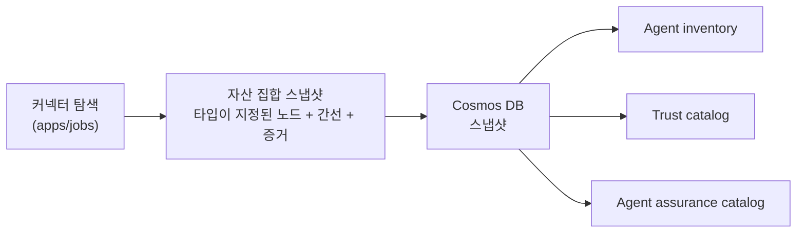
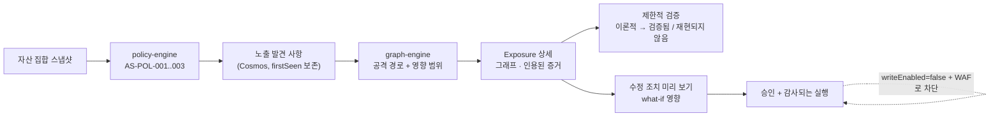

# 제품 개요

Agent Sentinel은 AI 에이전트의 **운영, 거버넌스, 보안, 최적화, 수명주기**를 위한 플랫폼 간 제어 계층입니다. 에이전트를 소유한 플랫폼의 권위 있는 기록을 읽어 타입이 지정된 단일 증거 그래프로 상관 분석합니다. 해당 플랫폼의 고유 관리 기능을 복제하거나 대체하지 않습니다.

마지막 검토일: **2026-09-14**.

---

## 해결하려는 문제

기업의 에이전트 자산 집합(estate)은 Microsoft Agent 365, Microsoft Copilot Studio, Microsoft Foundry, Microsoft 365와 SharePoint, Microsoft Teams 배포, 자체 또는 타사 런타임에 흩어져 있습니다. 각 플랫폼은 자신의 에이전트에 관한 질문에는 잘 답하지만 다른 플랫폼에 관해서는 답하지 못합니다. 자산 집합 전체를 대상으로 다음 질문에 답할 수 있는 주체가 없습니다.

- 어떤 에이전트가 존재하고, 누가 소유하며, 어떤 에이전트가 아직 서비스 중인가?
- 어떤 에이전트가 어떤 단계의 연속을 통해 민감한 데이터에 도달할 수 있는가?
- 어떤 발견 사항이 이론적이며 어떤 것이 검증되었는가?
- 이 수정 조치를 적용하면 실제로 무엇이 바뀌는가?
- 직원이 이 작업에 사용할 만큼 이 에이전트가 안전한가?

Agent Sentinel은 하나의 증거 집합으로 이 다섯 가지 질문에 답합니다.

---

## 제품의 핵심 축

| 핵심 축      | 답하는 질문                                                     | 주요 화면                      |
| ------------ | --------------------------------------------------------------- | ------------------------------ |
| **발견**     | 어떤 에이전트가 어느 플랫폼에 있고 누가 소유하는가?             | Agent inventory, Trust catalog |
| **거버넌스** | 어떤 정책이 적용되고 무엇이 예외이며 무엇이 승인되었는가?       | Governance                     |
| **보호**     | 노출은 어디에 있고 실제인가? 무엇으로 줄일 수 있는가?           | Exposure 목록·상세·그래프      |
| **관측**     | 증거가 얼마나 최신이고 완전하며 신뢰할 수 있는가?               | Observability                  |
| **최적화**   | 증거가 뒷받침하는 제한된 변경 중 무엇을 수행할 가치가 있는가?   | Optimization                   |
| **수명주기** | 어떤 버전이 실행 중이고 릴리스 준비가 되었으며 언제 폐기되는가? | Lifecycle                      |

---

## 사용자 유형

| 사용자 유형                                            | 목표                                                                                                | 사용하는 화면                                          | 현재 지원 수준                                                                                     |
| ------------------------------------------------------ | --------------------------------------------------------------------------------------------------- | ------------------------------------------------------ | -------------------------------------------------------------------------------------------------- |
| **보안 분석가**                                        | 노출 우선순위를 정하고 공격 경로를 이해하며 발견 사항을 검증하거나 기각하고 수정 조치를 제안합니다. | Exposure 목록·상세, 그래프, 증거 서랍, Observability   | **현재 지원.** Foundry의 선언된 설정에서 나온 실제 Cosmos 기반 발견 사항을 제공합니다.             |
| **에이전트 플랫폼 소유자·사이트 신뢰성 엔지니어(SRE)** | 탐색 상태를 정상으로 유지하고 저하된 커넥터와 오래된 증거를 파악합니다.                             | Connectors, Observability, Overview                    | **현재 지원.** 커넥터 준비도와 실측 연결 상태가 구현되었습니다.                                    |
| **거버넌스·규정 준수 책임자**                          | 어떤 정책이 강제되고 예외는 어디에 있으며 어떤 에이전트가 통제를 통과하지 못했는지 입증합니다.      | Governance, Trust catalog, Lifecycle                   | **현재 코드에 구현.** 영속 작업 흐름은 존재하지만 공개 변경 요청은 차단되어 있습니다.              |
| **에이전트 소유자(사업부)**                            | 자신의 에이전트만 보고 릴리스 차단 요인을 이해하며 범위가 지정된 권고에 따라 조치합니다.            | Agent inventory(필터 적용), Agent detail, Optimization | **읽기 지원.** 소유자 범위 개인화는 인증된 로그인을 기다리며 차단되어 있습니다.                    |
| **직원·에이전트 사용자**                               | 자신의 신원에 대해 권위 있는 사용 권한 증거로 뒷받침되는 에이전트를 봅니다.                         | My agents                                              | **기본 거부형(fail-closed).** 인증과 사용 권한 증거가 구성된 경우에만 사용할 수 있습니다.          |
| **승인자·관리자**                                      | 수정 조치를 승인하고 감사 이력을 유지하며 제어 계층을 구성합니다.                                   | Exposure 상세, Settings                                | **코드 기반 완료, 차단 상태.** [인증 상태](security-authentication.md#auth-states)를 참고하십시오. |

---

## 핵심 작업 흐름

### 1. 발견 및 인벤토리

`apps/jobs`의 수집 루프는 시작 시와 이후 `DISCOVERY_INTERVAL_MS`마다(기본값 300000ms) 실행되며, `snapshot-ingestion` Service Bus 큐를 통해 필요할 때 트리거할 수도 있습니다. 각 주기마다 탐색, 스냅샷 생성, 정책 평가, 발견 사항 삽입·갱신, 더 이상 존재하지 않는 발견 사항의 해결 처리를 수행합니다.

### 2. 노출 탐지·검증·수정

현재 제공되는 결정론적 정책:

| 정책         | 이름                              | 심각도 |
| ------------ | --------------------------------- | ------ |
| `AS-POL-001` | 승인되지 않은 외부 전송 또는 발송 | 치명적 |
| `AS-POL-002` | 승인 없는 과도한 권한의 직원 조회 | 높음   |
| `AS-POL-003` | 승인 없는 변경 도구               | 높음   |

실제 수집 및 개발 초기 단계 검사(시프트 레프트) 노출 카탈로그에는 `AS-POL-001..003`이 포함됩니다.
`AS-POL-004`는 로컬 모의 작업 흐름에서만 사용하는 기존 공격 경로 `Finding` 평가기입니다.
`ExposureFinding`으로 영속화되지 않으며 실제 정책 포괄 범위에 포함해서는 안 됩니다.

발견 사항에는 `theoretical`, `validated`, `mitigated` 중 하나인 `validationStatus`와 `mock`, `foundry`, 비권위 `manifest` 중 하나인 `sourceMode`가 포함되므로 출처가 모호해지지 않습니다.

### 3. 거버넌스 및 보증

거버넌스 상태는 Exposure 화면과 동일한 Cosmos 기반 발견 사항에서 도출되므로 상태 타일은 항상 해당 상태를 만든 정확한 필터 결과로 직접 연결됩니다. 별도 거버넌스 점수 저장소가 없어 동기화 불일치가 발생하지 않습니다.

### 4. 에이전트 평가

각 에이전트에는 **서로 독립적인 6개 차원**의 보증 평가표가 있으며 각 차원마다 자체 상태, 포괄 범위, 쉬운 설명이 있습니다.

| 차원         | 현재 원본                                    | 상태                                                                                            |
| ------------ | -------------------------------------------- | ----------------------------------------------------------------------------------------------- |
| **보안**     | 해당 에이전트의 실제 노출 발견 사항          | **현재 지원.** 실제 노출을 불러오지 못하면 `unknown`으로 보고합니다.                            |
| **거버넌스** | 정책 상태 및 승인 증거                       | **현재 지원.**                                                                                  |
| **수명주기** | 선언된 설정에 대한 릴리스 준비도 검사        | **현재 지원.**                                                                                  |
| **품질**     | 평가 결과                                    | **설계상 알 수 없음** — 평가 커넥터가 연결되지 않았습니다.                                      |
| **신뢰성**   | 정확한 Azure Monitor 기준·관측 오류율 증거   | **실제 서비스, 증거 게이트 적용** — 두 기간 모두 최소 샘플 10개를 충족할 때까지 알 수 없습니다. |
| **비용**     | 에이전트 수준 토큰 사용량 및 비용 텔레메트리 | **설계상 알 수 없음** — [토큰 경제성](#token-economics-scope)을 참고하십시오.                   |

차원들을 의도적으로 단일 숫자로 **합치지 않습니다**. 알 수 없는 차원은 눈에 보이게 알 수 없는 상태로 남으며, 안심시키는 평균 점수 속에 숨기지 않습니다.

---

## 인벤토리·에이전트 카탈로그·개인 목록·신뢰 카탈로그 비교

네 화면은 에이전트 관련 레코드를 나열합니다. 서로 다른 사용자의 서로 다른 질문에 답하므로 혼동해서는 안 됩니다.

|                  | **Agent inventory**                                                    | **Agent assurance catalog**                                                              | **My agents**                                                                            | **Trust catalog**                                          |
| ---------------- | ---------------------------------------------------------------------- | ---------------------------------------------------------------------------------------- | ---------------------------------------------------------------------------------------- | ---------------------------------------------------------- |
| 라우트           | `/agent-inventory`                                                     | `/agent-catalog`                                                                         | `/my-agents`                                                                             | `/trust-catalog`                                           |
| 대상             | 보안·플랫폼·거버넌스 운영자                                            | 권한 있는 운영자                                                                         | 인증된 직원 및 에이전트 사용자                                                           | 보안 설계자 및 검토자                                      |
| 질문             | _"어떤 에이전트 노드가 발견되었는가?"_                                 | _"조직 전체에 어떤 에이전트 카탈로그 증거가 있는가?"_                                    | _"어떤 에이전트에 대해 나의 권위 있는 사용 권한 증거가 있는가?"_                         | _"이 구성요소는 무엇으로 이루어졌고 무엇을 할 수 있는가?"_ |
| 범위             | 모든 환경의 발견된 모든 에이전트                                       | `kind === "agent"`인 모든 스냅샷 노드. 확장 제어 항목은 제외                             | 정확하고 권위 있는 개인별 사용 권한 일치만 포함                                          | 에이전트, MCP 서버, 도구, 모델, 커넥터                     |
| 경계             | 발견이 런타임 사용을 입증하지 않음                                     | Agent 365 패키지는 사용 권한·설치·신뢰·런타임을 입증하지 않으며 합성 Foundry 표시는 유지 | 인벤토리로 대체하지 않으며 증거를 알 수 없거나 사용할 수 없으면 에이전트를 반환하지 않음 | 출처 정보, 권한, 의존성, 검증, 노출, 수명주기              |
| 권위 있는 저장소 | 원본 플랫폼이며 Agent Sentinel이 아님                                  | Agent 365 또는 게시 플랫폼                                                               | Agent 365 또는 게시 플랫폼                                                               | 원본 플랫폼                                                |
| 현재 미충족 사항 | Foundry와 Agent 365는 배포되었으나 플랫폼 간 정확한 신원 연결은 미완료 | Agent 365 agent-package 레코드 302개와 합성 Foundry 검증 레코드 6개 존재                 | 인증이 비활성화되어 엔드포인트가 올바르게 기본 거부 처리                                 | 적격 실제 OTel 증거 0개                                    |

보증 카탈로그는 명시적으로 **운영자를 위한 보조 계층**입니다. Agent 365 또는 게시 플랫폼이 권위 있는 저장소이자 접근 제어 계층으로 남습니다. Agent Sentinel은 증거 맥락을 추가할 뿐 접근을 부여·취소·중개하지 않습니다. **My agents**는 별도의 개인화 화면이며 사용 권한 증거가 없을 때 조직 인벤토리로 대체하지 않습니다.

---

## Microsoft Agent 365와의 차별점

Agent 365는 자신이 관리하는 에이전트의 권위 있는 레지스트리이자 관리 계층입니다. Agent Sentinel은 그 기록의 **소비자**이며 `m365-agent-registry`로 카탈로그에 등록되어 있습니다. 참조 배포는 패키지 308개를 agent-package 노드 302개와 extension-package 노드 6개로 정규화한 준비·완전 상태입니다. 소유권 모델은 `consumes`로 유지됩니다.

| 영역                             | Agent 365                             | Agent Sentinel                                                                        |
| -------------------------------- | ------------------------------------- | ------------------------------------------------------------------------------------- |
| 에이전트 등록 및 관리            | **권위 있는 원본**                    | 읽고 인용하며 쓰지 않음                                                               |
| 에이전트 신원 및 사용 권한       | Microsoft Entra를 통한 권위 있는 원본 | 읽고 인용하며 그래프에 상관 분석                                                      |
| 플랫폼 간 상관 분석              | 관리 대상 에이전트로 범위 제한        | **차별점** — Foundry, Copilot Studio, M365, 사용자 지정 환경을 아우르는 하나의 그래프 |
| 결정론적 공격 경로 및 영향 범위  | 제공하지 않음                         | **차별점**                                                                            |
| 범위가 제한된 안전한 검증        | 제공하지 않음                         | **차별점**                                                                            |
| 수정 조치 what-if 미리 보기      | 제공하지 않음                         | **차별점**                                                                            |
| 에이전트별 설명 가능한 보증 차원 | 제공하지 않음                         | **차별점**                                                                            |
| 도메인 간 거버넌스 작업 흐름     | 자체 관리로 범위 제한                 | **차별점** — 보안·플랫폼·비즈니스를 위한 하나의 증거 집합                             |

동일한 경계가 Microsoft Entra, Microsoft Defender, Microsoft Purview에도 적용됩니다. Agent Sentinel은 정보를 보강하며 권위 있는 기록 시스템이 되지 않습니다.

---

## AI 및 대규모 언어 모델의 경계

이 경계는 구현 세부 사항이 아니라 제품 불변 원칙입니다. [아키텍처 결정 기록 0002](adr/0002-evidence-first-deterministic-core.md)에 기록되어 있습니다.

| 판단 영역                                      | 책임 주체                   |
| ---------------------------------------------- | --------------------------- |
| 발견 사항의 존재 여부                          | 결정론적 정책 엔진          |
| 어떤 공격 경로와 영향 범위가 실제로 성립하는지 | 결정론적 그래프 탐색        |
| 승인된 작업에 허용되는 행동                    | 역할 및 기능 권한 보호      |
| 기존 증거를 쉬운 언어로 설명                   | **GPT-5.6 Terra 자문 설명** |

구체적인 경계:

- 자문 서비스는 근거 기반입니다. 모델에는 발견 사항, 인용된 증거, 영향을 받는 하위 그래프만 제공하고 출력은 스키마로 검증합니다. 제공된 증거에 근거할 수 없는 설명은 `AdvisoryGroundingError`로 거부합니다.
- 모델 입력과 출력은 키, 토큰, JWT(JSON 웹 토큰), SAS(공유 액세스 서명), 자격 증명, 이메일 주소를 제거하는 민감정보 삭제 계층을 거칩니다.
- 설명을 재현할 수 있도록 모델 배포를 고정합니다(`gpt-5.6-terra`, `GlobalStandard`, `NoAutoUpgrade`).
- 자문 배포가 구성되지 않으면 결정론적 모의 공급자를 사용합니다. 공개 Azure 에지의 자문 출력은 사내 Entra 및 WAF 활성화 전까지 **모의**입니다.
- 대규모 언어 모델(LLM)은 보안 사실을 결정하거나 작업을 승인하지 않습니다.

---

## 현재 실제 서비스 증거

자산 집합은 **합성 전용**입니다. 목적에 맞게 만든 Microsoft Foundry 검증 에이전트 6개가 GPT-5.6 Terra에서 실행됩니다.

| 에이전트                    | 검증하도록 설계된 시나리오                        |
| --------------------------- | ------------------------------------------------- |
| `sales-research-vulnerable` | 민감한 데이터 읽기 주체의 통제되지 않은 외부 송신 |
| `procurement-gated`         | 안전한 대조 사례인 승인 게이트 적용 변경          |
| `customer-support-safe`     | 문제가 없는 기준 사례인 읽기 전용 지식 접근       |
| `hr-policy-overprivileged`  | 과도한 권한의 직원 조회                           |
| `incident-triage-readonly`  | 읽기 전용 텔레메트리 접근                         |
| `external-transfer-unsafe`  | 승인되지 않은 외부 전송                           |

이 환경에는 **프로덕션 고객 에이전트가 없습니다**. Foundry 커넥터는 플랫폼이 보유한 에이전트 및 함수 도구 정의인 **선언된 설정**을 반환합니다. 런타임 추적, 도구 권한 부여 결정, 비용은 반환하지 **않습니다**. 이를 조용히 정상으로 취급하지 않고 커넥터의 관측 사각지대로 보고합니다.

---

## 토큰 경제성 범위

**실측 분석과 비즈니스 성과 증거 계약은 구현되었으며 실제 서비스 활성화는 대기 중입니다.**

에이전트 수준의 실측 토큰 총량, 실측 성공당 비용, 포괄 범위, 결정론적 이상 탐지,
원본을 인용한 소유자·사업부 귀속이 구현되었습니다. OTel의 정확한 에이전트 실행·상관관계
식별자는 보존되며 그 포괄 범위가 표시됩니다. 더 넓은 비즈니스 성과 경제성은 권위 있는
성과 원본이 일치하는 식별자와 기간 의미를 제공할 때까지 알 수 없는 상태입니다.

활성화에는 런타임 텔레메트리 구성이 필요합니다. 읽기 전용 `azure-monitor-otel` 커넥터가 구현되어 행동 드리프트와 토큰 경제성의 실측 원본으로 사용되도록 설계되었습니다. 배포 활성화에는 여전히 계측된 요청 스팬, 작업 영역 설정, 최소 권한 쿼리 접근이 필요합니다. 이 선행 조건이 제공되기 전까지는 다음과 같습니다.

- 모든 보증 평가표의 **비용** 차원은 에이전트 수준 토큰 사용량과 비용 텔레메트리가 연결되지 않았다는 설명과 함께 `unknown`으로 보고합니다.
- 제품 어디에도 추정·외삽·모델 추론 비용 수치를 표시하지 않습니다.

작업 순서와 완료 기준: [로드맵](roadmap.md).

---

## 계획된 기능

| 기능                     | 설명                                                                                                 | 의존성                                      |
| ------------------------ | ---------------------------------------------------------------------------------------------------- | ------------------------------------------- |
| **행동 드리프트 활성화** | 정상 에이전트 행동의 기준을 정하고 구성된 실측 텔레메트리에서 이탈을 탐지·설명합니다.                | 계측 스팬 및 커넥터 설정                    |
| **범용 어댑터**          | 모든 에이전트 런타임이 증거를 제공할 수 있도록 문서화된 매니페스트 및 인증된 수집 계약을 제공합니다. | `custom-manifest-adapter` 스키마와 수집 API |
| **시프트 레프트 검사**   | 게시 전에 동일한 결정론적 정책으로 에이전트 정의를 평가합니다.                                       | 거버넌스 수명주기 작업 흐름 완료            |
| **비즈니스 가치 증거**   | 에이전트 활동을 단순 호출 수가 아닌 비즈니스 성과에 연결합니다.                                      | 런타임 텔레메트리 및 성과 원본              |

단계와 완료 기준은 [로드맵](roadmap.md), 각 기능의 현재 제약은 [알려진 문제](known-issues.md)를 참고하십시오.
