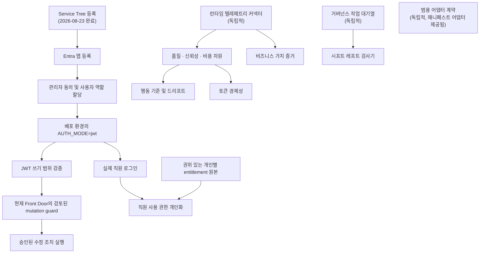

# 로드맵

Agent Sentinel의 단계별 제공 계획입니다. **2026-09-15**에 통합 코드 기준점 `1129bbe8`과
배포 코드 `7c1336bc`를 대조했습니다. 수량·관측 시각은 [현재 상태](current-status.md)가
기준이며, 아래 구현 완료와 실제 배포·실증 완료는 별도입니다.

모든 단계에는 명시적인 완료 기준이 있습니다. UI가 표시된다고 완료된 것은 아닙니다. 증거가 실제이고, 경계가 코드로 강제되며, 모델 접근 없이 테스트로 동작을 입증할 때 완료됩니다.

## 검증된 실제 서비스 기준점

- Agent 365 패키지 카탈로그는 배포되어 `ready / complete`입니다. 변동하는 수량과 분류는 [관측 기록](current-status.md#connector-ledger)을 참고합니다.
- `RUNS_AS`의 정확한 간선 0개, 적격한 실제 OpenTelemetry(OTel) 레코드 0개, 인증 비활성화, 쓰기 false이므로 Release readiness는 **partial**로 남습니다. 이 운영 결과는 릴리스 검토의 필수 입력이지 릴리스 승인이 아닙니다.
- 참조 환경의 커넥터 원본 계층은 프로비저닝되었습니다. 새 테넌트에는 여전히 자체 격리 리소스와 권한이 필요합니다.
- Entra 인증 기반 코드와 release-review v2 도구는 배포 기준 코드에 포함되어 있습니다. 관리자 동의·역할·로그인 활성화와 사람의 승인은 미완료입니다.
- 이후 Foundry instance identity 지원, 외부 runtime SDK, pilot 도구, 패키징·시각 표시는 저장소 변경이며 아직 미배포입니다. SDK만 추가한다고 실제 스팬이 생기지 않습니다.

---

## 두 개의 독립적인 작업 경로

작업은 사내 신원을 사용할 수 있을 때까지 진행할 수 없는 경로와 지금 진행할 수 있는 경로로 나뉩니다. 이 둘을 혼동하는 것이 이 프로젝트에서 가장 흔한 계획 오류입니다.

모든 실제 서비스 커넥터는 이제 하나의 공통 다중 원본 계약을 따릅니다. 독립적으로
허가된 원본 인스턴스, 안정적인 자산 집합(estate) 격리, 원본 범위 출처 정보,
원본별 상태, 결정론적 집계, 불완전한 권위 있는 스냅샷의 승격 금지가 그 내용입니다.

| 작업 경로                   | 게이트                                                       | 지금 시작 가능한가?              |
| --------------------------- | ------------------------------------------------------------ | -------------------------------- |
| 신원·쓰기·수정 조치         | 등록은 완료, 관리자 동의·역할·실제 JWT 및 쓰기 승인은 미완료 | **활성화는 승인 대기**           |
| 런타임 텔레메트리 및 경제성 | 외부 런타임 계측·정확한 바인딩·실측 데이터 필요              | **SDK 지원은 있음, 실증은 대기** |
| 거버넌스 작업 흐름          | 없음                                                         | **가능**                         |
| 범용 어댑터                 | 실제 API 수집을 위한 인증된 쓰기 활성화                      | **코드 작업 가능**               |
| 공개 에지 강화              | Service Tree가 아닌 도메인 소유권                            | **가능**                         |

---

## 0단계 — 증거 우선 기반 · **완료**

결정론적 코어, 전체 탐색 화면, 실제 Microsoft Foundry 탐색, Cosmos 기반 노출 및 거버넌스, 증거 기반 평가표, 커넥터 카탈로그, Entra RBAC(역할 기반 접근 제어) 코드 기반을 제공했습니다.

**완료 기준 — 충족:**

- 모든 화면은 타입이 지정된 증거에서 렌더링되거나 `unknown`을 명시적으로 보고합니다.
- 모델 접근 없이 단위 테스트로 결정론적 정책과 그래프 동작을 입증할 수 있습니다.
- 모의 경로는 Azure 접근 없이 처음부터 끝까지 실행됩니다.
- 실제 Foundry 탐색 결과는 Cosmos에 영속화되어 Exposure 및 Governance 화면에 반영됩니다.
- 합성 검증 에이전트 6개가 실제 서비스 검증을 통과했습니다. 6개 중 6개입니다.
- API·웹·종단 간 테스트 모음이 통과합니다. [검증 기준 결과](current-status.md#validation-baseline)를 참고하십시오.

---

## 1단계 — 거버넌스 작업 대기열 및 수명주기 작업 흐름 · **완료** · _독립적_

읽기 전용 거버넌스 상태를 실제 운영 가능한 작업 흐름으로 전환합니다.

**범위**

- 할당, 상태 전이, 불변 감사 이력을 갖춘 승인 작업 대기열.
- 정책 예외 수명주기: 요청, 승인, 만료, 재평가.
- 승격, 드리프트 확인, 롤백, 폐기의 수명주기 상태 전이를 증거로 기록.
- 보안·플랫폼·비즈니스 소유자가 하나의 공통 증거 집합에 따라 행동하도록 도메인 간 라우팅.

**의존성:** 없음. 실제 대상을 향한 승인 _실행_은 3단계에서 별도로 제한합니다.

**구현된 내용**

- 공통 도메인과 API에서 할당 및 상태 보호를 강제합니다.
- 모든 전이는 원본 참조, 수행자, 타임스탬프, 기능 권한, 권한 부여 맥락을 포함하는 증거를 추가합니다. 저장소 읽기는 복제본을 반환하므로 호출자가 저장 이력을 변경할 수 없습니다.
- `AUTH_MODE=disabled`는 호출자가 제공한 신원을 무시하고 수행자와 권한 부여 주체를 `anonymous`로 기록합니다. 모의 모드와 JWT(JSON 웹 토큰) 모드는 명시적 맥락을 유지합니다.
- 정책 예외에는 정책, 증거, 만료가 필요합니다. 승인, 거부, 시간 검사 기반 만료, 증거 기반 재평가는 API 테스트로 검증합니다.
- 승인된 수명주기 검토는 선택된 승격, 드리프트 확인, 롤백, 폐기 작업만 정확히 기록할 수 있습니다.
- 거버넌스 상태는 요청마다 현재 발견 사항 전체에서 다시 계산되며 점수 저장소가 없습니다.

**완료 기준**

- [x] 모든 작업 흐름 전이가 원본·수행자·타임스탬프를 인용하는 증거 레코드를 기록한다.
- [x] `AUTH_MODE=disabled`에서 맥락이 익명으로 표시되더라도 권한 부여 맥락 없이는 어떤 전이도 불가능하다.
- [x] 전이 후 별도 점수 저장소 없이 발견 사항으로 거버넌스 상태를 다시 계산한다.
- [x] 승인·거부·만료·재평가에 대한 단위 및 종단 간 테스트 범위를 확보한다.

거버넌스 저장·전이 코드는 구현되어 있지만 현재 공개 쓰기는 제품 쓰기 스위치로 차단되어 있습니다.
Front Door의 사용자 지정 mutation guard가 배포됐다고 가정하지 않습니다.

---

## 2단계 — 사내 신원 활성화 · **진행 중** · _승인 필요_

| 차원        | 상태                                                                                                                                         |
| ----------- | -------------------------------------------------------------------------------------------------------------------------------------------- |
| 코드 준비도 | **단계적 활성화 준비 완료:** JWT·RBAC, MSAL, 초기 구성, 사전 점검, 보호된 워크플로, 검증기가 구현되었습니다.                                 |
| 활성화      | **부분 준비·차단됨:** 대체 API·SPA 등록과 service principal은 생성됐지만 관리자 동의·사용자 역할·JWT 활성화·실제 직원 로그인은 미완료입니다. |
| 활성 에지   | Front Door가 예정된 HTTPS 리디렉션·로그아웃 출처이지만 WAF의 사용자 지정 변경 요청 규칙은 증거로 확인되지 않았으며 쓰기는 false입니다.       |

OneRAI와 서비스 온보딩은 독립적으로 진행하며 로컬 구현을 차단하지 않습니다.

**범위**

- 읽기·쓰기 범위와 `AgentSentinel.Viewer` / `.Analyst` / `.Approver` / `.Administrator` 앱 역할을 노출하는 API 앱 등록.
- 증거로 확인된 HTTPS 리디렉션 URI와 동일 출처 로그아웃 URL을 갖춘 SPA 앱 등록.
- 타입이 지정된 테넌트, 대상, 발급자, JWKS, 범위, SPA, 리디렉션 설정을 `AUTH_MODE=jwt`로 활성화.
- SPA와 API를 의도적으로 서로 다른 출처로 구성하는 경우에만 승인된 CORS 출처 사용.
- 실제 주체를 대상으로 검증된 최소 권한 역할 할당.

**완료 기준**

- [ ] 실제 직원이 SPA로 로그인하고 API에서 대상과 테넌트가 검증되는 토큰을 받는다.
- 네 역할 각각이 문서화된 기능 권한 집합과 정확히 일치하며 실제 토큰으로 검증된다.
- [ ] 비공개 라우트에 익명 접근하면 `401`, 권한이 부족한 토큰이면 `403`을 반환한다.
- [ ] `/api/auth/me`는 원시 토큰이나 전체 클레임 집합 없이 민감정보를 제거한 주체를 반환한다.
- [보안 및 인증](security-authentication.md#activation-checklist)의 활성화 체크리스트가 모두 승인된다.

---

## 3단계 — 승인된 쓰기 경로 · **차단됨** · _2단계에 의존_

**범위**

- 배포된 API에 대해 JWT 쓰기 범위를 종단 간 검증합니다.
- 실제 활성 Front Door에 검토된 경로·메서드별 mutation guard를 적용하고 JWT와 함께 검증합니다. 중지된 Application Gateway의 `BlockApiMutationPreAuth`를 활성 에지의 규칙으로 취급하지 않습니다. 헤더 형태 검사는 JWT 검증을 대신하지 않습니다.
- 롤백 준비를 갖춘 승인된 수정 조치 실행을 위해 `writeEnabled`를 활성화합니다.
- 공개 에지를 대상으로 한 Terra 실제 서비스 검증에 사용되는 인증된 `POST` 경로의 차단을 해소합니다.

**완료 기준**

- 규칙을 축소한 후에도 `/api/` 아래 익명 변경 요청은 거부됩니다. 추정이 아니라 검증해야 합니다.
- 승인된 수정 조치가 실행되고 재시도 시 멱등성을 가지며 완전한 감사 기록을 생성합니다.
- 테스트한 시나리오의 수정 조치 what-if 미리 보기가 관측된 실행 후 상태와 일치합니다.
- 변경을 종료하기 전에 `RB-011` 게이트 제거 검사를 통과합니다.

---

## 4단계 — 런타임 텔레메트리 커넥터 · _쿼리 경로 연결됨, 증거 부족_

커넥터·엔진 연결부·원본 라우팅은 구현되었습니다. 현재 `otel:primary`는 `degraded / not-queried`이며
적격 에이전트 0개라 이번 수집에서 런타임 쿼리를 수행하지 않았습니다. 과거 접근 확인과
현재 조회 실행·적격 실제 증거 확보를 구분합니다.

**범위**

- [x] `azure-monitor-otel` 구현: OpenTelemetry 호환 에이전트 요청 스팬을 대상으로 제한된 Azure Monitor Logs 쿼리를 수행한다.
- [x] 투영된 행을 결합된 `ObservationWindow` 개체로 엄격하게 변환해 행동 드리프트와 토큰 경제성에 제공한다.
- [x] 집계된 에이전트를 원본별 작업 영역·테넌트·환경·공급자 에이전트 ID로 해석하고 실측 기간을 집계 자산 집합 신원에 다시 결합한다.
- [x] 독립적인 기본 자격 증명 또는 비밀정보 없는 페더레이션 자격 증명과 원본별 상태를 갖춘 다중 작업 영역 원본을 지원한다.
- [x] 정확한 자산 집합·원본·리소스·추적·스팬 출처 정보를 포함한 제한된 대표 추적·스팬·지표 픽스처를 정규화한다. 공급자 호출 없이 실제·합성 구분, 샘플링, 집계, 최신성, 중복, 페이지 처리 품질을 유지한다.
- [ ] 정확한 원본·에이전트·추적·스팬 필드, 비샘플링 실측 지연·토큰·비용, 충분한 최신 기준·관측 샘플을 갖춘 승인된 대표 비고객 스팬을 생성한다. 쿼리 권한과 작업 영역 경로는 이미 존재한다.
- [x] 관계를 만들어 내지 않고 런타임 스팬을 기존 그래프 노드와 간선에 매핑한다.
- [x] 증거 타입 수준에서 관측된 런타임 동작과 선언된 설정을 구분한다.
- [x] 외부 런타임용 `@agent-sentinel/runtime-instrumentation`과 공유 `agent.invoke` 계약을 제공한다(저장소 구현).
- [ ] 실제 agent 실행 경계에 SDK를 도입하고 exporter·sampling을 구성한다. Sentinel API/jobs의 운영 telemetry를 agent 실행으로 재분류하지 않는다.
- 비용은 권위 있는 실제 금액을 제공할 때만 기록합니다. SDK가 비용을 생략할 수 있어도 현재 분석 계약의 완전한 token/cost gate는 충족되지 않습니다. 단가를 곱한 추정값으로 통과시키지 않습니다.

**완료 기준**

- 품질·신뢰성·비용 평가표 차원이 `derived` 포괄 범위와 함께 실제 상태를 표시합니다.
- 모든 런타임 주장에는 원본, 신뢰도, 최신성, 관측 타임스탬프가 포함됩니다.
- 텔레메트리가 없으면 기본 통과가 아니라 계속 `unknown`을 보고합니다.
- Observability 화면은 텔레메트리 원본의 실제 최신성과 포괄 범위를 보여 줍니다.

---

## 5단계 — 추가 증거 커넥터 · _실제 서비스와 차단 상태 혼재_

**다중 원본 선행 조건 — 구현됨:** Foundry는 여러 테넌트·프로젝트 원본 정의를 수용하고
이후 실제 서비스 커넥터가 재사용하는 집계, 신원, 출처 정보, 상태 저하 동작을 제공합니다.
추가 대상 프로젝트와 테넌트 간 페더레이션이 승인될 때까지 배포에는
Foundry 원본이 하나만 있습니다.

**다중 원본 Entra 구성 결합 — 구현됨:** `ENTRA_SOURCES_JSON`은 각 Foundry 원본 ID를
정확한 테넌트·환경에 대응시키고 신원 증거에 네임스페이스를 적용하며 테넌트 동의 누락을
독립적으로 보고합니다. 배포 활성화는 테넌트 관리자의 `Application.Read.All`을 사용합니다.
기본 원본은 실제 서비스에 연결되어 있으며 선택적 소유자·앱 역할·미리 보기 읽기는 비활성화되어 있습니다.

**Azure Resource Graph 인벤토리 — 허가된 보기 범위에서 실제 서비스 연결:** 고정된
정식 출시(GA) REST 쿼리가 정확한 구독 범위에 대해 제한된 Azure AI 및 지원 리소스 필드를
읽습니다. 레코드는 미귀속 제어 항목·증거로 남으며 에이전트나 간선이 되지 않습니다.
애플리케이션 사용자 할당 관리 ID(UAMI)는 현재 기존 리소스 범위 역할로 리소스 5개를
영속화합니다. 더 넓은 Reader 할당은 별도 승인 결정입니다.

**다중 원본 Power Platform 인벤토리 — 구현됨, 활성화 차단:**
공식 ResourceQuery API는 제한된 Copilot Studio 및 Microsoft 365 Copilot Agent Builder
핵심 인벤토리를 제공합니다. 원본은 Foundry ID와 독립적이며 신원 간선을 추정하지 않고
Entra 다음에 결합됩니다. Microsoft가 현재 위임된 인벤토리 접근만 문서화하고
미리 보기 Power Platform RBAC 역할을 인벤토리에서 명시적으로 제외하므로
커넥터는 비활성화되어 있습니다.

**Microsoft Agent 365 패키지 카탈로그 — 배포됨, 준비·완전 상태:**
공식 Microsoft Graph v1.0 목록 API가 Power Platform 결합 이후 제한된 테넌트 패키지
인벤토리를 제공합니다. 상세 조회와 모든 쓰기는 비활성화 상태입니다. 배포된 원본에는
필수 라이선스와 `CopilotPackages.Read.All`이 있습니다. 패키지 308개에서 agent-package
노드 302개, extension-package 노드 6개, 실제 원본 결합 증거 레코드 308개가 생성되었습니다.
패키지 총수는 실행 중인 에이전트 총수가 아닙니다.

**Microsoft Defender for Cloud Apps 증거 — 기본 원본 실제 서비스 연결:**
Agent 365 결합 이후 OAuth 애플리케이션 맥락으로 공식 테넌트별 v1 경고·활동 GET 목록을
읽습니다. 증거는 범위가 제한되고 개인정보를 최소화한 테넌트 수준 자료이며, 지원되는
에이전트 상관관계 키가 없어 미귀속임을 명시합니다. Defender XDR 프로비저닝,
정확한 About 페이지 URL 탐색, 테넌트 관리자의 `Investigation.Read` 이후 대체 원본은
API·작업 처리기에서 준비 상태입니다. 현재 제한된 목록은 비어 있습니다.

**Microsoft Purview 민감도 레이블 카탈로그 — 기본 원본 실제 서비스 연결:**
Defender for Cloud Apps 이후 공식 Global Microsoft Graph v1.0 테넌트 레이블 목록을
읽습니다. 증거에는 제한된 레이블 정의 메타데이터만 포함되며 미귀속 상태를 명시적으로
유지하고 사용·콘텐츠·에이전트 상관관계·신뢰·규정 준수를 주장하지 않습니다.
대체 기본 원본은 테넌트 관리자의 `SensitivityLabel.Read`를 통해 제한된
레이블 제어 항목 12개를 영속화합니다.

**Microsoft Teams 테넌트 앱 카탈로그 — 기본 원본 실제 서비스 연결:**
Purview 이후 공식 Global Microsoft Graph v1.0 `appCatalogs/teamsApps` 목록을 문서화된
고정 `organization` 필터와 4개 필드 선택으로 읽습니다. 레코드는 제어 항목·증거 쌍이 되며
에이전트가 되지 않습니다. 배포·설치·사이드로딩·배포 포괄 범위·신뢰·도구·사용 권한·접근을
주장하지 않습니다. 대체 기본 원본은 테넌트 관리자의 `AppCatalog.Read.All`을 통해
준비 상태이며 현재 조직 항목 0개를 반환합니다.

| 커넥터                                      | 카탈로그 상태            | 게이트                                                                                                                                             |
| ------------------------------------------- | ------------------------ | -------------------------------------------------------------------------------------------------------------------------------------------------- |
| Microsoft Agent 365 (`m365-agent-registry`) | `connected`              | 배포된 `ready + complete` 상태. 패키지 308개를 agent-package 노드 302개와 extension-package 노드 6개로 정규화하고 원본 결합 증거 레코드 308개 보유 |
| Microsoft Entra 신원 및 사용 권한           | `connected`              | 기본 안정 버전 v1.0 인벤토리는 실제 서비스 연결 상태이며 추가 테넌트마다 동의 필요                                                                 |
| Azure Resource Graph                        | `connected`              | 기존 UAMI 역할로 리소스 5개가 보이며 더 넓은 Reader 범위에는 별도 승인 필요                                                                        |
| Microsoft Purview                           | `connected`              | 기본 레이블 정의 카탈로그는 실제 서비스 연결 상태이며 카탈로그 증거가 사용을 입증하지 않음                                                         |
| Microsoft Defender for Cloud Apps           | `connected`              | 기본 제한 경고·활동 목록이 준비되었으며 현재 결과는 비어 있음                                                                                      |
| Microsoft Copilot Studio / Agent Builder    | `authorization-required` | 지원되는 무인 ResourceQuery 인벤토리 권한 부여가 없으며 스키마는 미리 보기                                                                         |
| Microsoft 365 및 SharePoint 에이전트        | `connected`              | 배포된 Agent 365 패키지 메타데이터로 분류하며 SharePoint 스크래핑은 사용하지 않음                                                                  |
| Microsoft Teams 배포                        | `connected`              | 조직 카탈로그 원본이 준비되었으며 현재 결과는 비어 있음                                                                                            |

**커넥터별 완료 기준**

- 읽기 전용입니다. 어떤 커넥터도 원본 플랫폼에 쓰지 않습니다.
- `GET /api/connectors`는 기능, 권한, API 성숙도, 알려진 관측 사각지대, 실측 연결 결과를 보고합니다.
- 스키마 검증 실패는 계약 드리프트로 드러나며 조용히 모의 환경으로 대체하지 않습니다.
- 인벤토리, Trust catalog, 보증 평가표는 올바른 출처 정보와 함께 증거를 사용합니다.

---

## 6단계 — 직원 사용 권한 개인화 · **차단됨** · _5단계에 의존_

**범위:** `/my-agents`에서 검증된 Entra 사용자 ID와 권위 있는 개인별 사용 권한 결정을 정확히 연결합니다.
운영자용 `/agent-catalog`는 별도의 조직 증거 목록이며 이를 개인 목록으로 대체하지 않습니다.

**현재 구현:** fail-closed UI/API와 resolver 주입 계약은 구현·배포되었지만 production
서버의 실제 entitlement resolver는 미구성입니다. 로그인 활성화만으로는 해결되지 않습니다.
Agent 365 catalog, Teams 설치, 그룹·라이선스·게시 상태를 조합해 effective entitlement를
추정하지 않습니다. 실제 권위 원본 없이 신규 adapter 서비스를 만드는 일은 동결 이후입니다.

**완료 기준**

- 카탈로그는 인증된 주체의 실제 사용 권한을 반영합니다.
- Agent 365 또는 게시 플랫폼이 권위 있는 접근 제어 계층으로 남으며 Agent Sentinel은 접근을 부여하거나 중개하지 않습니다.
- 직원은 자신에게 보이지 않는 에이전트의 존재를 추론할 수 없습니다.

---

## 7단계 — 범용 어댑터 · **부분 제공** · _독립적_

**범위:** 타사·자체 런타임을 포함한 모든 에이전트 런타임이 증거를 제공할 수 있도록 문서화된 매니페스트 스키마와 인증된 수집 API를 제공합니다. `sourceOfTruth: false`인 `custom-manifest-adapter`로 카탈로그에 등록되어 있으며 현재 `available-to-configure`입니다.

**제공된 내용**

- 엄격한 검증을 갖추고 버전이 지정된 매니페스트 스키마를 게시했습니다. `MANIFEST_SCHEMA_VERSION`과 `SUPPORTED_MANIFEST_VERSIONS`는 `@agent-sentinel/connector-sdk`에 있으며 지원되지 않는 버전은 강제 변환하지 않고 거부합니다. 수동 관리 JSON Schema를 함께 제공하고 일치 여부를 테스트합니다.
- 참조 어댑터와 적합성 테스트: 정규화, 격리, 참조 무결성, 신뢰도, 경로 안전성 테스트 모음과 완성된 예제 매니페스트를 포함한 `@agent-sentinel/manifest-connector`.
- 어댑터 원본 증거는 자사 커넥터 증거와 눈에 띄게 구분됩니다. `sourceOfTruth: false`, `isNonAuthoritative: true`, 기본 신뢰도 0.4이며 매니페스트가 심층 런타임 텔레메트리를 선언하지 않으면 상한은 0.7입니다.
- 테넌트·환경 격리와 수집 멱등성을 위한 결정론적 SHA-256 매니페스트 해싱.
- 오프라인 검증 CLI: `pnpm manifest:validate`.
- 인증된 Administrator 전용 수집 API, 불변 `manifest-ingestions` Cosmos 버전, 결정론적 콘텐츠 해시 재시도, 고유한 `(manifestId, producedAt)` 버전.
- 작업 처리기가 자산 집합의 테넌트·환경별 최신 매니페스트 버전을 결합합니다. 어댑터 실패는 권위 있는 Foundry 스냅샷 영속화를 차단할 수 없으며 매니페스트에서 도출된 발견 사항은 `sourceMode=manifest`를 유지합니다.
- 전용 컨테이너와 API·작업 처리기 이미지는 실제 쓰기를 비활성화한 상태로 배포되었습니다. 익명 수집은 `401`을 반환하며 수용된 매니페스트는 없습니다.
- `runtime_observed` 주장에 대한 선택적 정확한 원본 결합과 비합성 Azure Monitor 증거를
  대상으로 하는 일시적 검증을 제공합니다. 누락, 모호함, 사용 불가, 관측 없음 결과는
  명시적으로 유지되며 그래프 관계를 생성하지 않습니다.
- 선언된 설정 증거에 대한 정확한 권위 있는 개체 대조를 제공합니다. 노드를 병합하거나
  어댑터 증거가 원본을 덮어쓰게 하지 않고 일치하는 자사 개체를 인용합니다.
- 일치하는 자사 개체가 해당 계약 필드를 노출할 때 어댑터가 선언한 플랫폼, 버전,
  모델, 승인 요구 사항, 도구 타입, 주체 타입, 데이터 민감도·분류, MCP 엔드포인트·승인
  필드를 정확한 타입 기반으로 비교합니다. 불일치, 원본 값 누락, 잘못된 원본 값은
  서로 다른 결과로 유지됩니다. 자유 형식 증거 주장은 개수를 세고 키로 식별하지만
  비교하거나 인정하지 않습니다.

**남은 작업**

- Administrator 역할, 쓰기 범위, 배포 쓰기 게이트, 정확한 공개 에지 변경 요청 경로가 각각 승인·검증된 후에만 실제 API 수집을 활성화합니다.

---

## 8단계 — 행동 드리프트 및 토큰 경제성 · _엔진 제공됨, 실제 증거 부족_

**범위**

- ~~런타임 텔레메트리에서 정상 에이전트 행동의 기준을 설정합니다.~~ **완료(결정론적 엔진):** `@agent-sentinel/behavior-engine`은 중앙값·중앙값 절대 편차(MAD) 통계, 드리프트 분석, 증거 포괄 범위 점수 계산을 구현합니다. 도메인 타입과 Zod 스키마는 `@agent-sentinel/domain`에 있습니다.
- ~~기준에서의 이탈을 모델 의견이 아닌 증거로 탐지·설명합니다.~~ **완료(결정론적 엔진):** `analyzeDrift`는 임계값과 실측값을 인용하는 차원별 설명을 포함한 `DriftAnalysisResult`를 생성합니다. 대규모 언어 모델(LLM)은 관여하지 않습니다.
- ~~OpenTelemetry 스팬을 `ObservationWindow` 개체에 연결합니다.~~ **완료:** 읽기 전용 Azure Monitor OTel 커넥터가 결합된 요청 행을 엄격히 매핑하며 실제 서비스에서 모의 환경으로 대체하지 않고 두 엔진에 제공합니다.
- ~~향후 성과 상관 분석에 필요한 정확한 런타임 식별자를 보존합니다.~~ **완료:** 제한된 에이전트 실행·상관관계·에이전트 버전 식별자는 비즈니스 성과 상관 분석 용어를 공유합니다. 직접적인 AppRequests 작업 ID와 명시적 OTel 속성을 보존합니다. 포괄 범위는 실행·상관관계 ID를 통한 런타임 연결 가능성을 보고하며 추정된 성과 조인이나 버전만 있는 맥락을 보고하지 않습니다.
- ~~에이전트별 실측 토큰 소비, 성공당 비용, 지출 이상 탐지, 원본을 인용한 소유자·사업부 귀속을 제공합니다.~~ **완료:** 실측 전용 토큰 경제성이 구현되었습니다. 소유자·사업부 값은 정확한 권위 있는 에이전트와 인용된 선언 설정 증거에서만 가져옵니다. 누락 값은 타입이 지정된 `partial` 또는 `unknown`으로 남습니다. 비즈니스 성과 경제성은 계획 상태입니다.

**완료 기준**

- 드리프트 발견 사항은 기준 기간, 관측된 이탈, 양쪽 증거를 인용합니다. ✅ (타입이 지정된 `DriftAnalysisResult.baselineEvidenceId` + `observedEvidenceId`)
- 비용 수치는 실측이며 추정이나 모델 추론이 아닙니다. 텔레메트리가 없으면 비용은 `unknown`으로 남습니다. ✅ (기준에 `costUsd`가 없으면 비용 차원 없음)
- Cost / Efficiency 평가표는 검증된 전체 포괄 범위의 Token Economics 보고서를 사용하며 그 외에는 `unknown`으로 남습니다. 모의·실제 커넥터 연결 지점에서 ✅. 배포 활성화에는 계측 스팬, 설정, 읽기 전용 쿼리 권한이 필요합니다.
- 모의 모드는 명확히 표시된 합성 드리프트 예제를 보여 주며 실제 서비스 모드는 `Telemetry not connected`를 표시합니다. ✅

---

## 9단계 — 비즈니스 가치 증거 · _기반 완료, 실제 원본 대기_

**범위:** 에이전트 활동을 비즈니스 성과에 연결해 호출 수에서 가치를 추정하지 않고 증거로 입증합니다.

**제공된 내용**

- 실행·상관관계 ID·에이전트 버전 식별자를 갖춘 엄격한 원본 인용 성과 관측입니다.
  현재 제품 해석기는 발견된 정확한 에이전트 버전만 수용합니다.
- 읽기 전용 성과 커넥터 계약과 명확히 표시된 모의 환경 전용 픽스처.
- 집계·금액 추정·호출 수 대리 지표 없이 원본이 작성한 값을 보존하는
  에이전트 수준 API 및 상세 UI.
- 실제 서비스 모드는 성과 원본이 미구성이면 타입이 지정된 `unknown`을 반환하며
  모의 결과로 대체하지 않고 합성 또는 계약에 맞지 않는 실제 관측을 거부합니다.

**남은 작업**

- 대상 에이전트에 대한 정확한 상관관계 식별자를 갖춘 권위 있는 비즈니스 성과 원본을 구성합니다.

**완료 기준**

- 모든 가치 주장은 활동 대리 지표가 아닌 성과 원본을 인용합니다.
- 성과 데이터가 없으면 `unknown`을 보고합니다.

---

## 10단계 — 시프트 레프트 검사 · **완료**

**범위:** 개발 초기 단계 검사인 시프트 레프트를 통해 CI 또는 플랫폼 게시 게이트에서 게시 전에 동일한 결정론적 정책 엔진으로 에이전트 정의를 평가합니다.

게시 전 평가와 배포 후 평가가 정확히 하나의 정책 정의를 공유하도록 의도적으로 거버넌스 수명주기 작업 흐름 다음에 배치했습니다. 먼저 만들면 정책 의미가 갈라질 수 있습니다.

**2026-08-26 제공 완료**

- `@agent-sentinel/shift-left-scanner`는 신뢰하지 않는 매니페스트를 기존 기본 거부형 수용·정규화 파이프라인으로 받아 기존 `evaluateAllExposurePolicies()` 런타임 진입점을 호출합니다.
- 모든 카탈로그 정책은 결정론적 `pass`, `warn`, `block`을 반환합니다. 치명적 발견 사항은 차단하고 그 외 심각도는 경고합니다. 보고서는 변경하지 않은 `ExposureFinding` 레코드를 포함하고 모든 인용 ID를 기존 `Evidence` 형태로 해석합니다.
- 이미 타입이 지정된 봉투 객체에서도 매니페스트 테넌트와 선택적 환경 결합을 다시 검사합니다. 출처 정보는 `sourceOfTruth: false`, `isNonAuthoritative: true`로 유지됩니다. 데이터를 수집하지 않으며 HTTP 엔드포인트도 추가하지 않았습니다.
- `pnpm manifest:scan`은 기본적으로 결정론적 JSON을 출력하고 설명 가능한 텍스트 보기를 제공하며 `--fail-on warn`을 지원합니다. CI에 안전한 종료 코드는 수용 `0`, 정책 게이트 실패 `1`, 잘못된 입력 `2`, 예상하지 못한 실패 `3`입니다.
- 매니페스트 계약은 이제 에이전트 정의에 선택적 `approvalRequired`를 포함합니다. 게시 전 평가가 검사기 전용 의미를 만들어 내는 대신 공통 런타임 정책 엔진이 사용하는 정확한 메타데이터를 제공합니다.

**완료 기준**

- 게시 전·배포 후 평가가 규칙 로직 중복 없이 하나의 정책 정의를 공유합니다. ✅
- 검사는 인용된 증거를 포함해 런타임 평가와 같은 형태의 발견 사항을 생성합니다. ✅
- 보안 전문 지식이 없는 에이전트 작성자에게도 차단 결과를 설명할 수 있습니다. ✅

---

## UI 디자인 시스템 및 Storybook · _기반 완료_

제품 명세는 페이지를 더 늘리기 전에 공통 UI 기본 요소를 마련하도록 요구합니다.
`@agent-sentinel/ui`가 이제 첫 프로덕션 패키지를 제공합니다.

- 의미 기반 색상·간격·모서리 반경·높이감·동작 토큰
- 재사용 가능한 핵심 성과 지표(KPI)·상태·최신성·로딩·빈 결과·저하·거부·오류 상태
- 현재 모든 제품 페이지가 사용하는 접근성 지원 단일 페이지 헤더 및 탐색 경로 계약
- 접근성 검사와 현실적인 합성 상태를 갖춘 Fluent 어두운 테마 Storybook
- 중복 로컬 구성요소에서 이전한 Observability·Optimization 지표 화면과 Optimization 운영 상태

**남은 작업:** 커넥터 카드, 타임라인, 승인 패널, 수정 조치 비교를 점진적으로 이전합니다.
기존 노출 그래프 계약을 보존할 수 있을 때만 그래프 기본 요소를 추가합니다.

---

## 공개 에지 강화 · _지속적·독립적_

번호가 있는 단계는 아니며 여러 단계의 제약 조건입니다.

| 항목                                             | 상태                                                                                                                                            |
| ------------------------------------------------ | ----------------------------------------------------------------------------------------------------------------------------------------------- |
| Application Gateway HTTP 수신기                  | 작동하지만 포트 80의 HTTP만 지원하며 사용자 지정 도메인이나 TLS는 없습니다. 관리 자동화 대상이며 중지될 수 있습니다.                            |
| Front Door 엔드포인트                            | **활성** HTTPS 경로입니다. WAF의 사용자 지정 변경 요청 규칙이 증거로 확인되지 않아 쓰기는 false를 유지해야 합니다.                              |
| 사용자 지정 도메인 및 TLS                        | 등록되어 활성화된 Front Door 기본 HTTPS 출처에 더하는 선택적 프로덕션 강화입니다. `RB-013`을 참고하십시오.                                      |
| 실행기 및 배포 RBAC                              | 대상 RG에는 전용 runner VM이 아직 없습니다. 과거 runner 권한을 현재 배포 완료 사실로 취급하지 않으며 최소 권한·네트워크 구성은 별도 검토합니다. |
| 필요한 부분만 변경하는 Container App 이미지 갱신 | 현재 수동입니다. 자동화하려면 리소스 그룹에 추가 역할 할당이 필요합니다.                                                                        |

전체 내용: [알려진 문제](known-issues.md) 및 [배포](deployment.md).
