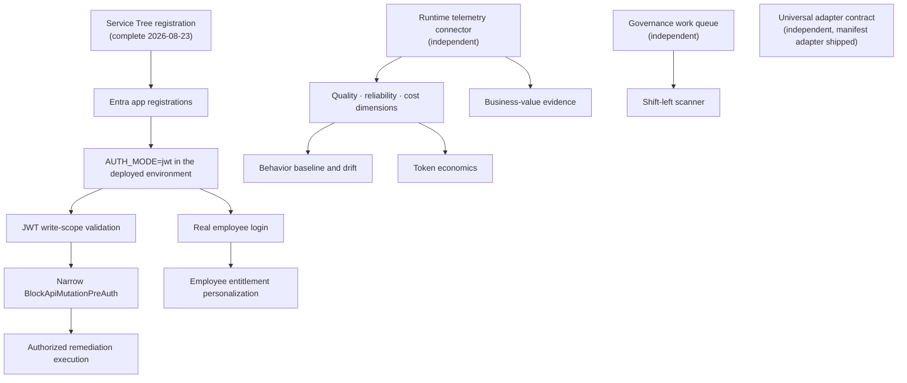

# Roadmap

Phased delivery plan for Agent Sentinel. Last reviewed **2026-08-28** against branch `feature/multi-source-otel`.

Every phase has an explicit definition of done. A phase is not done because its UI renders; it is done when its evidence is real, its boundaries are enforced in code, and its tests prove the behavior without model access.

---

## Two independent tracks

Work splits into a track that cannot move until corporate identity is available, and a track that can move today. Confusing the two is the single most common planning error on this project.

All live connectors now target one shared multi-source contract: independently
authorized source instances, stable estate isolation, source-scoped provenance,
per-source health, deterministic aggregation, and no promotion of incomplete
authoritative snapshots.

| Track                            | Gate                                                  | Can start today?  |
| -------------------------------- | ----------------------------------------------------- | ----------------- |
| Identity, write, and remediation | API and SPA app registration                          | **Yes**           |
| Runtime telemetry and economics  | None — connector implementation work                  | **Yes**           |
| Governance workflow              | None                                                  | **Yes**           |
| Universal adapters               | Authenticated write activation for live API ingestion | **Code work yes** |
| Public edge hardening            | Domain ownership, not Service Tree                    | **Yes**           |

---

## Phase 0 — Evidence-first foundation · **Complete**

Delivered the deterministic core, the full navigation surface, live Microsoft Foundry discovery, Cosmos-backed exposure and governance, evidence-backed scorecards, the connector catalog, and the Entra RBAC code foundation.

**Definition of done — met:**

- Every surface renders from typed evidence or explicitly reports `unknown`.
- Deterministic policy and graph behavior is provable in unit tests without model access.
- The mock path runs end to end with no Azure access.
- Live Foundry discovery persists to Cosmos and drives the Exposure and Governance surfaces.
- Six synthetic validation agents pass live validation, 6 of 6.
- API, web, and end-to-end suites pass. See the [validation baseline](current-status.md#validation-baseline).

---

## Phase 1 — Governance work queue and lifecycle workflow · **Complete** · _independent_

Turn read-only governance posture into an operable workflow.

**Scope**

- Approval work queue with assignment, state transitions, and an immutable audit trail.
- Policy exception lifecycle: request, approve, expire, re-evaluate.
- Lifecycle state transitions — promotion, drift acknowledgement, rollback, retirement — recorded as evidence.
- Cross-domain routing so security, platform, and business owners act on one shared evidence set.

**Dependencies:** none. Approval _execution_ against a real target is separately gated by Phase 3.

**Implemented**

- Assignment and state guards are enforced in the shared domain and API.
- Every transition appends evidence with source references, actor, timestamp, capability, and authorization context. Repository reads return clones so callers cannot mutate stored history.
- `AUTH_MODE=disabled` ignores caller-supplied identity and records the actor and authorization subject as `anonymous`; mock and JWT modes retain their explicit contexts.
- Policy exceptions require policy, evidence, and expiry; approve, reject, time-checked expiry, and evidence-backed re-evaluation are covered by API tests.
- Approved lifecycle reviews can record exactly their selected promotion, drift acknowledgement, rollback, or retirement action.
- Governance posture is recomputed from the current finding population on each request; there is no scoring store.

**Definition of done**

- [x] Every workflow transition writes an evidence record citing source, actor, and timestamp.
- [x] No transition is possible without an authorization context, even while `AUTH_MODE=disabled` renders that context anonymous.
- [x] Governance posture recomputes from findings after a transition, with no separate scoring store.
- [x] Unit and end-to-end coverage for approve, reject, expire, and re-evaluate.

Durable live governance cases and append-only transition history are persisted in Cosmos. Public writes remain independently blocked by the product write switch and WAF.

---

## Phase 2 — Corporate identity activation · **In progress** · _approval required_

**Current condition:** the single-tenant API and SPA registrations exist, the Front Door HTTPS
origin is registered, and read-only JWT mode is deployed. Employee popup sign-in, logout,
anonymous `401`, Viewer mutation `403`, and `/api/auth/me` have been validated in production.
Analyst, Approver, Administrator, write-scope, and public mutation validation remain pending.
OneRAI and service onboarding proceed independently and do not block local implementation.

**Scope**

- API app registration exposing read and write scopes, plus `AgentSentinel.Viewer` / `.Analyst` / `.Approver` / `.Administrator` app roles.
- SPA app registration with an evidenced HTTPS redirect URI and same-origin logout URL.
- Typed tenant, audience, issuer, JWKS, scope, SPA, and redirect configuration, activated with `AUTH_MODE=jwt`.
- Approved CORS origins only when the SPA and API are intentionally cross-origin.
- Least-privilege role assignment validated against real principals.

**Definition of done**

- [x] A real employee signs in through the SPA and receives a token whose audience and tenant validate at the API.
- Each of the four roles resolves to exactly its documented capability set, verified against a live token.
- [x] Anonymous access to non-public routes returns `401`; an under-privileged token returns `403`.
- [x] `/api/auth/me` returns a sanitized principal with no raw token or full claim set.
- The activation checklist in [security-authentication.md](security-authentication.md#activation-checklist) is fully signed off.

---

## Phase 3 — Authorized write path · **Blocked** · _depends on Phase 2_

**Scope**

- Validate JWT write scopes end to end against the deployed API.
- Narrow the `BlockApiMutationPreAuth` WAF rule from "block all pre-auth mutations" to an authenticated, path-scoped allowance.
- Enable `writeEnabled` for authorized remediation execution with rollback posture.
- Unblock the authenticated `POST` path used by Terra live validation against the public edge.

**Definition of done**

- Anonymous mutation under `/api/` remains denied after the rule is narrowed — verified, not assumed.
- An authorized remediation executes, is idempotent on retry, and produces a complete audit record.
- Remediation what-if preview matches the observed post-execution state for the tested scenario.
- The `RB-011` gate-removal checks pass before the change is closed.

---

## Phase 4 — Runtime telemetry connector · _implementation complete; deployment activation pending_

The connector and engine bridge are implemented. Deployment prerequisites and the separate graph/evidence integrations below remain.

**Scope**

- [x] Implement `azure-monitor-otel`: restricted Azure Monitor Logs queries over OpenTelemetry-compatible agent request spans.
- [x] Strictly convert projected rows into bound `ObservationWindow` objects and feed behavior drift and token economics.
- [x] Resolve aggregate agents to source-specific workspace, tenant, environment, and provider agent id; rebind measured windows to the aggregate estate identity.
- [x] Support multiple workspace sources with independent default or secretless federated credentials and per-source health.
- [ ] Instrument the target agents, inject workspace/tenant/environment configuration, and grant read-only query permission.
- [x] Map runtime spans to existing graph nodes and edges without inventing relationships.
- [x] Distinguish observed runtime behavior from declared configuration at the evidence-type level.

**Definition of done**

- The quality, reliability, and cost scorecard dimensions render real postures with `derived` coverage.
- Every runtime claim carries source, confidence, freshness, and observation timestamp.
- Absent telemetry still reports `unknown`, never a default pass.
- Observability surface shows real freshness and coverage for the telemetry source.

---

## Phase 5 — Additional evidence connectors · _partly Service Tree-dependent_

**Multi-source prerequisite — implemented:** Foundry now accepts multiple
tenant/project source definitions and exposes the aggregation, identity,
provenance, and degradation behavior that subsequent live connectors reuse.
The deployment still has one Foundry source until additional target projects
and cross-tenant federation are approved.

**Multi-source Entra composition — implemented:** `ENTRA_SOURCES_JSON` matches
each Foundry source id to its exact tenant/environment, namespaces identity
evidence, and reports missing tenant consent independently. Deployment
activation uses tenant-admin `Application.Read.All`; the primary source is live
with optional owner, app-role, and preview reads disabled.

**Azure Resource Graph inventory — live for the authorized view:** a fixed
GA REST query reads bounded Azure AI and supporting-resource fields for exact
subscription scopes. Records remain unattributed control/evidence and never
become agents or edges. The application UAMI currently persists five resources
under its existing resource-scoped roles. A broader Reader assignment remains a
separate approval decision.

**Multi-source Power Platform inventory — implemented, activation pending:**
the official ResourceQuery API supplies bounded Copilot Studio and Microsoft
365 Copilot Agent Builder core inventory. Sources are independent of Foundry
IDs and compose after Entra without inferred identity edges. The connector is
disabled until tenant-scope read RBAC is separately approved.

**Microsoft Agent 365 package catalog foundation — implemented, authorization pending:**
the official Microsoft Graph v1.0 list API supplies bounded tenant package
inventory after Power Platform composition. Detail and all writes remain
disabled. Activation still requires separate Microsoft Agent 365 licensing and
tenant-admin `CopilotPackages.Read.All` application consent; no live tenant is
configured by this change.

**Microsoft Defender for Cloud Apps evidence — implemented, authorization pending:**
the official tenant-specific v1 alert and activity GET lists are consumed with
OAuth application context after Agent 365 composition. Evidence is bounded,
privacy-reduced, tenant-level, and explicitly unattributed because no supported
agent correlation key exists. Activation requires licensing/API availability,
the exact tenant portal URL, and tenant-admin `Investigation.Read` application
consent; no live tenant or permission is configured by this change.

**Microsoft Purview sensitivity-label catalog — implemented, authorization pending:**
the official Global Microsoft Graph v1.0 tenant label list is consumed after
Defender for Cloud Apps. Evidence contains only bounded label-definition
metadata, remains explicitly unattributed, and makes no usage, content,
agent-correlation, trust, or compliance claim. Activation requires
tenant-admin `SensitivityLabel.Read` application consent; no live tenant,
permission, or resource is configured by this change.

**Microsoft Teams tenant app catalog — implemented, authorization pending:**
the official Global Microsoft Graph v1.0 `appCatalogs/teamsApps` list is
consumed after Purview with the documented fixed `organization` filter and
four-field select. Records become control/evidence pairs, never agents, and
make no deployment, installation, sideloading, distribution coverage, trust,
tool, entitlement, or access claim. Activation requires tenant-admin
`AppCatalog.Read.All` application consent; no live tenant, permission, or
resource is configured by this change.

| Connector                                   | Catalogued state         | Gate                                                                                                       |
| ------------------------------------------- | ------------------------ | ---------------------------------------------------------------------------------------------------------- |
| Microsoft Agent 365 (`m365-agent-registry`) | `authorization-required` | Agent 365 license plus tenant-admin `CopilotPackages.Read.All` application consent                         |
| Microsoft Entra identity and entitlements   | `connected`              | Primary stable v1.0 inventory is live; each additional tenant requires consent                             |
| Azure Resource Graph                        | `connected`              | Five resources are visible through existing UAMI roles; broader Reader coverage requires separate approval |
| Microsoft Purview                           | `connected`              | Primary label-definition catalog is live; catalog evidence does not prove usage                            |
| Microsoft Defender for Cloud Apps           | `authorization-required` | Licensing/API availability, tenant portal URL, and tenant-admin `Investigation.Read` application consent   |
| Microsoft Copilot Studio / Agent Builder    | `authorization-required` | Power Platform Reader (or approved ResourceQuery read RBAC); schema is preview                             |
| Microsoft 365 and SharePoint agents         | `authorization-required` | Covered without duplication by Agent 365 packages; M365 E5 and Agent 365 licensing remain pending          |
| Microsoft Teams distribution                | `unavailable`            | `AppCatalog.Read.All` is assigned, but tenant Teams licensing/backend provisioning remains pending         |

**Definition of done, per connector**

- Read-only. No connector writes to its source platform.
- `GET /api/connectors` reports its capabilities, permissions, API maturity, known blind spots, and a measured connection result.
- Schema validation failure surfaces as contract drift, never as a silent fallback to mock.
- Inventory, Trust catalog, and the assurance scorecards consume its evidence with correct provenance.

---

## Phase 6 — Employee entitlement personalization · **Blocked** · _depends on Phase 5_

**Scope:** filter the agent assurance catalog to what the signed-in employee is actually entitled to use, using Entra entitlement evidence.

**Definition of done**

- The catalog reflects the authenticated principal's real entitlements.
- Agent 365 or the publishing platform remains the authoritative access-control plane; Agent Sentinel never grants or brokers access.
- An employee cannot infer the existence of an agent they cannot see.

---

## Phase 7 — Universal adapters · **Partially delivered** · _independent_

**Scope:** a documented manifest schema and an authenticated ingestion API so any agent runtime — including third-party and in-house — can supply evidence. Catalogued as `custom-manifest-adapter` with `sourceOfTruth: false`, now `available-to-configure`.

**Delivered**

- Published, versioned manifest schema with strict validation. `MANIFEST_SCHEMA_VERSION` and `SUPPORTED_MANIFEST_VERSIONS` live in `@agent-sentinel/connector-sdk`; unsupported versions are rejected, never coerced. A hand-maintained JSON Schema ships alongside and is parity-tested.
- Reference adapter and conformance tests: `@agent-sentinel/manifest-connector` with a normalization, isolation, referential-integrity, confidence, and path-safety suite, plus a worked example manifest.
- Adapter-sourced evidence is visibly distinguished from first-party connector evidence: `sourceOfTruth: false`, `isNonAuthoritative: true`, default confidence 0.4, capped at 0.7 unless the manifest declares deep runtime telemetry.
- Tenant and environment isolation plus deterministic SHA-256 manifest hashing for ingestion idempotency.
- Offline validation CLI: `pnpm manifest:validate`.
- Authenticated Administrator-only ingestion API, immutable `manifest-ingestions` Cosmos versions, deterministic content-hash retries, and unique `(manifestId, producedAt)` versions.
- Jobs composition of the latest manifest version per estate tenant/environment. Adapter failures cannot block authoritative Foundry snapshot persistence, and manifest-derived findings retain `sourceMode=manifest`.
- The dedicated container and API/jobs images are deployed with live writes disabled. Anonymous ingestion returns `401`; no manifest has been admitted.
- Optional exact source bindings for `runtime_observed` claims plus transient
  verification against non-synthetic Azure Monitor evidence. Missing,
  ambiguous, unavailable, and no-observation outcomes remain explicit and do
  not create graph relationships.
- Exact authoritative-object reconciliation for declared configuration
  evidence. It cites the matching first-party object without merging nodes,
  or letting adapter evidence override the source.
- Exact typed comparison for adapter-declared platform, version, model,
  approval requirement, tool type, principal type, data sensitivity and
  classification, and MCP endpoint/approval fields when the matched first-party
  object exposes the corresponding contract field. Mismatch, missing source
  value, and invalid source value remain distinct results. Free-form evidence
  claims are counted and identified by key but never compared or endorsed.

**Remaining**

- Activate live API ingestion only after the Administrator role, write scope, deployment write gate, and exact public-edge mutation path are separately approved and validated.

---

## Phase 8 — Behavioral drift and token economics · _engine and connector integration done; activation pending_

**Scope**

- ~~Baseline normal agent behavior from runtime telemetry.~~ **Done (deterministic engine):** `@agent-sentinel/behavior-engine` implements median/MAD statistics, drift analysis, and evidence-coverage scoring. Domain types and Zod schemas are in `@agent-sentinel/domain`.
- ~~Detect and explain deviation from baseline as evidence, not as a model opinion.~~ **Done (deterministic engine):** `analyzeDrift` produces `DriftAnalysisResult` with per-dimension explanations citing thresholds and measured values. No LLM involvement.
- ~~Bridge OpenTelemetry spans to `ObservationWindow` objects.~~ **Done:** the read-only Azure Monitor OTel connector strictly maps bound request rows and feeds both engines without a live mock fallback.
- ~~Per-agent measured token consumption, cost per success, and spend anomaly detection.~~ **Done:** measured-only token economics is implemented. Owner/business-unit attribution and business-outcome economics remain planned.

**Definition of done**

- A drift finding cites the baseline window, the observed deviation, and the evidence for both. ✅ (typed `DriftAnalysisResult.baselineEvidenceId` + `observedEvidenceId`)
- Cost figures are measured, never estimated or model-inferred. If telemetry is missing, cost stays `unknown`. ✅ (cost dimension absent when no `costUsd` in baseline)
- The Cost / Efficiency scorecard consumes a validated full-coverage Token Economics report and otherwise remains `unknown`. ✅ for mock and live connector seams; deployment activation requires instrumented spans, configuration, and read-only query permission.
- Mock mode shows clearly marked synthetic drift examples; live mode shows `Telemetry not connected`. ✅

---

## Phase 9 — Business-value evidence · _foundation complete; live source pending_

**Scope:** connect agent activity to business outcomes so value is evidenced rather than inferred from invocation counts.

**Delivered**

- Strict source-cited outcome observations with run, correlation ID, or agent
  version identifiers; the current product resolver accepts only an exact
  discovered agent version.
- Read-only outcome connector contract plus clearly labeled mock-only fixtures.
- Agent-level API and detail UI that preserve source-authored values without
  aggregation, monetary estimates, or invocation-count proxies.
- Live mode returns typed `unknown` when no outcome source is configured,
  returns no mock fallback, and rejects synthetic or contract-invalid live
  observations.

**Remaining**

- Configure an authoritative business outcome source with exact correlation
  identifiers for the target agents.

**Definition of done**

- Every value claim cites an outcome source, not an activity proxy.
- Absent outcome data reports `unknown`.

---

## Phase 10 — Shift-left scanning · **Complete**

**Scope:** evaluate an agent definition against the same deterministic policy engine before publication, in CI or at the platform's publish gate.

Deliberately sequenced after the governance lifecycle workflow so that pre-publication and post-deployment evaluation share exactly one policy definition. Building it earlier would fork policy semantics.

**Delivered 2026-08-26**

- `@agent-sentinel/shift-left-scanner` accepts an untrusted manifest through the existing fail-closed manifest acceptance and normalization pipeline, then invokes the existing `evaluateAllExposurePolicies()` runtime entry point.
- Every catalog policy returns a deterministic `pass`, `warn`, or `block`. Critical findings block; other severities warn. The report embeds unchanged `ExposureFinding` records and resolves every cited ID to the existing `Evidence` shape.
- Manifest tenant and optional environment bindings are rechecked even for already typed envelopes. Provenance remains `sourceOfTruth: false` and `isNonAuthoritative: true`; no data is ingested and no HTTP endpoint was added.
- `pnpm manifest:scan` emits deterministic JSON by default, offers an explainable text view, supports `--fail-on warn`, and uses CI-safe exit codes `0` accepted, `1` policy gate failed, `2` invalid input, and `3` unexpected failure.
- The manifest contract now carries optional `approvalRequired` on agent definitions so pre-publication evaluation supplies the exact metadata consumed by the shared runtime policy engine rather than inventing scanner-only semantics.

**Definition of done**

- One policy definition is shared by pre-publication and post-deployment evaluation, with no duplicated rule logic. ✅
- A scan produces the same finding shape as runtime evaluation, including cited evidence. ✅
- A blocking result is explainable to the agent author without security expertise. ✅

---

## Public edge hardening · _continuous, independent_

Not a numbered phase; it constrains several of them.

| Item                                 | State                                                                                                     |
| ------------------------------------ | --------------------------------------------------------------------------------------------------------- |
| Application Gateway HTTP listener    | Works, but HTTP on port 80 only, no custom domain or TLS. Management-automated and may stop.              |
| Front Door endpoint                  | **Active**, routes web and API over HTTPS, and is the registered SPA redirect/logout origin.              |
| Custom domain and TLS                | Optional production hardening beyond the active registered Front Door default HTTPS origin. See `RB-013`. |
| Runner and deployment RBAC           | The runner identity holds `AcrPush` only; automated platform deploy and what-if lack permission.          |
| Surgical Container App image updates | Currently manual. Automating them requires additional role assignment on the resource group.              |

Full detail: [known-issues.md](known-issues.md) and [deployment.md](deployment.md).
